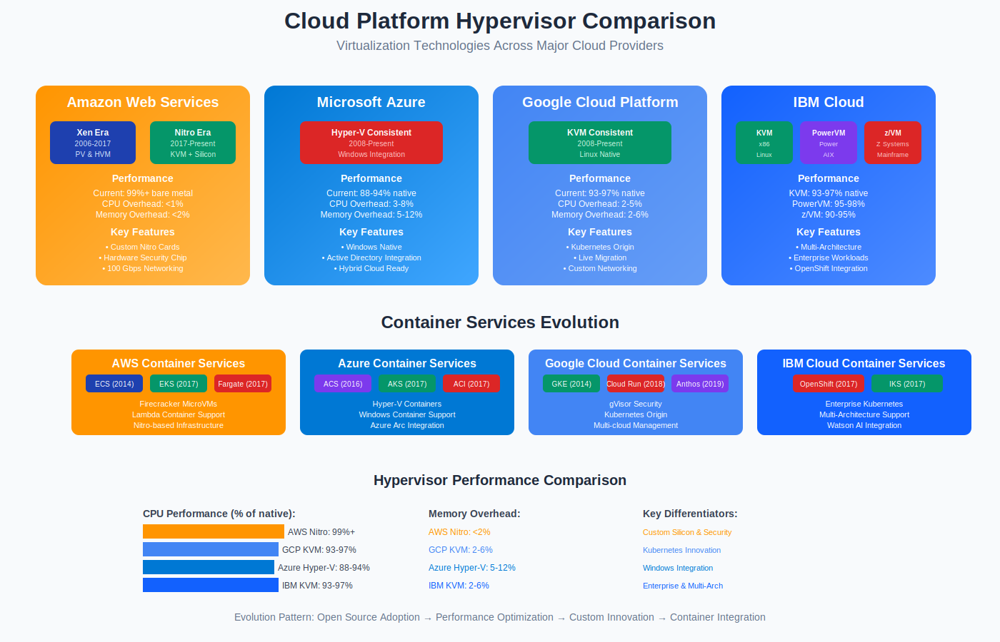

# Comprehensive Hypervisor Comparison Matrix



## 🔍 Executive Summary

This comprehensive comparison analyzes the major hypervisor technologies that form the foundation of modern cloud computing infrastructure, examining their technical characteristics, market adoption, and real-world implementations across major cloud platforms.

## 📊 Master Comparison Matrix

### Core Technical Specifications

| Hypervisor | Type | Creator/Maintainer | Release Year | License Model | Architecture | OS Dependency |
|------------|------|-------------------|--------------|---------------|--------------|---------------|
| **VMware ESXi** | Type 1 | VMware Inc. | 2001 (ESX), 2007 (ESXi) | Commercial/Proprietary | Microkernel | None (bare-metal) |
| **Xen** | Type 1 | University of Cambridge | 2003 | Open Source (GPL) | Microkernel | Linux Dom0 required |
| **KVM** | Type 1* | Qumranet/Red Hat | 2007 | Open Source (GPL) | Linux Kernel Module | Linux kernel integration |
| **Microsoft Hyper-V** | Type 1 | Microsoft Corporation | 2008 | Commercial/Proprietary | Microkernel | Windows Server |
| **Oracle VM Server** | Type 1 | Oracle Corporation | 2007 | Commercial | Modified Xen | Linux-based |
| **Citrix XenServer** | Type 1 | Citrix Systems | 2007 | Commercial | Modified Xen | Linux Dom0 |

*KVM is technically a Type 1 hypervisor that requires Linux kernel, making it a hybrid approach.

### Performance Characteristics

| Hypervisor | CPU Overhead | Memory Overhead | I/O Performance | Network Performance | VM Density | Boot Time |
|------------|--------------|-----------------|-----------------|-------------------|------------|-----------|
| **VMware ESXi** | 2-4% | 3-6% | 96-98% | 95-98% | Very High | Fast |
| **Xen (HVM)** | 3-6% | 4-8% | 92-95% | 90-95% | High | Fast |
| **Xen (PV)** | 1-3% | 2-5% | 95-98% | 93-97% | Very High | Very Fast |
| **KVM** | 2-5% | 2-6% | 93-97% | 92-97% | High | Fast |
| **Hyper-V** | 3-7% | 5-10% | 88-94% | 88-94% | Medium-High | Medium |
| **Oracle VM** | 3-6% | 4-9% | 90-94% | 89-93% | Medium-High | Fast |

### Security and Isolation

| Hypervisor | Isolation Strength | Security Features | Hardware Security | Compliance Support |
|------------|-------------------|-------------------|-------------------|-------------------|
| **VMware ESXi** | Excellent | vSphere Security, NSX | Intel TXT, TPM | SOC 2, FedRAMP |
| **Xen** | Excellent | Security modules, FLASK | Intel TXT, ARM TrustZone | Common Criteria |
| **KVM** | Very Good | SELinux, sVirt | Intel TXT, AMD SVM | FIPS 140-2 |
| **Hyper-V** | Very Good | Shielded VMs, HVCI | TPM, Secure Boot | FIPS 140-2, CC |
| **Oracle VM** | Good | Oracle security stack | Standard features | Oracle compliance |

## 🌐 Cloud Platform Adoption Analysis

### Amazon Web Services (AWS)

#### Historical Evolution
```
AWS Hypervisor Timeline:
2006-2017: Xen Hypervisor
├── EC2 Classic: Paravirtual (PV) instances
├── 2008: Hardware Virtual Machine (HVM) support
├── 2013: Enhanced networking with SR-IOV
└── 2017: Transition to Nitro system begins

2017-Present: Nitro System (KVM-based)
├── Custom silicon (Nitro cards)
├── Dedicated security chip
├── Hardware-accelerated networking
└── Near bare-metal performance
```

#### Why AWS Chose Xen Initially (2006)
```
Xen Selection Criteria:
✅ Open source (no licensing costs)
✅ Paravirtualization performance
✅ Strong multi-tenant isolation
✅ Academic credibility and support
✅ Customization flexibility
✅ Mature codebase for enterprise use
```

#### Transition to Nitro (2017-2020)
```
Nitro System Advantages:
✅ Better performance (99%+ of bare metal)
✅ Enhanced security (dedicated security chip)
✅ Improved networking (100 Gbps)
✅ Custom silicon integration
✅ Reduced virtualization overhead
✅ Support for larger instance types
```

#### Current AWS Implementation
| Service | Hypervisor | Instance Types | Performance Characteristics |
|---------|------------|----------------|---------------------------|
| **EC2 (Current Gen)** | Nitro (KVM) | M5, C5, R5, etc. | 99%+ bare metal performance |
| **EC2 (Previous Gen)** | Xen | M4, C4, R4, etc. | 90-95% bare metal performance |
| **Lambda** | Firecracker (KVM) | Serverless functions | Sub-second cold start |
| **Fargate** | Firecracker (KVM) | Container tasks | Optimized for containers |

### Microsoft Azure

#### Hyper-V Integration Strategy
```
Azure Hyper-V Evolution:
2008: Windows Azure launch with Hyper-V
├── Custom Hyper-V modifications for cloud
├── Multi-tenant isolation enhancements
├── Azure Fabric integration
└── Hardware acceleration support

2010-Present: Continuous Enhancement
├── Generation 2 VMs (UEFI boot)
├── Nested virtualization support
├── Confidential computing integration
└── Azure Stack hybrid deployment
```

#### Why Microsoft Uses Hyper-V
```
Strategic Advantages:
✅ Windows ecosystem integration
✅ Active Directory seamless integration
✅ Enterprise Windows licensing synergy
✅ Hybrid cloud (on-premises to Azure)
✅ Full control over hypervisor development
✅ Windows Server feature parity
```

#### Azure Implementation Details
| Service | Hypervisor | Optimization | Use Case |
|---------|------------|--------------|----------|
| **Virtual Machines** | Hyper-V | Multi-tenant cloud | General compute |
| **Azure Stack** | Hyper-V | On-premises | Hybrid cloud |
| **Windows Virtual Desktop** | Hyper-V | VDI optimized | Desktop virtualization |
| **Azure Kubernetes Service** | Hyper-V | Container support | Container orchestration |

### Google Cloud Platform (GCP)

#### KVM Standardization
```
GCP KVM Implementation:
2008: Initial infrastructure on KVM
├── Custom Linux kernel modifications
├── Google-specific performance optimizations
├── Integration with Borg orchestrator
└── Custom networking stack (Andromeda)

2012-Present: Compute Engine Evolution
├── Live migration capabilities
├── Preemptible instances
├── Custom machine types
└── Confidential computing support
```

#### Why Google Chose KVM
```
Technical Rationale:
✅ Linux-native integration
✅ Open source flexibility
✅ Hardware virtualization support
✅ Minimal overhead
✅ Google's Linux expertise
✅ Cost-effective scaling
```

#### GCP Implementation Matrix
| Service | Hypervisor | Specialization | Performance Focus |
|---------|------------|----------------|-------------------|
| **Compute Engine** | KVM | General purpose | High performance |
| **Google Kubernetes Engine** | KVM | Container-optimized | Container workloads |
| **Cloud Run** | gVisor (KVM-based) | Serverless containers | Security isolation |
| **App Engine** | KVM | Platform-as-a-Service | Application hosting |

### Other Major Cloud Providers

#### IBM Cloud
```
IBM Cloud Hypervisor Strategy:
x86 Infrastructure: KVM (OpenStack-based)
Power Systems: PowerVM (proprietary)
Z Systems: z/VM (mainframe virtualization)
```

#### Oracle Cloud Infrastructure (OCI)
```
OCI Hypervisor Evolution:
Generation 1: Xen-based infrastructure
Generation 2: KVM-based (bare metal focus)
Specialty: Oracle VM for Oracle workloads
```

#### Alibaba Cloud
```
Alibaba Cloud Implementation:
Primary: KVM (customized for scale)
Legacy: Xen (older instances)
Specialty: Custom optimizations for Chinese market
```

## 🏢 Enterprise Data Center Adoption

### Market Share Analysis (2023)

| Hypervisor | Market Share | Primary Segment | Growth Trend |
|------------|--------------|-----------------|--------------|
| **VMware vSphere** | 75-80% | Enterprise data centers | Stable/Declining |
| **Microsoft Hyper-V** | 15-20% | Windows-centric orgs | Growing |
| **KVM/RHEV** | 8-12% | Cost-conscious enterprises | Growing |
| **Citrix XenServer** | 3-5% | VDI and specialized | Declining |
| **Oracle VM** | 1-2% | Oracle-specific workloads | Stable |

### Enterprise Selection Criteria

#### VMware ESXi Advantages
```
Enterprise Benefits:
✅ Mature ecosystem and tooling
✅ Advanced features (vMotion, DRS, HA)
✅ Extensive third-party support
✅ Proven reliability and performance
✅ Comprehensive management suite
✅ Strong professional services
```

#### Microsoft Hyper-V Advantages
```
Windows Integration Benefits:
✅ Included with Windows Server
✅ System Center integration
✅ Active Directory integration
✅ Familiar management tools
✅ Lower total cost of ownership
✅ Azure hybrid capabilities
```

#### KVM/Red Hat Advantages
```
Open Source Benefits:
✅ No licensing costs
✅ Open source flexibility
✅ Strong Linux integration
✅ OpenStack compatibility
✅ Community-driven innovation
✅ Vendor independence
```

## 🔧 Technical Deep Dive Comparison

### Memory Management

| Hypervisor | Memory Virtualization | Overcommit Support | Memory Ballooning | Transparent Page Sharing |
|------------|----------------------|-------------------|-------------------|-------------------------|
| **VMware ESXi** | Hardware-assisted | Advanced | Yes | Yes (deprecated) |
| **Xen** | Shadow/HAP | Basic | Yes | Limited |
| **KVM** | Hardware-assisted | Good | Yes | KSM (Kernel Same-page Merging) |
| **Hyper-V** | Hardware-assisted | Good | Yes | No |

### Storage Integration

| Hypervisor | Native File System | Shared Storage | Thin Provisioning | Snapshot Technology |
|------------|-------------------|----------------|-------------------|-------------------|
| **VMware ESXi** | VMFS | FC, iSCSI, NFS | Yes | Advanced (linked clones) |
| **Xen** | Ext4/XFS | LVM, FC, iSCSI | Yes | LVM-based |
| **KVM** | Ext4/XFS/Btrfs | Multiple | Yes | QCOW2-based |
| **Hyper-V** | NTFS/ReFS | SMB, FC, iSCSI | Yes | VHDX-based |

### Network Virtualization

| Hypervisor | Virtual Switch | VLAN Support | Network Offload | SDN Integration |
|------------|----------------|--------------|-----------------|-----------------|
| **VMware ESXi** | vSphere Standard/Distributed | Advanced | Yes | NSX |
| **Xen** | Linux bridge/Open vSwitch | Good | Limited | OpenStack Neutron |
| **KVM** | Linux bridge/Open vSwitch | Good | Yes | OpenStack Neutron |
| **Hyper-V** | Hyper-V Virtual Switch | Good | Yes | Azure Virtual Network |

### High Availability Features

| Hypervisor | Live Migration | Clustering | Fault Tolerance | Disaster Recovery |
|------------|----------------|------------|-----------------|-------------------|
| **VMware ESXi** | vMotion | vSphere HA/DRS | vSphere FT | vSphere Replication |
| **Xen** | XenMotion | Basic clustering | Limited | Third-party |
| **KVM** | Live migration | Pacemaker/Corosync | Limited | Third-party |
| **Hyper-V** | Live Migration | Failover Clustering | Limited | Hyper-V Replica |

## 💰 Cost Analysis

### Licensing Models

| Hypervisor | Base License | Per-CPU Cost | Enterprise Features | Support Cost |
|------------|--------------|--------------|-------------------|--------------|
| **VMware ESXi** | Free (limited) | $995-$4,995 | Additional cost | 20-25% annually |
| **Xen** | Free | $0 | Free | Community/Commercial |
| **KVM** | Free | $0 | Free | Red Hat subscription |
| **Hyper-V** | Included with Windows | Windows Server cost | Included | Microsoft support |

### Total Cost of Ownership (3-Year)

| Scenario | VMware vSphere | Hyper-V | KVM/RHEV |
|----------|----------------|---------|----------|
| **Small (10 hosts)** | $150,000 | $80,000 | $60,000 |
| **Medium (50 hosts)** | $500,000 | $250,000 | $200,000 |
| **Large (200 hosts)** | $1,500,000 | $800,000 | $600,000 |

*Costs include licensing, support, and management tools*

## 🚀 Performance Benchmarks

### CPU Performance (% of Native)

| Workload Type | VMware ESXi | Xen HVM | Xen PV | KVM | Hyper-V |
|---------------|-------------|---------|--------|-----|---------|
| **CPU-intensive** | 97% | 94% | 98% | 96% | 92% |
| **Memory-intensive** | 95% | 92% | 96% | 94% | 90% |
| **I/O-intensive** | 96% | 90% | 94% | 93% | 88% |
| **Network-intensive** | 95% | 89% | 93% | 92% | 87% |

### Scalability Limits

| Hypervisor | Max VMs per Host | Max vCPUs per VM | Max RAM per VM | Max Hosts per Cluster |
|------------|------------------|------------------|----------------|----------------------|
| **VMware ESXi** | 1,024 | 768 | 24 TB | 96 |
| **Xen** | 512 | 512 | 1.5 TB | Unlimited |
| **KVM** | Unlimited* | 288 | 12 TB | Unlimited* |
| **Hyper-V** | 1,024 | 240 | 12 TB | 64 |

*Limited by host resources and Linux kernel limits

## 🔮 Future Trends and Evolution

### Emerging Technologies

#### Container Integration
```
Hypervisor Container Support:
VMware: vSphere with Kubernetes (Project Pacific)
Microsoft: Windows containers on Hyper-V
KVM: Kata Containers for secure containers
Xen: Unikernel support and lightweight VMs
```

#### Hardware Acceleration
```
Next-Generation Features:
- GPU virtualization and partitioning
- FPGA and AI accelerator support
- NVMe storage optimization
- 100+ Gbps networking support
- Confidential computing integration
```

#### Edge Computing Adaptations
```
Edge-Optimized Hypervisors:
- Lightweight footprint requirements
- Reduced management overhead
- Enhanced security for edge deployment
- 5G network function virtualization
```

### Market Predictions (2025-2030)

| Trend | Impact | Timeline |
|-------|--------|----------|
| **Container Adoption** | Reduced VM density | 2025-2027 |
| **Edge Computing** | Specialized hypervisors | 2024-2026 |
| **Confidential Computing** | Hardware security integration | 2025-2028 |
| **Serverless Growth** | MicroVM technologies | 2024-2026 |
| **AI/ML Workloads** | GPU virtualization focus | 2024-2027 |

## 🎯 Selection Decision Matrix

### Use Case Recommendations

| Use Case | Primary Choice | Alternative | Rationale |
|----------|----------------|-------------|-----------|
| **Enterprise Data Center** | VMware ESXi | Hyper-V | Mature ecosystem, advanced features |
| **Windows-Heavy Environment** | Hyper-V | VMware ESXi | Native integration, cost-effective |
| **Cost-Sensitive Deployment** | KVM | Xen | Open source, no licensing |
| **Cloud Infrastructure** | KVM | Xen | Customization, performance |
| **Development/Testing** | KVM/VirtualBox | VMware Workstation | Cost-effective, flexible |
| **High-Security Environment** | Xen | VMware ESXi | Strong isolation, security focus |

### Decision Framework

#### Technical Requirements Assessment
```
Performance Priority:
High → VMware ESXi or KVM
Medium → Hyper-V or Xen
Low → Any suitable option

Security Priority:
High → Xen or VMware ESXi
Medium → KVM or Hyper-V
Low → Cost-based decision

Cost Priority:
High → KVM or Xen
Medium → Hyper-V
Low → VMware ESXi acceptable
```

---

## 📚 References and Benchmarking Sources

- VMware Performance Best Practices Guide
- Microsoft Hyper-V Performance Tuning Guidelines
- Red Hat Enterprise Virtualization Performance Guide
- Citrix XenServer Performance Handbook
- SPECvirt Virtualization Benchmarks
- Cloud Provider Technical Documentation
- Industry Analyst Reports (Gartner, IDC, Forrester)

*This comprehensive comparison provides the technical foundation for understanding how different hypervisor technologies enable modern cloud computing infrastructure and guide architectural decisions for enterprise and cloud deployments.*
