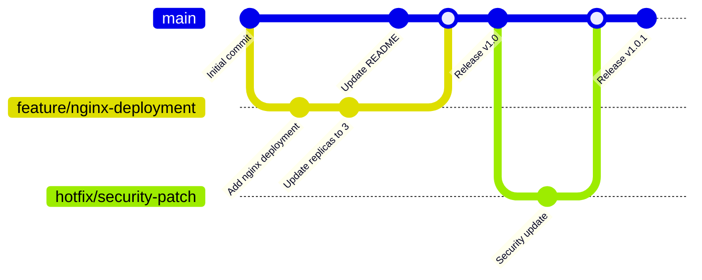

# Session 02: Git Hands-on & Version Control

## 🎯 **Session Objectives**
By the end of this session, you will be able to:
- Install and configure Git on your local machine
- Master essential Git commands for daily development workflows
- Implement branching strategies suitable for corporate environments
- Collaborate effectively using GitHub/GitLab in team settings
- Apply Git best practices for Kubernetes and DevOps workflows

---

## 📚 **Session Agenda** (3 hours)

### **Part 1: Git Installation & Setup (45 minutes)**
- Git installation across platforms (Windows, macOS, Linux)
- Initial configuration and SSH key setup
- Understanding Git architecture and terminology

### **Part 2: Core Git Operations (90 minutes)**
- Repository initialization and cloning
- Staging, committing, and pushing changes
- Branch management and merging strategies
- Conflict resolution techniques

### **Part 3: Corporate Git Workflows (45 minutes)**
- GitFlow vs GitHub Flow for enterprise teams
- Pull request workflows and code reviews
- Integration with CI/CD pipelines
- Git hooks and automation

---

## 🔧 **Hands-on Labs**

### **Lab 1: Git Installation and Configuration**

#### **Step 1: Install Git**
```bash
# Windows (using Chocolatey)
choco install git

# macOS (using Homebrew)
brew install git

# Ubuntu/Debian
sudo apt update && sudo apt install git

# CentOS/RHEL
sudo yum install git
```

#### **Step 2: Initial Configuration**
```bash
# Set global user information
git config --global user.name "Your Name"
git config --global user.email "your.email@company.com"

# Set default branch name
git config --global init.defaultBranch main

# Set default editor
git config --global core.editor "code --wait"  # VS Code
# git config --global core.editor "vim"        # Vim

# Verify configuration
git config --global --list
```

#### **Step 3: SSH Key Setup for GitHub**
```bash
# Generate SSH key
ssh-keygen -t ed25519 -C "your.email@company.com"

# Start SSH agent
eval "$(ssh-agent -s)"

# Add SSH key to agent
ssh-add ~/.ssh/id_ed25519

# Copy public key to clipboard
cat ~/.ssh/id_ed25519.pub
# Add this key to your GitHub account: Settings > SSH and GPG keys
```

**Expected Output:**
```
Generating public/private ed25519 key pair.
Your identification has been saved in ~/.ssh/id_ed25519
Your public key has been saved in ~/.ssh/id_ed25519.pub
```

### **Lab 2: Corporate Git Workflow Implementation**

#### **Step 1: Repository Setup**
```bash
# Create a new repository for Kubernetes manifests
mkdir k8s-corporate-app && cd k8s-corporate-app
git init

# Create initial project structure
mkdir -p {environments/{dev,staging,prod},manifests/{deployments,services,configmaps}}
touch README.md .gitignore

# Create .gitignore for Kubernetes projects
cat > .gitignore << EOF
# Kubernetes
*.tmp
*.log
.kube/config

# IDE
.vscode/
.idea/

# OS
.DS_Store
Thumbs.db

# Secrets (never commit)
*secret*.yaml
*password*
*.key
*.pem
EOF
```

#### **Step 2: Feature Branch Workflow**
```bash
# Create and switch to feature branch
git checkout -b feature/add-nginx-deployment

# Create a sample Kubernetes deployment
cat > manifests/deployments/nginx-deployment.yaml << EOF
apiVersion: apps/v1
kind: Deployment
metadata:
  name: nginx-deployment
  labels:
    app: nginx
spec:
  replicas: 3
  selector:
    matchLabels:
      app: nginx
  template:
    metadata:
      labels:
        app: nginx
    spec:
      containers:
      - name: nginx
        image: nginx:1.21
        ports:
        - containerPort: 80
EOF

# Stage and commit changes
git add .
git commit -m "feat: add nginx deployment manifest

- Add nginx deployment with 3 replicas
- Configure container port 80
- Use nginx:1.21 image for stability"
```

#### **Step 3: Collaborative Workflow**
```bash
# Push feature branch to remote
git push -u origin feature/add-nginx-deployment

# Simulate code review process
git checkout main
git pull origin main

# Merge feature branch (after PR approval)
git merge feature/add-nginx-deployment
git push origin main

# Clean up feature branch
git branch -d feature/add-nginx-deployment
git push origin --delete feature/add-nginx-deployment
```

**Expected Output:**
```
[feature/add-nginx-deployment 1a2b3c4] feat: add nginx deployment manifest
 1 file changed, 20 insertions(+)
 create mode 100644 manifests/deployments/nginx-deployment.yaml
```

---

## 📊 **Git Workflow Visualization**



---

## 🏢 **Real-World Use Case: Banking Application Deployment**

### **Scenario: BFSI Git Strategy**
A major bank implements Git workflows for their Kubernetes-based core banking system:

**Challenge:**
- Multiple development teams (payments, loans, accounts)
- Strict compliance requirements (SOX, PCI DSS)
- Zero-downtime deployment requirements
- Audit trail for all changes

**Solution:**
```bash
# Repository structure for banking application
banking-k8s-platform/
├── applications/
│   ├── payment-service/
│   ├── loan-service/
│   └── account-service/
├── infrastructure/
│   ├── monitoring/
│   ├── security/
│   └── networking/
├── environments/
│   ├── development/
│   ├── staging/
│   └── production/
└── policies/
    ├── network-policies/
    ├── pod-security-policies/
    └── rbac/
```

**Git Workflow Implementation:**
```bash
# Feature development with compliance
git checkout -b feature/payment-encryption-update
# Implement changes with proper commit messages
git commit -m "feat(payment): implement AES-256 encryption

- Add encryption for payment data at rest
- Update security policies for PCI DSS compliance
- Add audit logging for payment transactions

Compliance: PCI-DSS-3.2.1
Reviewed-by: security-team@bank.com
Tested-by: qa-team@bank.com"

# Mandatory code review process
git push origin feature/payment-encryption-update
# Create pull request with security team review
# Automated security scanning via Git hooks
# Compliance verification before merge
```

**Benefits Achieved:**
- **100% audit trail** for all changes
- **Automated compliance checks** via Git hooks
- **Zero-downtime deployments** with GitOps
- **Reduced deployment time** from 4 hours to 15 minutes

---

## 🔍 **Advanced Git Techniques for DevOps**

### **Git Hooks for Kubernetes**
```bash
# Pre-commit hook for YAML validation
cat > .git/hooks/pre-commit << 'EOF'
#!/bin/bash
# Validate Kubernetes YAML files
for file in $(git diff --cached --name-only | grep -E '\.(yaml|yml)$'); do
    if ! kubectl --dry-run=client apply -f "$file" > /dev/null 2>&1; then
        echo "❌ Invalid Kubernetes YAML: $file"
        exit 1
    fi
done
echo "✅ All Kubernetes manifests are valid"
EOF

chmod +x .git/hooks/pre-commit
```

### **Git Aliases for Productivity**
```bash
# Add useful Git aliases
git config --global alias.k8s-status "status --porcelain | grep -E '\.(yaml|yml)$'"
git config --global alias.k8s-diff "diff --name-only | grep -E '\.(yaml|yml)$'"
git config --global alias.deploy-log "log --oneline --grep='deploy'"
git config --global alias.rollback "reset --hard HEAD~1"
```

---

## 🛠 **Troubleshooting Common Git Issues**

### **Issue 1: Merge Conflicts in YAML**
```bash
# When conflicts occur in Kubernetes manifests
git status
# Shows conflicted files

# Edit conflicted file and resolve markers
# <<<<<<< HEAD
# =======
# >>>>>>> branch-name

# Validate resolved YAML
kubectl --dry-run=client apply -f conflicted-file.yaml

# Complete merge
git add conflicted-file.yaml
git commit -m "resolve: merge conflict in deployment manifest"
```

### **Issue 2: Accidentally Committed Secrets**
```bash
# Remove sensitive data from Git history
git filter-branch --force --index-filter \
'git rm --cached --ignore-unmatch path/to/secret-file.yaml' \
--prune-empty --tag-name-filter cat -- --all

# Force push to update remote (use with caution)
git push origin --force --all
```

---

## 📚 **Best Practices for Corporate Git Usage**

### **Commit Message Standards**
```bash
# Use conventional commits for automation
feat(k8s): add horizontal pod autoscaler
fix(security): update RBAC permissions
docs(readme): add deployment instructions
chore(deps): update container images
```

### **Branch Protection Rules**
- Require pull request reviews (minimum 2 reviewers)
- Require status checks to pass (CI/CD pipeline)
- Require branches to be up to date before merging
- Restrict pushes to main branch

### **Security Considerations**
- Never commit secrets or credentials
- Use Git-crypt for sensitive configuration files
- Implement signed commits for critical repositories
- Regular security audits of repository access

---

## ✅ **Session 02 Checklist**

- [ ] Git installed and configured with proper user information
- [ ] SSH keys generated and added to GitHub/GitLab
- [ ] Completed basic Git workflow (clone, add, commit, push)
- [ ] Practiced branching and merging strategies
- [ ] Implemented Git hooks for Kubernetes YAML validation
- [ ] Understood corporate Git workflows and best practices
- [ ] Set up Git aliases for improved productivity

---

## 🎯 **Next Session Preview**

**Session 03: Docker Basics & Installation**
- Docker installation across different platforms
- Understanding containers vs virtual machines
- Basic Docker commands and container lifecycle
- Building your first container images
- Docker networking and volume management

---

## 👨‍💻 **About the Author**

**Varun Kumar Manik** is a distinguished **Cloud Architect, Kubernetes Expert, and DevOps Specialist** with nearly **1.5 decades of hands-on experience** in designing, implementing, and optimizing cloud-native solutions across enterprise environments. As an **AWS Ambassador for 6+ years**, Varun has been officially recognized by Amazon Web Services for his outstanding contributions to the cloud community and deep expertise in AWS technologies.

### 🏆 **Professional Recognition**
- **AWS Ambassador Profile**: [View on AWS Partners Portal](https://aws.amazon.com/partners/ambassadors/)
- **Kubernetes Community Contributor**: Active in CNCF ecosystem
- **Corporate Training Specialist**: Delivered K8s training to 500+ professionals

### 💼 **Professional Expertise**

#### ☸️ **Kubernetes & Container Orchestration**
- Production Kubernetes deployments across Telco, BFSI, and Enterprise sectors
- Multi-cluster management and federation strategies
- Kubernetes security hardening and RBAC implementation
- Service mesh integration (Istio, Linkerd) for enterprise workloads

#### 🚀 **DevOps & CI/CD Excellence**
- GitOps workflows with ArgoCD and Flux
- Infrastructure as Code with Terraform and Helm
- Container security and compliance automation
- Enterprise CI/CD pipeline optimization

### 🌐 **Connect & Follow**

- **GitHub**: [https://github.com/manikcloud](https://github.com/manikcloud)
- **LinkedIn**: [https://www.linkedin.com/in/vkmanik/](https://www.linkedin.com/in/vkmanik/)
- **Email**: [varunmanik1@gmail.com](mailto:varunmanik1@gmail.com)

---

*Next: [Session 03 - Docker Basics & Installation](../session-03-docker-basic-handson/)*
