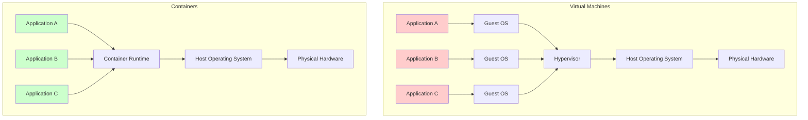

# Session 03: Docker Basics & Installation

## 🎯 **Session Objectives**
By the end of this session, you will be able to:
- Install Docker Desktop on Windows, macOS, and Linux systems
- Understand the fundamental differences between containers and virtual machines
- Execute essential Docker commands for container lifecycle management
- Pull, run, and manage Docker images from registries
- Implement basic container networking and data persistence concepts

---

## 📚 **Session Agenda** (4 hours)

### **Part 1: Docker Installation & Setup (60 minutes)**
- Docker Desktop installation across platforms
- Docker Engine configuration and verification
- Understanding Docker architecture components

### **Part 2: Container Fundamentals (90 minutes)**
- Containers vs VMs comparison
- Docker images and container lifecycle
- Basic Docker commands and operations

### **Part 3: Image Management (60 minutes)**
- Working with Docker Hub and registries
- Image pulling, tagging, and pushing
- Container data management and volumes

### **Part 4: Networking Basics (30 minutes)**
- Docker networking concepts
- Port mapping and container communication
- Basic troubleshooting techniques

---

## 🔧 **Hands-on Labs**

### **Lab 1: Docker Desktop Installation**

#### **Windows Installation**
```powershell
# Download Docker Desktop from https://docker.com/products/docker-desktop
# Run the installer as Administrator

# Verify installation
docker --version
docker-compose --version

# Test Docker installation
docker run hello-world
```

#### **macOS Installation**
```bash
# Download Docker Desktop for Mac
# Install the .dmg file

# Verify installation
docker --version
docker info

# Test Docker installation
docker run hello-world
```

#### **Linux Installation (Ubuntu)**
```bash
# Update package index
sudo apt-get update

# Install required packages
sudo apt-get install \
    ca-certificates \
    curl \
    gnupg \
    lsb-release

# Add Docker's official GPG key
sudo mkdir -p /etc/apt/keyrings
curl -fsSL https://download.docker.com/linux/ubuntu/gpg | sudo gpg --dearmor -o /etc/apt/keyrings/docker.gpg

# Set up repository
echo \
  "deb [arch=$(dpkg --print-architecture) signed-by=/etc/apt/keyrings/docker.gpg] https://download.docker.com/linux/ubuntu \
  $(lsb_release -cs) stable" | sudo tee /etc/apt/sources.list.d/docker.list > /dev/null

# Install Docker Engine
sudo apt-get update
sudo apt-get install docker-ce docker-ce-cli containerd.io docker-compose-plugin

# Add user to docker group
sudo usermod -aG docker $USER
newgrp docker

# Verify installation
docker --version
docker run hello-world
```

**Expected Output:**
```
Hello from Docker!
This message shows that your installation appears to be working correctly.
```

### **Lab 2: Container Lifecycle Management**

#### **Step 1: Basic Container Operations**
```bash
# Pull an image from Docker Hub
docker pull nginx:1.21

# List downloaded images
docker images

# Run a container in detached mode
docker run -d --name my-nginx -p 8080:80 nginx:1.21

# List running containers
docker ps

# View container logs
docker logs my-nginx

# Execute commands inside container
docker exec -it my-nginx bash
# Inside container:
ls /usr/share/nginx/html
exit

# Stop and remove container
docker stop my-nginx
docker rm my-nginx
```

#### **Step 2: Container with Custom Configuration**
```bash
# Create a custom HTML file
mkdir -p ~/docker-lab/html
cat > ~/docker-lab/html/index.html << EOF
<!DOCTYPE html>
<html>
<head>
    <title>Corporate Docker Lab</title>
</head>
<body>
    <h1>Welcome to Corporate Kubernetes Training</h1>
    <p>This is a custom web page served by Docker container</p>
    <p>Session 03: Docker Basics & Installation</p>
</body>
</html>
EOF

# Run container with volume mount
docker run -d \
  --name corporate-web \
  -p 8080:80 \
  -v ~/docker-lab/html:/usr/share/nginx/html:ro \
  nginx:1.21

# Test the custom web page
curl http://localhost:8080
# Or open in browser: http://localhost:8080

# View container resource usage
docker stats corporate-web --no-stream
```

**Expected Output:**
```
CONTAINER ID   NAME            CPU %     MEM USAGE / LIMIT     MEM %     NET I/O       BLOCK I/O   PIDS
abc123def456   corporate-web   0.00%     3.5MiB / 7.775GiB     0.04%     1.2kB / 0B    0B / 0B     2
```

---

## 📊 **Container vs VM Architecture Comparison**



---

## 🏢 **Real-World Use Case: Telecom Network Function Virtualization**

### **Scenario: 5G Core Network Containerization**
A telecom operator migrates their 5G core network functions from VMs to containers:

**Traditional Approach (VMs):**
```
Physical Server (64GB RAM, 16 CPU cores)
├── VM1: User Plane Function (UPF) - 16GB RAM, 4 cores
├── VM2: Session Management Function (SMF) - 8GB RAM, 2 cores
├── VM3: Access and Mobility Function (AMF) - 8GB RAM, 2 cores
└── VM4: Network Repository Function (NRF) - 4GB RAM, 1 core
Total Overhead: ~28GB RAM for Guest OS instances
```

**Container Approach:**
```bash
# Deploy 5G network functions as containers
docker run -d --name upf-container \
  --cpus="4" --memory="12g" \
  --network=5g-core \
  telco-registry/5g-upf:v2.1

docker run -d --name smf-container \
  --cpus="2" --memory="6g" \
  --network=5g-core \
  telco-registry/5g-smf:v2.1

docker run -d --name amf-container \
  --cpus="2" --memory="6g" \
  --network=5g-core \
  telco-registry/5g-amf:v2.1

docker run -d --name nrf-container \
  --cpus="1" --memory="2g" \
  --network=5g-core \
  telco-registry/5g-nrf:v2.1

# Create custom network for 5G functions
docker network create --driver bridge 5g-core
```

**Benefits Achieved:**
- **Resource Efficiency**: 40% reduction in memory usage
- **Startup Time**: From 5 minutes (VM) to 30 seconds (container)
- **Scalability**: Dynamic scaling based on network traffic
- **Deployment Speed**: 10x faster deployment of network functions

---

## 🔍 **Advanced Docker Operations**

### **Container Health Monitoring**
```bash
# Run container with health check
docker run -d --name web-with-health \
  --health-cmd="curl -f http://localhost:80 || exit 1" \
  --health-interval=30s \
  --health-timeout=10s \
  --health-retries=3 \
  -p 8080:80 \
  nginx:1.21

# Check container health status
docker ps
docker inspect web-with-health | grep -A 10 "Health"
```

### **Multi-Container Application**
```bash
# Create a network for multi-container app
docker network create app-network

# Run database container
docker run -d --name app-db \
  --network app-network \
  -e MYSQL_ROOT_PASSWORD=secretpassword \
  -e MYSQL_DATABASE=corporate_app \
  mysql:8.0

# Run application container
docker run -d --name app-backend \
  --network app-network \
  -e DB_HOST=app-db \
  -e DB_NAME=corporate_app \
  -p 3000:3000 \
  node:16-alpine \
  sh -c "npm install express mysql2 && node server.js"

# Verify connectivity
docker exec app-backend ping app-db
```

---

## 🛠 **Docker Troubleshooting Guide**

### **Common Issues and Solutions**

#### **Issue 1: Container Won't Start**
```bash
# Check container logs
docker logs container-name

# Inspect container configuration
docker inspect container-name

# Run container interactively for debugging
docker run -it --rm image-name /bin/bash
```

#### **Issue 2: Port Already in Use**
```bash
# Find process using the port
sudo netstat -tulpn | grep :8080
# or
sudo lsof -i :8080

# Kill the process or use different port
docker run -d -p 8081:80 nginx:1.21
```

#### **Issue 3: Permission Denied**
```bash
# Add user to docker group (Linux)
sudo usermod -aG docker $USER
newgrp docker

# Fix file permissions for volumes
sudo chown -R $USER:$USER ~/docker-lab/
```

---

## 📚 **Docker Best Practices for Corporate Environments**

### **Security Considerations**
```bash
# Run containers as non-root user
docker run --user 1000:1000 nginx:1.21

# Limit container resources
docker run --memory="512m" --cpus="0.5" nginx:1.21

# Use read-only root filesystem
docker run --read-only nginx:1.21

# Scan images for vulnerabilities
docker scan nginx:1.21
```

### **Image Management**
```bash
# Tag images properly
docker tag nginx:1.21 corporate-registry/nginx:v1.21-prod

# Clean up unused resources
docker system prune -a

# Monitor disk usage
docker system df
```

---

## 🔧 **Docker Commands Reference**

### **Essential Commands**
```bash
# Image operations
docker pull <image>          # Download image
docker images               # List images
docker rmi <image>          # Remove image
docker build -t <tag> .     # Build image

# Container operations
docker run <image>          # Create and start container
docker ps                   # List running containers
docker ps -a               # List all containers
docker stop <container>     # Stop container
docker start <container>    # Start stopped container
docker rm <container>       # Remove container

# Information and logs
docker logs <container>     # View container logs
docker inspect <container> # Detailed container info
docker stats               # Resource usage statistics
docker exec -it <container> /bin/bash  # Execute command in container
```

---

## ✅ **Session 03 Checklist**

- [ ] Docker Desktop installed and verified on your system
- [ ] Successfully ran hello-world container
- [ ] Completed basic container lifecycle operations (run, stop, remove)
- [ ] Created and mounted volumes for data persistence
- [ ] Implemented port mapping for web applications
- [ ] Understood container vs VM differences
- [ ] Practiced Docker troubleshooting techniques
- [ ] Applied security best practices for container deployment

---

## 🎯 **Next Session Preview**

**Session 04: Dockerfile & Advanced Docker Concepts**
- Writing efficient Dockerfiles
- Multi-stage builds for production
- Docker Compose for multi-container applications
- Container registry management
- Advanced networking and security concepts

---

## 👨‍💻 **About the Author**

**Varun Kumar Manik** is a distinguished **Cloud Architect, Kubernetes Expert, and DevOps Specialist** with nearly **1.5 decades of hands-on experience** in designing, implementing, and optimizing cloud-native solutions across enterprise environments. As an **AWS Ambassador for 6+ years**, Varun has been officially recognized by Amazon Web Services for his outstanding contributions to the cloud community and deep expertise in AWS technologies.

### 🏆 **Professional Recognition**
- **AWS Ambassador Profile**: [View on AWS Partners Portal](https://aws.amazon.com/partners/ambassadors/)
- **Kubernetes Community Contributor**: Active in CNCF ecosystem
- **Corporate Training Specialist**: Delivered K8s training to 500+ professionals

### 💼 **Professional Expertise**

#### ☸️ **Kubernetes & Container Orchestration**
- Production Kubernetes deployments across Telco, BFSI, and Enterprise sectors
- Multi-cluster management and federation strategies
- Kubernetes security hardening and RBAC implementation
- Service mesh integration (Istio, Linkerd) for enterprise workloads

#### 🚀 **DevOps & CI/CD Excellence**
- GitOps workflows with ArgoCD and Flux
- Infrastructure as Code with Terraform and Helm
- Container security and compliance automation
- Enterprise CI/CD pipeline optimization

### 🌐 **Connect & Follow**

- **GitHub**: [https://github.com/manikcloud](https://github.com/manikcloud)
- **LinkedIn**: [https://www.linkedin.com/in/vkmanik/](https://www.linkedin.com/in/vkmanik/)
- **Email**: [varunmanik1@gmail.com](mailto:varunmanik1@gmail.com)

---

*Next: [Session 04 - Dockerfile & Advanced Docker Concepts](../session-04-dockerfile-handson-advanced/)*
