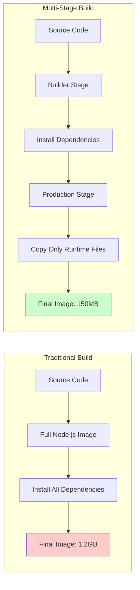

# Session 04: Dockerfile & Advanced Docker Concepts

## 🎯 **Session Objectives**
By the end of this session, you will be able to:
- Write efficient and secure Dockerfiles following best practices
- Implement multi-stage builds to optimize image size and security
- Use Docker Compose for orchestrating multi-container applications
- Manage private container registries for corporate environments
- Apply advanced Docker networking and security configurations

---

## 📚 **Session Agenda** (4 hours)

### **Part 1: Dockerfile Mastery (90 minutes)**
- Dockerfile syntax and best practices
- Layer optimization and caching strategies
- Multi-stage builds for production

### **Part 2: Docker Compose (90 minutes)**
- Multi-container application orchestration
- Service definitions and networking
- Environment management and scaling

### **Part 3: Registry Management (60 minutes)**
- Private registry setup and configuration
- Image security scanning and policies
- CI/CD integration with registries

---

## 🔧 **Hands-on Labs**

### **Lab 1: Production-Ready Dockerfile**

#### **Step 1: Basic Node.js Application Dockerfile**
```dockerfile
# Create a sample Node.js application
mkdir -p ~/docker-advanced/nodejs-app
cd ~/docker-advanced/nodejs-app

# Create package.json
cat > package.json << EOF
{
  "name": "corporate-api",
  "version": "1.0.0",
  "description": "Corporate API for Kubernetes training",
  "main": "server.js",
  "scripts": {
    "start": "node server.js"
  },
  "dependencies": {
    "express": "^4.18.0",
    "helmet": "^6.0.0"
  }
}
EOF

# Create server.js
cat > server.js << EOF
const express = require('express');
const helmet = require('helmet');
const app = express();
const PORT = process.env.PORT || 3000;

// Security middleware
app.use(helmet());
app.use(express.json());

// Health check endpoint
app.get('/health', (req, res) => {
  res.status(200).json({ 
    status: 'healthy', 
    timestamp: new Date().toISOString(),
    version: process.env.APP_VERSION || '1.0.0'
  });
});

// API endpoint
app.get('/api/corporate', (req, res) => {
  res.json({
    message: 'Welcome to Corporate Kubernetes Training API',
    environment: process.env.NODE_ENV || 'development',
    session: 'Session 04 - Dockerfile Advanced'
  });
});

app.listen(PORT, '0.0.0.0', () => {
  console.log(`Corporate API running on port ${PORT}`);
});
EOF
```

#### **Step 2: Multi-Stage Production Dockerfile**
```dockerfile
# Create optimized Dockerfile
cat > Dockerfile << EOF
# Multi-stage build for production optimization
FROM node:18-alpine AS builder

# Set working directory
WORKDIR /app

# Copy package files
COPY package*.json ./

# Install dependencies (including dev dependencies)
RUN npm ci --only=production && npm cache clean --force

# Production stage
FROM node:18-alpine AS production

# Create non-root user for security
RUN addgroup -g 1001 -S nodejs && \
    adduser -S nodejs -u 1001

# Set working directory
WORKDIR /app

# Copy built application from builder stage
COPY --from=builder /app/node_modules ./node_modules
COPY --chown=nodejs:nodejs . .

# Set environment variables
ENV NODE_ENV=production
ENV PORT=3000
ENV APP_VERSION=1.0.0

# Expose port
EXPOSE 3000

# Switch to non-root user
USER nodejs

# Health check
HEALTHCHECK --interval=30s --timeout=3s --start-period=5s --retries=3 \
  CMD node -e "require('http').get('http://localhost:3000/health', (res) => { process.exit(res.statusCode === 200 ? 0 : 1) })"

# Start application
CMD ["npm", "start"]
EOF

# Build the image
docker build -t corporate-api:v1.0.0 .

# Run the container
docker run -d --name corporate-api -p 3000:3000 corporate-api:v1.0.0

# Test the application
curl http://localhost:3000/health
curl http://localhost:3000/api/corporate
```

### **Lab 2: Docker Compose Multi-Container Application**

#### **Step 1: Create Docker Compose Configuration**
```yaml
# Create docker-compose.yml
cat > docker-compose.yml << EOF
version: '3.8'

services:
  # Database service
  database:
    image: postgres:14-alpine
    container_name: corporate-db
    environment:
      POSTGRES_DB: corporate_app
      POSTGRES_USER: app_user
      POSTGRES_PASSWORD: secure_password
    volumes:
      - postgres_data:/var/lib/postgresql/data
      - ./init-db.sql:/docker-entrypoint-initdb.d/init-db.sql
    networks:
      - corporate-network
    healthcheck:
      test: ["CMD-SHELL", "pg_isready -U app_user -d corporate_app"]
      interval: 30s
      timeout: 10s
      retries: 3

  # Redis cache service
  cache:
    image: redis:7-alpine
    container_name: corporate-cache
    command: redis-server --appendonly yes
    volumes:
      - redis_data:/data
    networks:
      - corporate-network
    healthcheck:
      test: ["CMD", "redis-cli", "ping"]
      interval: 30s
      timeout: 10s
      retries: 3

  # Application service
  api:
    build: .
    container_name: corporate-api
    ports:
      - "3000:3000"
    environment:
      NODE_ENV: production
      DB_HOST: database
      DB_NAME: corporate_app
      DB_USER: app_user
      DB_PASSWORD: secure_password
      REDIS_HOST: cache
      REDIS_PORT: 6379
    depends_on:
      database:
        condition: service_healthy
      cache:
        condition: service_healthy
    networks:
      - corporate-network
    restart: unless-stopped

  # Nginx reverse proxy
  nginx:
    image: nginx:1.21-alpine
    container_name: corporate-proxy
    ports:
      - "80:80"
      - "443:443"
    volumes:
      - ./nginx.conf:/etc/nginx/nginx.conf:ro
      - ./ssl:/etc/nginx/ssl:ro
    depends_on:
      - api
    networks:
      - corporate-network
    restart: unless-stopped

volumes:
  postgres_data:
  redis_data:

networks:
  corporate-network:
    driver: bridge
EOF
```

#### **Step 2: Create Supporting Configuration Files**
```bash
# Create database initialization script
cat > init-db.sql << EOF
CREATE TABLE IF NOT EXISTS users (
    id SERIAL PRIMARY KEY,
    username VARCHAR(50) UNIQUE NOT NULL,
    email VARCHAR(100) UNIQUE NOT NULL,
    created_at TIMESTAMP DEFAULT CURRENT_TIMESTAMP
);

INSERT INTO users (username, email) VALUES 
('admin', 'admin@corporate.com'),
('developer', 'dev@corporate.com');
EOF

# Create Nginx configuration
cat > nginx.conf << EOF
events {
    worker_connections 1024;
}

http {
    upstream api_backend {
        server api:3000;
    }

    server {
        listen 80;
        server_name localhost;

        location / {
            proxy_pass http://api_backend;
            proxy_set_header Host \$host;
            proxy_set_header X-Real-IP \$remote_addr;
            proxy_set_header X-Forwarded-For \$proxy_add_x_forwarded_for;
            proxy_set_header X-Forwarded-Proto \$scheme;
        }

        location /health {
            proxy_pass http://api_backend/health;
            access_log off;
        }
    }
}
EOF

# Deploy the complete stack
docker-compose up -d

# Verify all services are running
docker-compose ps

# Test the application through Nginx
curl http://localhost/health
curl http://localhost/api/corporate
```

**Expected Output:**
```
NAME              COMMAND                  SERVICE     STATUS      PORTS
corporate-api     "docker-entrypoint.s…"   api         running     0.0.0.0:3000->3000/tcp
corporate-cache   "docker-entrypoint.s…"   cache       running     6379/tcp
corporate-db      "docker-entrypoint.s…"   database    running     5432/tcp
corporate-proxy   "/docker-entrypoint.…"   nginx       running     0.0.0.0:80->80/tcp, 0.0.0.0:443->443/tcp
```

---

## 📊 **Multi-Stage Build Optimization**



---

## 🏢 **Real-World Use Case: Banking Microservices Architecture**

### **Scenario: BFSI Multi-Service Deployment**
A bank implements a microservices architecture using Docker Compose for their loan processing system:

**Architecture Components:**
```yaml
# Production-grade banking application
version: '3.8'

services:
  # Customer service
  customer-service:
    build: ./services/customer
    environment:
      - DB_CONNECTION=postgresql://customer_db:5432/customers
      - JWT_SECRET=${JWT_SECRET}
    depends_on:
      - customer-db
    deploy:
      replicas: 3
      resources:
        limits:
          memory: 512M
          cpus: '0.5'

  # Loan processing service
  loan-service:
    build: ./services/loan
    environment:
      - CREDIT_SCORE_API=${CREDIT_SCORE_API}
      - COMPLIANCE_MODE=PCI_DSS
    depends_on:
      - loan-db
      - message-queue

  # Payment service
  payment-service:
    build: ./services/payment
    environment:
      - ENCRYPTION_KEY=${AES_256_KEY}
      - PCI_COMPLIANCE=enabled
    volumes:
      - payment-logs:/var/log/payments
    depends_on:
      - payment-db

  # API Gateway
  api-gateway:
    image: nginx:1.21-alpine
    ports:
      - "443:443"
    volumes:
      - ./gateway/nginx.conf:/etc/nginx/nginx.conf
      - ./ssl:/etc/nginx/ssl
    depends_on:
      - customer-service
      - loan-service
      - payment-service

  # Monitoring stack
  prometheus:
    image: prom/prometheus:latest
    volumes:
      - ./monitoring/prometheus.yml:/etc/prometheus/prometheus.yml
    ports:
      - "9090:9090"

  grafana:
    image: grafana/grafana:latest
    environment:
      - GF_SECURITY_ADMIN_PASSWORD=${GRAFANA_PASSWORD}
    ports:
      - "3000:3000"
    volumes:
      - grafana-data:/var/lib/grafana
```

**Benefits Achieved:**
- **Compliance**: PCI DSS compliant containerized payment processing
- **Scalability**: Independent scaling of each microservice
- **Security**: Encrypted communication and secure secret management
- **Monitoring**: Comprehensive observability with Prometheus and Grafana

---

## 🔍 **Advanced Docker Techniques**

### **Docker BuildKit for Enhanced Builds**
```dockerfile
# syntax=docker/dockerfile:1.4
FROM node:18-alpine AS base

# Enable BuildKit features
RUN --mount=type=cache,target=/var/cache/apk \
    apk add --no-cache git

# Use build secrets
RUN --mount=type=secret,id=npm_token \
    echo "//registry.npmjs.org/:_authToken=$(cat /run/secrets/npm_token)" > ~/.npmrc

# Build with BuildKit
DOCKER_BUILDKIT=1 docker build --secret id=npm_token,src=./npm_token .
```

### **Container Security Scanning**
```bash
# Install Docker Scout (if not already available)
docker scout --help

# Scan image for vulnerabilities
docker scout cves corporate-api:v1.0.0

# Generate SBOM (Software Bill of Materials)
docker scout sbom corporate-api:v1.0.0

# Compare images for security improvements
docker scout compare corporate-api:v1.0.0 --to corporate-api:v1.1.0
```

---

## 🛠 **Docker Compose Advanced Operations**

### **Environment-Specific Configurations**
```bash
# Create environment-specific compose files
# docker-compose.override.yml (for development)
cat > docker-compose.override.yml << EOF
version: '3.8'

services:
  api:
    environment:
      - NODE_ENV=development
      - DEBUG=true
    volumes:
      - .:/app
      - /app/node_modules
    command: npm run dev

  database:
    ports:
      - "5432:5432"  # Expose DB port for development
EOF

# Production configuration
# docker-compose.prod.yml
cat > docker-compose.prod.yml << EOF
version: '3.8'

services:
  api:
    deploy:
      replicas: 3
      resources:
        limits:
          memory: 512M
          cpus: '0.5'
    logging:
      driver: "json-file"
      options:
        max-size: "10m"
        max-file: "3"

  nginx:
    deploy:
      replicas: 2
EOF

# Deploy to different environments
docker-compose up -d  # Development (uses override)
docker-compose -f docker-compose.yml -f docker-compose.prod.yml up -d  # Production
```

### **Health Checks and Dependencies**
```yaml
services:
  api:
    healthcheck:
      test: ["CMD", "curl", "-f", "http://localhost:3000/health"]
      interval: 30s
      timeout: 10s
      retries: 3
      start_period: 40s
    depends_on:
      database:
        condition: service_healthy
      cache:
        condition: service_started
```

---

## 📚 **Dockerfile Best Practices**

### **Security Best Practices**
```dockerfile
# Use specific image versions
FROM node:18.17.0-alpine3.18

# Create non-root user
RUN addgroup -g 1001 -S nodejs && \
    adduser -S nodejs -u 1001

# Use .dockerignore to exclude sensitive files
# .dockerignore content:
# node_modules
# .git
# .env
# *.log
# Dockerfile
# docker-compose.yml

# Minimize layers and use multi-stage builds
RUN apk add --no-cache \
    ca-certificates \
    && rm -rf /var/cache/apk/*

# Set proper file permissions
COPY --chown=nodejs:nodejs . .

# Use COPY instead of ADD
COPY package*.json ./

# Set security-focused environment variables
ENV NODE_ENV=production
ENV NPM_CONFIG_LOGLEVEL=warn
ENV NPM_CONFIG_AUDIT_LEVEL=high
```

### **Performance Optimization**
```dockerfile
# Leverage build cache effectively
COPY package*.json ./
RUN npm ci --only=production

# Copy application code after dependencies
COPY . .

# Use .dockerignore to reduce build context
# Combine RUN commands to reduce layers
RUN apt-get update && \
    apt-get install -y --no-install-recommends \
    ca-certificates \
    && rm -rf /var/lib/apt/lists/*
```

---

## ✅ **Session 04 Checklist**

- [ ] Created production-ready Dockerfile with multi-stage builds
- [ ] Implemented Docker Compose for multi-container applications
- [ ] Applied security best practices in container configurations
- [ ] Set up health checks and service dependencies
- [ ] Configured environment-specific deployments
- [ ] Performed container security scanning
- [ ] Optimized image size and build performance
- [ ] Implemented proper logging and monitoring configurations

---

## 🎯 **Next Session Preview**

**Session 05: Docker Desktop for Kubernetes Setup**
- Enabling Kubernetes in Docker Desktop
- Local Kubernetes cluster configuration
- kubectl installation and basic commands
- Deploying first applications to local K8s
- Understanding the transition from Docker to Kubernetes

---

## 👨‍💻 **About the Author**

**Varun Kumar Manik** is a distinguished **Cloud Architect, Kubernetes Expert, and DevOps Specialist** with nearly **1.5 decades of hands-on experience** in designing, implementing, and optimizing cloud-native solutions across enterprise environments. As an **AWS Ambassador for 6+ years**, Varun has been officially recognized by Amazon Web Services for his outstanding contributions to the cloud community and deep expertise in AWS technologies.

### 🏆 **Professional Recognition**
- **AWS Ambassador Profile**: [View on AWS Partners Portal](https://aws.amazon.com/partners/ambassadors/)
- **Kubernetes Community Contributor**: Active in CNCF ecosystem
- **Corporate Training Specialist**: Delivered K8s training to 500+ professionals

### 💼 **Professional Expertise**

#### ☸️ **Kubernetes & Container Orchestration**
- Production Kubernetes deployments across Telco, BFSI, and Enterprise sectors
- Multi-cluster management and federation strategies
- Kubernetes security hardening and RBAC implementation
- Service mesh integration (Istio, Linkerd) for enterprise workloads

#### 🚀 **DevOps & CI/CD Excellence**
- GitOps workflows with ArgoCD and Flux
- Infrastructure as Code with Terraform and Helm
- Container security and compliance automation
- Enterprise CI/CD pipeline optimization

### 🌐 **Connect & Follow**

- **GitHub**: [https://github.com/manikcloud](https://github.com/manikcloud)
- **LinkedIn**: [https://www.linkedin.com/in/vkmanik/](https://www.linkedin.com/in/vkmanik/)
- **Email**: [varunmanik1@gmail.com](mailto:varunmanik1@gmail.com)

---

*Next: [Session 05 - Docker Desktop for Kubernetes Setup](../session-05-docker-desktop-kubernetes/)*
