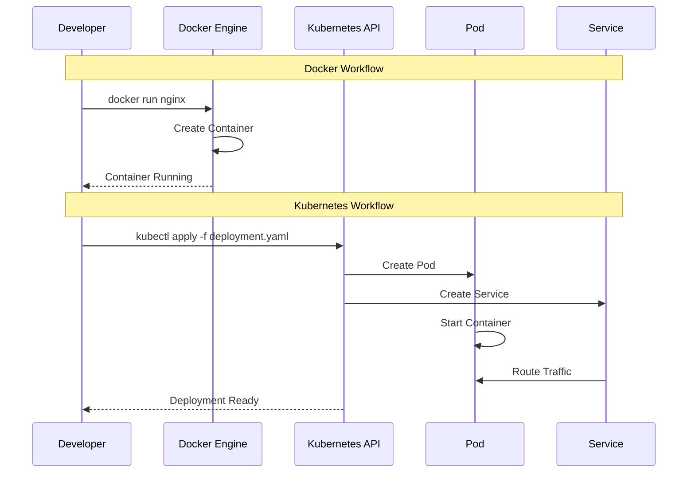

# Session 05: Docker Desktop for Kubernetes Setup

## 🎯 **Session Objectives**
By the end of this session, you will be able to:
- Enable and configure Kubernetes in Docker Desktop
- Install and configure kubectl for cluster management
- Deploy your first applications to a local Kubernetes cluster
- Understand the transition from Docker containers to Kubernetes pods
- Troubleshoot common local Kubernetes setup issues

---

## 📚 **Session Agenda** (3 hours)

### **Part 1: Kubernetes Setup (60 minutes)**
- Enabling Kubernetes in Docker Desktop
- kubectl installation and configuration
- Cluster verification and basic commands

### **Part 2: First Kubernetes Deployments (90 minutes)**
- Converting Docker containers to Kubernetes pods
- Creating deployments and services
- Accessing applications in Kubernetes

### **Part 3: Local Development Workflow (30 minutes)**
- Development best practices with local K8s
- Debugging and troubleshooting techniques
- Alternative local Kubernetes options

---

## 🔄 **Docker to Kubernetes Transition**


## 🛠️ **Local Kubernetes Development Setup**


---

## 🔧 **Hands-on Labs**

### **Lab 1: Kubernetes Cluster Setup**

#### **Step 1: Enable Kubernetes in Docker Desktop**
```bash
# For Windows/macOS Docker Desktop:
# 1. Open Docker Desktop
# 2. Go to Settings/Preferences
# 3. Click on "Kubernetes" tab
# 4. Check "Enable Kubernetes"
# 5. Click "Apply & Restart"

# Verify Kubernetes is running
docker info | grep -i kubernetes
# Should show: Kubernetes: v1.27.x

# Check cluster status
kubectl cluster-info
kubectl get nodes
```

#### **Step 2: kubectl Installation and Configuration**
```bash
# kubectl is included with Docker Desktop, but let's verify
kubectl version --client

# If kubectl is not available, install it:
# Windows (using Chocolatey)
choco install kubernetes-cli

# macOS (using Homebrew)
brew install kubectl

# Linux
curl -LO "https://dl.k8s.io/release/$(curl -L -s https://dl.k8s.io/release/stable.txt)/bin/linux/amd64/kubectl"
sudo install -o root -g root -m 0755 kubectl /usr/local/bin/kubectl

# Configure kubectl context
kubectl config get-contexts
kubectl config current-context
# Should show: docker-desktop

# Test cluster connectivity
kubectl get all --all-namespaces
```

**Expected Output:**
```
Kubernetes control plane is running at https://kubernetes.docker.internal:6443
CoreDNS is running at https://kubernetes.docker.internal:6443/api/v1/namespaces/kube-system/services/kube-dns:dns/proxy

NAME             STATUS   ROLES           AGE   VERSION
docker-desktop   Ready    control-plane   5m    v1.27.2
```

### **Lab 2: From Docker to Kubernetes Migration**

#### **Step 1: Convert Docker Container to Kubernetes Pod**
```bash
# Create a namespace for our corporate application
kubectl create namespace corporate-training

# Create a simple pod YAML
cat > corporate-pod.yaml << EOF
apiVersion: v1
kind: Pod
metadata:
  name: corporate-web
  namespace: corporate-training
  labels:
    app: corporate-web
    version: v1.0.0
spec:
  containers:
  - name: nginx
    image: nginx:1.21
    ports:
    - containerPort: 80
    resources:
      requests:
        memory: "64Mi"
        cpu: "250m"
      limits:
        memory: "128Mi"
        cpu: "500m"
    env:
    - name: ENVIRONMENT
      value: "development"
    volumeMounts:
    - name: html-volume
      mountPath: /usr/share/nginx/html
  volumes:
  - name: html-volume
    configMap:
      name: web-content
---
apiVersion: v1
kind: ConfigMap
metadata:
  name: web-content
  namespace: corporate-training
data:
  index.html: |
    <!DOCTYPE html>
    <html>
    <head>
        <title>Corporate Kubernetes Training</title>
        <style>
            body { font-family: Arial, sans-serif; margin: 40px; }
            .header { color: #2c3e50; }
            .info { background: #ecf0f1; padding: 20px; border-radius: 5px; }
        </style>
    </head>
    <body>
        <h1 class="header">Welcome to Kubernetes!</h1>
        <div class="info">
            <h2>Session 05: Docker Desktop for Kubernetes</h2>
            <p>This application is now running in a Kubernetes Pod!</p>
            <p>Environment: Development</p>
            <p>Instructor: Varun Kumar Manik</p>
        </div>
    </body>
    </html>
EOF

# Deploy the pod and configmap
kubectl apply -f corporate-pod.yaml

# Verify deployment
kubectl get pods -n corporate-training
kubectl get configmaps -n corporate-training

# Check pod details
kubectl describe pod corporate-web -n corporate-training
```

#### **Step 2: Create Deployment and Service**
```bash
# Create a deployment for better management
cat > corporate-deployment.yaml << EOF
apiVersion: apps/v1
kind: Deployment
metadata:
  name: corporate-web-deployment
  namespace: corporate-training
  labels:
    app: corporate-web
spec:
  replicas: 3
  selector:
    matchLabels:
      app: corporate-web
  template:
    metadata:
      labels:
        app: corporate-web
    spec:
      containers:
      - name: nginx
        image: nginx:1.21
        ports:
        - containerPort: 80
        resources:
          requests:
            memory: "64Mi"
            cpu: "250m"
          limits:
            memory: "128Mi"
            cpu: "500m"
        volumeMounts:
        - name: html-volume
          mountPath: /usr/share/nginx/html
      volumes:
      - name: html-volume
        configMap:
          name: web-content
---
apiVersion: v1
kind: Service
metadata:
  name: corporate-web-service
  namespace: corporate-training
spec:
  selector:
    app: corporate-web
  ports:
  - protocol: TCP
    port: 80
    targetPort: 80
    nodePort: 30080
  type: NodePort
EOF

# Deploy the application
kubectl apply -f corporate-deployment.yaml

# Verify deployment
kubectl get deployments -n corporate-training
kubectl get services -n corporate-training
kubectl get pods -n corporate-training -o wide

# Test the application
curl http://localhost:30080
# Or open in browser: http://localhost:30080
```

**Expected Output:**
```
NAME                        READY   STATUS    RESTARTS   AGE
corporate-web-deployment-xxx   1/1     Running   0          30s
corporate-web-deployment-yyy   1/1     Running   0          30s
corporate-web-deployment-zzz   1/1     Running   0          30s
```

---

## 📊 **Docker vs Kubernetes Architecture**



---

## 🏢 **Real-World Use Case: Cloud Migration Strategy**

### **Scenario: Enterprise Application Modernization**
A traditional enterprise migrates from VM-based applications to Kubernetes:

**Phase 1: Containerization (Docker)**
```bash
# Traditional VM deployment
VM: 4GB RAM, 2 CPU cores
Application: Java Spring Boot
Database: PostgreSQL on separate VM
Load Balancer: Hardware F5

# Containerized version
docker run -d --name app \
  -p 8080:8080 \
  -e DB_HOST=postgres-vm \
  enterprise-app:v1.0
```

**Phase 2: Kubernetes Migration**
```yaml
# Kubernetes deployment
apiVersion: apps/v1
kind: Deployment
metadata:
  name: enterprise-app
spec:
  replicas: 3
  selector:
    matchLabels:
      app: enterprise-app
  template:
    spec:
      containers:
      - name: app
        image: enterprise-app:v1.0
        ports:
        - containerPort: 8080
        env:
        - name: DB_HOST
          value: "postgres-service"
        resources:
          requests:
            memory: "1Gi"
            cpu: "500m"
          limits:
            memory: "2Gi"
            cpu: "1000m"
---
apiVersion: v1
kind: Service
metadata:
  name: enterprise-app-service
spec:
  selector:
    app: enterprise-app
  ports:
  - port: 80
    targetPort: 8080
  type: LoadBalancer
```

**Benefits Achieved:**
- **Resource Efficiency**: 60% reduction in resource usage
- **High Availability**: Automatic pod replacement and scaling
- **Rolling Updates**: Zero-downtime deployments
- **Cost Savings**: 40% reduction in infrastructure costs

---

## 🔍 **Advanced Local Kubernetes Operations**

### **Kubernetes Dashboard Setup**
```bash
# Install Kubernetes Dashboard
kubectl apply -f https://raw.githubusercontent.com/kubernetes/dashboard/v2.7.0/aio/deploy/recommended.yaml

# Create admin user
cat > dashboard-admin.yaml << EOF
apiVersion: v1
kind: ServiceAccount
metadata:
  name: admin-user
  namespace: kubernetes-dashboard
---
apiVersion: rbac.authorization.k8s.io/v1
kind: ClusterRoleBinding
metadata:
  name: admin-user
roleRef:
  apiGroup: rbac.authorization.k8s.io
  kind: ClusterRole
  name: cluster-admin
subjects:
- kind: ServiceAccount
  name: admin-user
  namespace: kubernetes-dashboard
EOF

kubectl apply -f dashboard-admin.yaml

# Get access token
kubectl -n kubernetes-dashboard create token admin-user

# Start proxy
kubectl proxy

# Access dashboard at:
# http://localhost:8001/api/v1/namespaces/kubernetes-dashboard/services/https:kubernetes-dashboard:/proxy/
```

### **Local Development with Skaffold**
```bash
# Install Skaffold for development workflow
# Windows
choco install skaffold

# macOS
brew install skaffold

# Create skaffold.yaml
cat > skaffold.yaml << EOF
apiVersion: skaffold/v4beta6
kind: Config
metadata:
  name: corporate-app
build:
  artifacts:
  - image: corporate-app
    docker:
      dockerfile: Dockerfile
deploy:
  kubectl:
    manifests:
    - k8s-manifests/*.yaml
portForward:
- resourceType: service
  resourceName: corporate-web-service
  port: 80
  localPort: 8080
EOF

# Start development mode
skaffold dev
```

---

## 🛠 **Troubleshooting Local Kubernetes**

### **Common Issues and Solutions**

#### **Issue 1: Kubernetes Not Starting**
```bash
# Check Docker Desktop status
docker system info

# Reset Kubernetes cluster
# Docker Desktop > Settings > Kubernetes > Reset Kubernetes Cluster

# Check system resources
docker system df
docker system prune -a  # Clean up if needed
```

#### **Issue 2: Pod Stuck in Pending State**
```bash
# Check pod events
kubectl describe pod <pod-name> -n <namespace>

# Check node resources
kubectl top nodes
kubectl describe nodes

# Check for resource constraints
kubectl get events --sort-by=.metadata.creationTimestamp
```

#### **Issue 3: Service Not Accessible**
```bash
# Check service endpoints
kubectl get endpoints -n <namespace>

# Test service connectivity
kubectl run test-pod --image=busybox -it --rm -- /bin/sh
# Inside pod: wget -qO- http://service-name.namespace.svc.cluster.local

# Check port forwarding
kubectl port-forward service/corporate-web-service 8080:80
```

---

## 📚 **Alternative Local Kubernetes Options**

### **Minikube**
```bash
# Install Minikube
curl -LO https://storage.googleapis.com/minikube/releases/latest/minikube-linux-amd64
sudo install minikube-linux-amd64 /usr/local/bin/minikube

# Start cluster
minikube start --driver=docker --memory=4096 --cpus=2

# Enable addons
minikube addons enable dashboard
minikube addons enable ingress
```

### **Kind (Kubernetes in Docker)**
```bash
# Install Kind
go install sigs.k8s.io/kind@v0.20.0

# Create cluster
kind create cluster --name corporate-training

# Load local images
kind load docker-image corporate-app:v1.0 --name corporate-training
```

### **k3s (Lightweight Kubernetes)**
```bash
# Install k3s
curl -sfL https://get.k3s.io | sh -

# Check status
sudo k3s kubectl get nodes
```

---

## ✅ **Session 05 Checklist**

- [ ] Successfully enabled Kubernetes in Docker Desktop
- [ ] Installed and configured kubectl
- [ ] Created and deployed first Kubernetes pod
- [ ] Converted Docker containers to Kubernetes deployments
- [ ] Set up services for application access
- [ ] Configured local development workflow
- [ ] Installed Kubernetes Dashboard
- [ ] Practiced troubleshooting common issues
- [ ] Explored alternative local Kubernetes options

---

## 🎯 **Next Session Preview**

**Session 06: Kubernetes Basic Concepts & Hands-on**
- Deep dive into Kubernetes architecture
- Understanding control plane and worker nodes
- Core Kubernetes objects and their relationships
- Namespaces, labels, and selectors
- Kubernetes API and resource management

---

## 👨‍💻 **About the Author**

**Varun Kumar Manik** is a distinguished **Cloud Architect, Kubernetes Expert, and DevOps Specialist** with nearly **1.5 decades of hands-on experience** in designing, implementing, and optimizing cloud-native solutions across enterprise environments. As an **AWS Ambassador for 6+ years**, Varun has been officially recognized by Amazon Web Services for his outstanding contributions to the cloud community and deep expertise in AWS technologies.

### 🏆 **Professional Recognition**
- **AWS Ambassador Profile**: [View on AWS Partners Portal](https://aws.amazon.com/partners/ambassadors/)
- **Kubernetes Community Contributor**: Active in CNCF ecosystem
- **Corporate Training Specialist**: Delivered K8s training to 500+ professionals

### 💼 **Professional Expertise**

#### ☸️ **Kubernetes & Container Orchestration**
- Production Kubernetes deployments across Telco, BFSI, and Enterprise sectors
- Multi-cluster management and federation strategies
- Kubernetes security hardening and RBAC implementation
- Service mesh integration (Istio, Linkerd) for enterprise workloads

#### 🚀 **DevOps & CI/CD Excellence**
- GitOps workflows with ArgoCD and Flux
- Infrastructure as Code with Terraform and Helm
- Container security and compliance automation
- Enterprise CI/CD pipeline optimization

### 🌐 **Connect & Follow**

- **GitHub**: [https://github.com/manikcloud](https://github.com/manikcloud)
- **LinkedIn**: [https://www.linkedin.com/in/vkmanik/](https://www.linkedin.com/in/vkmanik/)
- **Email**: [varunmanik1@gmail.com](mailto:varunmanik1@gmail.com)

---

*Next: [Session 06 - Kubernetes Basic Concepts & Hands-on](../session-06-k8s-basic-concepts-handson/)*
