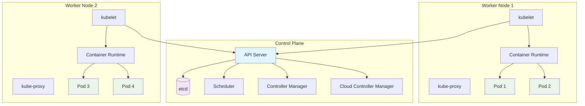

# Session 06: Kubernetes Basic Concepts & Hands-on

## 🎯 **Session Objectives**
By the end of this session, you will be able to:
- Understand Kubernetes architecture and core components
- Master essential kubectl commands for cluster management
- Work with namespaces, labels, and selectors effectively
- Create and manage basic Kubernetes resources
- Understand the Kubernetes API and resource hierarchy

---

## 📚 **Session Agenda** (4 hours)

### **Part 1: Kubernetes Architecture Deep Dive (90 minutes)**
- Control plane components and their functions
- Worker node components and container runtime
- Kubernetes API and resource model

### **Part 2: Core Kubernetes Objects (120 minutes)**
- Pods, ReplicaSets, and Deployments
- Services and Endpoints
- Namespaces and resource organization

### **Part 3: kubectl Mastery (30 minutes)**
- Essential kubectl commands and shortcuts
- Resource management and troubleshooting
- Configuration and context management

---

## 🔧 **Hands-on Labs**

### **Lab 1: Kubernetes Architecture Exploration**

#### **Step 1: Cluster Component Analysis**
```bash
# Examine cluster information
kubectl cluster-info
kubectl cluster-info dump

# List all nodes and their details
kubectl get nodes -o wide
kubectl describe nodes

# Explore control plane components
kubectl get pods -n kube-system
kubectl describe pod -n kube-system $(kubectl get pods -n kube-system | grep etcd | awk '{print $1}')

# Check API server health
kubectl get --raw='/healthz'
kubectl get --raw='/version'

# Examine cluster resources
kubectl api-resources
kubectl api-versions
```

#### **Step 2: Namespace and Resource Management**
```bash
# Create corporate namespaces
kubectl create namespace corporate-dev
kubectl create namespace corporate-staging
kubectl create namespace corporate-prod

# Create namespace with YAML
cat > corporate-namespaces.yaml << EOF
apiVersion: v1
kind: Namespace
metadata:
  name: corporate-monitoring
  labels:
    environment: shared
    team: platform
---
apiVersion: v1
kind: Namespace
metadata:
  name: corporate-security
  labels:
    environment: shared
    team: security
EOF

kubectl apply -f corporate-namespaces.yaml

# List all namespaces
kubectl get namespaces --show-labels

# Set default namespace context
kubectl config set-context --current --namespace=corporate-dev
kubectl config view --minify | grep namespace
```

### **Lab 2: Pod Creation and Management**

#### **Step 1: Basic Pod Operations**
```bash
# Create a simple pod imperatively
kubectl run corporate-app --image=nginx:1.21 --port=80 -n corporate-dev

# Create pod with labels
kubectl run database --image=postgres:14 --port=5432 \
  --labels="app=database,tier=backend,version=v1.0" \
  -n corporate-dev

# Create pod declaratively
cat > corporate-pod-advanced.yaml << EOF
apiVersion: v1
kind: Pod
metadata:
  name: corporate-web-advanced
  namespace: corporate-dev
  labels:
    app: corporate-web
    tier: frontend
    version: v2.0
    environment: development
  annotations:
    description: "Advanced corporate web application"
    maintainer: "varun.manik@corporate.com"
spec:
  containers:
  - name: web-server
    image: nginx:1.21
    ports:
    - containerPort: 80
      name: http
    - containerPort: 443
      name: https
    env:
    - name: ENVIRONMENT
      value: "development"
    - name: LOG_LEVEL
      value: "debug"
    resources:
      requests:
        memory: "128Mi"
        cpu: "100m"
      limits:
        memory: "256Mi"
        cpu: "200m"
    livenessProbe:
      httpGet:
        path: /
        port: 80
      initialDelaySeconds: 30
      periodSeconds: 10
    readinessProbe:
      httpGet:
        path: /
        port: 80
      initialDelaySeconds: 5
      periodSeconds: 5
  - name: log-collector
    image: busybox:1.35
    command: ['sh', '-c', 'tail -f /var/log/nginx/access.log']
    volumeMounts:
    - name: nginx-logs
      mountPath: /var/log/nginx
  volumes:
  - name: nginx-logs
    emptyDir: {}
  restartPolicy: Always
  nodeSelector:
    kubernetes.io/os: linux
EOF

kubectl apply -f corporate-pod-advanced.yaml

# Examine pod details
kubectl get pods -n corporate-dev -o wide --show-labels
kubectl describe pod corporate-web-advanced -n corporate-dev
```

#### **Step 2: Labels and Selectors**
```bash
# Add labels to existing pods
kubectl label pod corporate-app -n corporate-dev tier=frontend
kubectl label pod database -n corporate-dev tier=backend

# Query pods using label selectors
kubectl get pods -n corporate-dev --selector="tier=frontend"
kubectl get pods -n corporate-dev --selector="app=database"
kubectl get pods -n corporate-dev --selector="tier in (frontend,backend)"

# Show labels in output
kubectl get pods -n corporate-dev --show-labels

# Remove labels
kubectl label pod corporate-app -n corporate-dev tier-

# Update labels
kubectl label pod corporate-app -n corporate-dev version=v1.1 --overwrite
```

**Expected Output:**
```
NAME                     READY   STATUS    RESTARTS   AGE   LABELS
corporate-app            1/1     Running   0          5m    app=corporate-app,tier=frontend,version=v1.1
corporate-web-advanced   2/2     Running   0          3m    app=corporate-web,environment=development,tier=frontend,version=v2.0
database                 1/1     Running   0          4m    app=database,tier=backend,version=v1.0
```

---

## 📊 **Kubernetes Architecture Diagram**



---

## 🏢 **Real-World Use Case: Multi-Tenant Banking Platform**

### **Scenario: BFSI Kubernetes Implementation**
A major bank implements Kubernetes for their digital banking platform with strict isolation requirements:

**Namespace Strategy:**
```bash
# Create environment-based namespaces
kubectl create namespace banking-dev
kubectl create namespace banking-staging  
kubectl create namespace banking-prod

# Create service-based namespaces
kubectl create namespace customer-services
kubectl create namespace payment-services
kubectl create namespace loan-services
kubectl create namespace compliance-services

# Apply resource quotas for cost control
cat > banking-resource-quotas.yaml << EOF
apiVersion: v1
kind: ResourceQuota
metadata:
  name: banking-dev-quota
  namespace: banking-dev
spec:
  hard:
    requests.cpu: "4"
    requests.memory: 8Gi
    limits.cpu: "8"
    limits.memory: 16Gi
    pods: "10"
    services: "5"
    persistentvolumeclaims: "4"
---
apiVersion: v1
kind: ResourceQuota
metadata:
  name: banking-prod-quota
  namespace: banking-prod
spec:
  hard:
    requests.cpu: "20"
    requests.memory: 40Gi
    limits.cpu: "40"
    limits.memory: 80Gi
    pods: "50"
    services: "20"
    persistentvolumeclaims: "20"
EOF

kubectl apply -f banking-resource-quotas.yaml
```

**Label Strategy for Compliance:**
```yaml
# Banking application with compliance labels
apiVersion: v1
kind: Pod
metadata:
  name: payment-processor
  namespace: payment-services
  labels:
    app: payment-processor
    tier: backend
    compliance: pci-dss
    data-classification: restricted
    business-unit: payments
    cost-center: "CC-PAY-001"
    backup-required: "true"
  annotations:
    compliance.bank.com/pci-dss: "required"
    security.bank.com/encryption: "aes-256"
    monitoring.bank.com/sla: "99.99"
spec:
  containers:
  - name: payment-app
    image: bank-registry/payment-processor:v2.1.0
    securityContext:
      runAsNonRoot: true
      runAsUser: 1000
      allowPrivilegeEscalation: false
```

**Benefits Achieved:**
- **Compliance**: Automated PCI DSS compliance through labels
- **Cost Tracking**: Granular cost allocation by business unit
- **Security**: Namespace isolation and RBAC implementation
- **Scalability**: Independent scaling per service domain

---

## 🔍 **Advanced kubectl Operations**

### **Resource Management Commands**
```bash
# Get resources with custom output
kubectl get pods -o wide
kubectl get pods -o yaml
kubectl get pods -o json | jq '.items[].metadata.name'

# Custom columns output
kubectl get pods -o custom-columns=NAME:.metadata.name,STATUS:.status.phase,NODE:.spec.nodeName

# Watch resources in real-time
kubectl get pods -w
kubectl get events --watch

# Resource usage
kubectl top pods -n corporate-dev
kubectl top nodes

# Dry run for validation
kubectl apply -f pod.yaml --dry-run=client
kubectl apply -f pod.yaml --dry-run=server

# Explain resource specifications
kubectl explain pod
kubectl explain pod.spec.containers
kubectl explain deployment.spec.strategy
```

### **Debugging and Troubleshooting**
```bash
# Execute commands in pods
kubectl exec -it corporate-web-advanced -n corporate-dev -- /bin/bash
kubectl exec -it corporate-web-advanced -n corporate-dev -c web-server -- nginx -t

# Port forwarding for local access
kubectl port-forward pod/corporate-web-advanced -n corporate-dev 8080:80

# Copy files to/from pods
kubectl cp /local/file corporate-web-advanced:/tmp/file -n corporate-dev
kubectl cp corporate-web-advanced:/var/log/nginx/access.log ./access.log -n corporate-dev

# View logs
kubectl logs corporate-web-advanced -n corporate-dev
kubectl logs corporate-web-advanced -n corporate-dev -c log-collector
kubectl logs -f corporate-web-advanced -n corporate-dev --tail=50

# Debug pod issues
kubectl describe pod corporate-web-advanced -n corporate-dev
kubectl get events --sort-by=.metadata.creationTimestamp -n corporate-dev
```

---

## 🛠 **Kubernetes API and Resource Management**

### **Understanding API Groups**
```bash
# List API groups
kubectl api-resources

# Group resources by API version
kubectl api-resources --api-group=apps
kubectl api-resources --api-group=networking.k8s.io

# Get specific resource definitions
kubectl get --raw="/api/v1/namespaces/corporate-dev/pods"
kubectl get --raw="/apis/apps/v1/namespaces/corporate-dev/deployments"

# Proxy to API server
kubectl proxy --port=8080 &
curl http://localhost:8080/api/v1/namespaces
```

### **Resource Relationships**
```bash
# Create resources with owner references
cat > related-resources.yaml << EOF
apiVersion: v1
kind: ConfigMap
metadata:
  name: app-config
  namespace: corporate-dev
data:
  database_url: "postgresql://db:5432/corporate"
  log_level: "info"
---
apiVersion: v1
kind: Secret
metadata:
  name: app-secrets
  namespace: corporate-dev
type: Opaque
data:
  db_password: Y29ycG9yYXRlMTIz  # corporate123 base64 encoded
---
apiVersion: v1
kind: Pod
metadata:
  name: app-with-config
  namespace: corporate-dev
spec:
  containers:
  - name: app
    image: nginx:1.21
    env:
    - name: DATABASE_URL
      valueFrom:
        configMapKeyRef:
          name: app-config
          key: database_url
    - name: DB_PASSWORD
      valueFrom:
        secretKeyRef:
          name: app-secrets
          key: db_password
    volumeMounts:
    - name: config-volume
      mountPath: /etc/config
  volumes:
  - name: config-volume
    configMap:
      name: app-config
EOF

kubectl apply -f related-resources.yaml

# Verify relationships
kubectl describe pod app-with-config -n corporate-dev
kubectl get configmaps,secrets,pods -n corporate-dev
```

---

## 📚 **kubectl Configuration and Contexts**

### **Context Management**
```bash
# View current context
kubectl config current-context
kubectl config get-contexts

# Create new context
kubectl config set-context corporate-dev-context \
  --cluster=docker-desktop \
  --namespace=corporate-dev \
  --user=docker-desktop

# Switch contexts
kubectl config use-context corporate-dev-context

# Set default namespace for current context
kubectl config set-context --current --namespace=corporate-staging

# Create kubeconfig for different environments
cat > ~/.kube/corporate-config << EOF
apiVersion: v1
kind: Config
contexts:
- context:
    cluster: docker-desktop
    namespace: corporate-dev
    user: docker-desktop
  name: corporate-dev
- context:
    cluster: docker-desktop
    namespace: corporate-prod
    user: docker-desktop
  name: corporate-prod
current-context: corporate-dev
EOF

# Use specific kubeconfig
export KUBECONFIG=~/.kube/corporate-config
kubectl config get-contexts
```

---

## ✅ **Session 06 Checklist**

- [ ] Understood Kubernetes architecture and core components
- [ ] Mastered essential kubectl commands and operations
- [ ] Created and managed namespaces effectively
- [ ] Worked with labels, selectors, and annotations
- [ ] Created pods with advanced configurations
- [ ] Implemented resource quotas and limits
- [ ] Practiced debugging and troubleshooting techniques
- [ ] Configured kubectl contexts and kubeconfig files
- [ ] Explored Kubernetes API and resource relationships

---

## 🎯 **Next Session Preview**

**Session 07: Pods, Deployments & ReplicaSets**
- Deep dive into pod lifecycle and management
- Understanding ReplicaSets and their role
- Deployment strategies and rolling updates
- Scaling applications horizontally
- Managing application versions and rollbacks

---

## 👨‍💻 **About the Author**

**Varun Kumar Manik** is a distinguished **Cloud Architect, Kubernetes Expert, and DevOps Specialist** with nearly **1.5 decades of hands-on experience** in designing, implementing, and optimizing cloud-native solutions across enterprise environments. As an **AWS Ambassador for 6+ years**, Varun has been officially recognized by Amazon Web Services for his outstanding contributions to the cloud community and deep expertise in AWS technologies.

### 🏆 **Professional Recognition**
- **AWS Ambassador Profile**: [View on AWS Partners Portal](https://aws.amazon.com/partners/ambassadors/)
- **Kubernetes Community Contributor**: Active in CNCF ecosystem
- **Corporate Training Specialist**: Delivered K8s training to 500+ professionals

### 💼 **Professional Expertise**

#### ☸️ **Kubernetes & Container Orchestration**
- Production Kubernetes deployments across Telco, BFSI, and Enterprise sectors
- Multi-cluster management and federation strategies
- Kubernetes security hardening and RBAC implementation
- Service mesh integration (Istio, Linkerd) for enterprise workloads

#### 🚀 **DevOps & CI/CD Excellence**
- GitOps workflows with ArgoCD and Flux
- Infrastructure as Code with Terraform and Helm
- Container security and compliance automation
- Enterprise CI/CD pipeline optimization

### 🌐 **Connect & Follow**

- **GitHub**: [https://github.com/manikcloud](https://github.com/manikcloud)
- **LinkedIn**: [https://www.linkedin.com/in/vkmanik/](https://www.linkedin.com/in/vkmanik/)
- **Email**: [varunmanik1@gmail.com](mailto:varunmanik1@gmail.com)

---

*Next: [Session 07 - Pods, Deployments & ReplicaSets](../session-07-k8s-pods-deployments/)*
