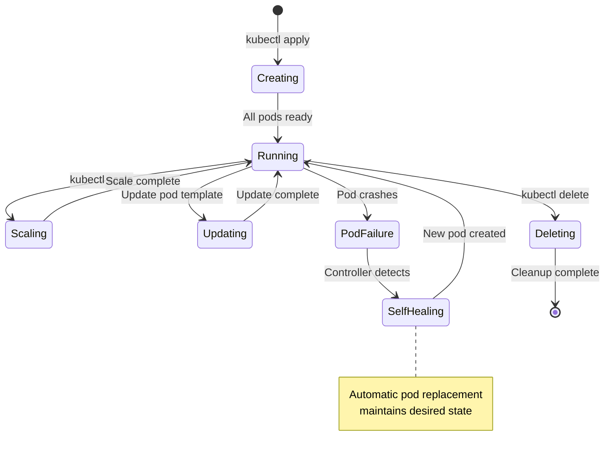

# Session 07: Pods, Deployments & ReplicaSets

## 🎯 **Session Objectives**
By the end of this session, you will be able to:
- Master pod lifecycle management and troubleshooting
- Create and manage ReplicaSets for high availability
- Deploy applications using Deployments with rolling updates
- Implement horizontal scaling strategies
- Perform application rollbacks and version management

---

## 📚 **Session Agenda** (4 hours)

### **Part 1: Pod Lifecycle Deep Dive (90 minutes)**
- Pod phases and container states
- Init containers and sidecar patterns
- Pod networking and storage

### **Part 2: ReplicaSets and High Availability (60 minutes)**
- ReplicaSet creation and management
- Pod template specifications
- Scaling and self-healing mechanisms

### **Part 3: Deployments and Rolling Updates (90 minutes)**
- Deployment strategies and configurations
- Rolling updates and rollback procedures
- Blue-green and canary deployment patterns

---

## 🔧 **Hands-on Labs**

### **Lab 1: Advanced Pod Management**

#### **Step 1: Pod Lifecycle Exploration**
```bash
# Create namespace for this session
kubectl create namespace session-07

# Create pod with init containers
cat > pod-with-init.yaml << EOF
apiVersion: v1
kind: Pod
metadata:
  name: corporate-app-with-init
  namespace: session-07
  labels:
    app: corporate-app
    version: v1.0
spec:
  initContainers:
  - name: database-migration
    image: busybox:1.35
    command: ['sh', '-c']
    args:
    - |
      echo "Running database migrations..."
      sleep 10
      echo "Database migration completed"
  - name: config-setup
    image: busybox:1.35
    command: ['sh', '-c']
    args:
    - |
      echo "Setting up configuration..."
      echo "corporate_config=production" > /shared/config.txt
      sleep 5
      echo "Configuration setup completed"
    volumeMounts:
    - name: shared-data
      mountPath: /shared
  containers:
  - name: main-app
    image: nginx:1.21
    ports:
    - containerPort: 80
    volumeMounts:
    - name: shared-data
      mountPath: /usr/share/nginx/html
    lifecycle:
      postStart:
        exec:
          command: ["/bin/sh", "-c", "echo 'Application started' >> /var/log/app.log"]
      preStop:
        exec:
          command: ["/bin/sh", "-c", "echo 'Application stopping' >> /var/log/app.log && sleep 15"]
  - name: log-sidecar
    image: busybox:1.35
    command: ['sh', '-c', 'tail -f /var/log/app.log']
    volumeMounts:
    - name: log-volume
      mountPath: /var/log
  volumes:
  - name: shared-data
    emptyDir: {}
  - name: log-volume
    emptyDir: {}
  restartPolicy: Always
EOF

kubectl apply -f pod-with-init.yaml

# Watch pod creation process
kubectl get pods -n session-07 -w

# Check init container logs
kubectl logs corporate-app-with-init -n session-07 -c database-migration
kubectl logs corporate-app-with-init -n session-07 -c config-setup

# Check main container logs
kubectl logs corporate-app-with-init -n session-07 -c main-app
kubectl logs corporate-app-with-init -n session-07 -c log-sidecar
```

### **Lab 2: ReplicaSet Management**

#### **Step 1: Create and Manage ReplicaSets**
```bash
# Create ReplicaSet
cat > corporate-replicaset.yaml << EOF
apiVersion: apps/v1
kind: ReplicaSet
metadata:
  name: corporate-web-rs
  namespace: session-07
  labels:
    app: corporate-web
    tier: frontend
spec:
  replicas: 3
  selector:
    matchLabels:
      app: corporate-web
      tier: frontend
  template:
    metadata:
      labels:
        app: corporate-web
        tier: frontend
        version: v1.0
    spec:
      containers:
      - name: web-server
        image: nginx:1.21
        ports:
        - containerPort: 80
        resources:
          requests:
            memory: "64Mi"
            cpu: "50m"
          limits:
            memory: "128Mi"
            cpu: "100m"
        env:
        - name: ENVIRONMENT
          value: "production"
        - name: REPLICA_ID
          valueFrom:
            fieldRef:
              fieldPath: metadata.name
EOF

kubectl apply -f corporate-replicaset.yaml

# Verify ReplicaSet creation
kubectl get replicasets -n session-07
kubectl get pods -n session-07 --show-labels

# Test self-healing by deleting a pod
kubectl delete pod $(kubectl get pods -n session-07 -l app=corporate-web -o jsonpath='{.items[0].metadata.name}')

# Watch automatic pod recreation
kubectl get pods -n session-07 -w

# Scale ReplicaSet
kubectl scale replicaset corporate-web-rs --replicas=5 -n session-07
kubectl get pods -n session-07
```

### **Lab 3: Deployment Strategies**

#### **Step 1: Rolling Update Deployment**
```bash
# Create initial deployment
cat > corporate-deployment.yaml << EOF
apiVersion: apps/v1
kind: Deployment
metadata:
  name: corporate-api-deployment
  namespace: session-07
  labels:
    app: corporate-api
spec:
  replicas: 4
  strategy:
    type: RollingUpdate
    rollingUpdate:
      maxUnavailable: 1
      maxSurge: 1
  selector:
    matchLabels:
      app: corporate-api
  template:
    metadata:
      labels:
        app: corporate-api
        version: v1.0
    spec:
      containers:
      - name: api-server
        image: nginx:1.20  # Starting with older version
        ports:
        - containerPort: 80
        resources:
          requests:
            memory: "128Mi"
            cpu: "100m"
          limits:
            memory: "256Mi"
            cpu: "200m"
        readinessProbe:
          httpGet:
            path: /
            port: 80
          initialDelaySeconds: 5
          periodSeconds: 5
        livenessProbe:
          httpGet:
            path: /
            port: 80
          initialDelaySeconds: 30
          periodSeconds: 10
        env:
        - name: VERSION
          value: "1.0"
EOF

kubectl apply -f corporate-deployment.yaml

# Check deployment status
kubectl get deployments -n session-07
kubectl rollout status deployment/corporate-api-deployment -n session-07

# Perform rolling update
kubectl set image deployment/corporate-api-deployment api-server=nginx:1.21 -n session-07

# Watch rolling update process
kubectl rollout status deployment/corporate-api-deployment -n session-07 -w

# Check rollout history
kubectl rollout history deployment/corporate-api-deployment -n session-07

# Update with change cause annotation
kubectl annotate deployment/corporate-api-deployment kubernetes.io/change-cause="Updated to nginx 1.21 for security patches" -n session-07

# Perform another update
kubectl set env deployment/corporate-api-deployment VERSION=2.0 -n session-07
kubectl annotate deployment/corporate-api-deployment kubernetes.io/change-cause="Updated version to 2.0" -n session-07

# View detailed rollout history
kubectl rollout history deployment/corporate-api-deployment -n session-07
```

#### **Step 2: Rollback Operations**
```bash
# Simulate problematic deployment
kubectl set image deployment/corporate-api-deployment api-server=nginx:invalid-tag -n session-07

# Check deployment status (should show issues)
kubectl get pods -n session-07
kubectl rollout status deployment/corporate-api-deployment -n session-07

# Rollback to previous version
kubectl rollout undo deployment/corporate-api-deployment -n session-07

# Rollback to specific revision
kubectl rollout undo deployment/corporate-api-deployment --to-revision=1 -n session-07

# Verify rollback
kubectl get pods -n session-07
kubectl describe deployment corporate-api-deployment -n session-07
```

**Expected Output:**
```
NAME                                      READY   STATUS    RESTARTS   AGE
corporate-api-deployment-7d4f8b6c8-abc12   1/1     Running   0          30s
corporate-api-deployment-7d4f8b6c8-def34   1/1     Running   0          30s
corporate-api-deployment-7d4f8b6c8-ghi56   1/1     Running   0          30s
corporate-api-deployment-7d4f8b6c8-jkl78   1/1     Running   0          30s
```

---

## 📊 **ReplicaSet Lifecycle Diagram**



---

## 🏢 **Real-World Use Case: Telecom 5G Core Scaling**

### **Scenario: 5G Network Function Auto-Scaling**
A telecom operator implements Kubernetes for their 5G core network functions with dynamic scaling:

**User Plane Function (UPF) Deployment:**
```yaml
apiVersion: apps/v1
kind: Deployment
metadata:
  name: upf-deployment
  namespace: telco-5g-core
  labels:
    app: upf
    network-function: user-plane
    generation: 5g
spec:
  replicas: 3
  strategy:
    type: RollingUpdate
    rollingUpdate:
      maxUnavailable: 0  # Zero downtime for telecom
      maxSurge: 2
  selector:
    matchLabels:
      app: upf
  template:
    metadata:
      labels:
        app: upf
        network-function: user-plane
        version: v2.1.0
    spec:
      containers:
      - name: upf-container
        image: telco-registry/5g-upf:v2.1.0
        ports:
        - containerPort: 8805  # GTP-U port
        - containerPort: 8080  # Management port
        resources:
          requests:
            memory: "2Gi"
            cpu: "1000m"
            hugepages-1Gi: "4Gi"
          limits:
            memory: "4Gi"
            cpu: "2000m"
            hugepages-1Gi: "4Gi"
        env:
        - name: NETWORK_SLICE_ID
          value: "slice-001"
        - name: QOS_PROFILE
          value: "ultra-low-latency"
        readinessProbe:
          httpGet:
            path: /health
            port: 8080
          initialDelaySeconds: 30
          periodSeconds: 10
        livenessProbe:
          httpGet:
            path: /health
            port: 8080
          initialDelaySeconds: 60
          periodSeconds: 30
      nodeSelector:
        node-type: compute-intensive
      tolerations:
      - key: "telco-workload"
        operator: "Equal"
        value: "5g-core"
        effect: "NoSchedule"
```

**Session Management Function (SMF) with Canary Deployment:**
```bash
# Initial SMF deployment
kubectl apply -f smf-deployment-v1.yaml

# Canary deployment (10% traffic)
cat > smf-canary-deployment.yaml << EOF
apiVersion: apps/v1
kind: Deployment
metadata:
  name: smf-canary
  namespace: telco-5g-core
spec:
  replicas: 1  # 10% of total traffic
  selector:
    matchLabels:
      app: smf
      version: canary
  template:
    metadata:
      labels:
        app: smf
        version: canary
    spec:
      containers:
      - name: smf-container
        image: telco-registry/5g-smf:v2.2.0-beta
        # ... container spec
EOF

kubectl apply -f smf-canary-deployment.yaml

# Monitor canary performance
kubectl logs -l app=smf,version=canary -n telco-5g-core

# Promote canary to full deployment if successful
kubectl patch deployment smf-deployment -n telco-5g-core -p '{"spec":{"template":{"spec":{"containers":[{"name":"smf-container","image":"telco-registry/5g-smf:v2.2.0"}]}}}}'
```

**Benefits Achieved:**
- **Zero Downtime**: Rolling updates with maxUnavailable: 0
- **Traffic Management**: Canary deployments for risk mitigation
- **Resource Optimization**: Right-sized containers for network functions
- **High Availability**: Multi-replica deployments across availability zones

---

## 🔍 **Advanced Deployment Patterns**

### **Blue-Green Deployment**
```bash
# Blue deployment (current production)
cat > blue-deployment.yaml << EOF
apiVersion: apps/v1
kind: Deployment
metadata:
  name: corporate-app-blue
  namespace: session-07
spec:
  replicas: 3
  selector:
    matchLabels:
      app: corporate-app
      version: blue
  template:
    metadata:
      labels:
        app: corporate-app
        version: blue
    spec:
      containers:
      - name: app
        image: nginx:1.20
        env:
        - name: VERSION
          value: "blue"
        - name: BACKGROUND_COLOR
          value: "#0066cc"
EOF

# Green deployment (new version)
cat > green-deployment.yaml << EOF
apiVersion: apps/v1
kind: Deployment
metadata:
  name: corporate-app-green
  namespace: session-07
spec:
  replicas: 3
  selector:
    matchLabels:
      app: corporate-app
      version: green
  template:
    metadata:
      labels:
        app: corporate-app
        version: green
    spec:
      containers:
      - name: app
        image: nginx:1.21
        env:
        - name: VERSION
          value: "green"
        - name: BACKGROUND_COLOR
          value: "#00cc66"
EOF

# Service for traffic switching
cat > app-service.yaml << EOF
apiVersion: v1
kind: Service
metadata:
  name: corporate-app-service
  namespace: session-07
spec:
  selector:
    app: corporate-app
    version: blue  # Initially pointing to blue
  ports:
  - port: 80
    targetPort: 80
  type: ClusterIP
EOF

# Deploy blue version
kubectl apply -f blue-deployment.yaml
kubectl apply -f app-service.yaml

# Deploy green version (parallel)
kubectl apply -f green-deployment.yaml

# Test green version separately
kubectl port-forward deployment/corporate-app-green 8081:80 -n session-07 &

# Switch traffic to green (blue-green cutover)
kubectl patch service corporate-app-service -n session-07 -p '{"spec":{"selector":{"version":"green"}}}'

# Rollback if needed
kubectl patch service corporate-app-service -n session-07 -p '{"spec":{"selector":{"version":"blue"}}}'
```

### **Horizontal Pod Autoscaler (HPA)**
```bash
# Enable metrics server (if not already enabled)
kubectl apply -f https://github.com/kubernetes-sigs/metrics-server/releases/latest/download/components.yaml

# Create deployment with resource requests
cat > hpa-deployment.yaml << EOF
apiVersion: apps/v1
kind: Deployment
metadata:
  name: corporate-app-hpa
  namespace: session-07
spec:
  replicas: 2
  selector:
    matchLabels:
      app: corporate-app-hpa
  template:
    metadata:
      labels:
        app: corporate-app-hpa
    spec:
      containers:
      - name: app
        image: nginx:1.21
        resources:
          requests:
            cpu: 100m
            memory: 128Mi
          limits:
            cpu: 200m
            memory: 256Mi
EOF

kubectl apply -f hpa-deployment.yaml

# Create HPA
kubectl autoscale deployment corporate-app-hpa --cpu-percent=50 --min=2 --max=10 -n session-07

# View HPA status
kubectl get hpa -n session-07

# Generate load to test scaling
kubectl run load-generator --image=busybox -n session-07 --rm -it --restart=Never -- /bin/sh -c "while true; do wget -q -O- http://corporate-app-hpa.session-07.svc.cluster.local; done"

# Watch scaling in action
kubectl get hpa -n session-07 -w
kubectl get pods -n session-07 -w
```

---

## 🛠 **Troubleshooting Deployments**

### **Common Issues and Solutions**

#### **Issue 1: ImagePullBackOff**
```bash
# Check pod events
kubectl describe pod <pod-name> -n session-07

# Common solutions:
# 1. Fix image name/tag
kubectl set image deployment/corporate-api-deployment api-server=nginx:1.21 -n session-07

# 2. Add image pull secrets for private registries
kubectl create secret docker-registry regcred \
  --docker-server=private-registry.com \
  --docker-username=user \
  --docker-password=password \
  --docker-email=user@company.com \
  -n session-07

# Update deployment to use secret
kubectl patch deployment corporate-api-deployment -n session-07 -p '{"spec":{"template":{"spec":{"imagePullSecrets":[{"name":"regcred"}]}}}}'
```

#### **Issue 2: CrashLoopBackOff**
```bash
# Check container logs
kubectl logs <pod-name> -n session-07 --previous

# Check resource constraints
kubectl describe pod <pod-name> -n session-07

# Increase resource limits if needed
kubectl patch deployment corporate-api-deployment -n session-07 -p '{"spec":{"template":{"spec":{"containers":[{"name":"api-server","resources":{"limits":{"memory":"512Mi","cpu":"500m"}}}]}}}}'
```

#### **Issue 3: Rolling Update Stuck**
```bash
# Check rollout status
kubectl rollout status deployment/corporate-api-deployment -n session-07

# Check for readiness probe failures
kubectl get pods -n session-07
kubectl describe pod <failing-pod> -n session-07

# Force rollout restart
kubectl rollout restart deployment/corporate-api-deployment -n session-07
```

---

## ✅ **Session 07 Checklist**

- [ ] Mastered pod lifecycle and init container patterns
- [ ] Created and managed ReplicaSets for high availability
- [ ] Implemented rolling update deployments
- [ ] Performed application rollbacks and version management
- [ ] Configured horizontal pod autoscaling
- [ ] Practiced blue-green and canary deployment strategies
- [ ] Troubleshot common deployment issues
- [ ] Applied enterprise-grade deployment patterns

---

## 🎯 **Next Session Preview**

**Session 08: Services, Networking & Ingress**
- Kubernetes networking fundamentals
- Service types and load balancing
- Ingress controllers and routing
- Network policies and security
- Service mesh introduction

---

## 👨‍💻 **About the Author**

**Varun Kumar Manik** is a distinguished **Cloud Architect, Kubernetes Expert, and DevOps Specialist** with nearly **1.5 decades of hands-on experience** in designing, implementing, and optimizing cloud-native solutions across enterprise environments. As an **AWS Ambassador for 6+ years**, Varun has been officially recognized by Amazon Web Services for his outstanding contributions to the cloud community and deep expertise in AWS technologies.

### 🏆 **Professional Recognition**
- **AWS Ambassador Profile**: [View on AWS Partners Portal](https://aws.amazon.com/partners/ambassadors/)
- **Kubernetes Community Contributor**: Active in CNCF ecosystem
- **Corporate Training Specialist**: Delivered K8s training to 500+ professionals

### 💼 **Professional Expertise**

#### ☸️ **Kubernetes & Container Orchestration**
- Production Kubernetes deployments across Telco, BFSI, and Enterprise sectors
- Multi-cluster management and federation strategies
- Kubernetes security hardening and RBAC implementation
- Service mesh integration (Istio, Linkerd) for enterprise workloads

#### 🚀 **DevOps & CI/CD Excellence**
- GitOps workflows with ArgoCD and Flux
- Infrastructure as Code with Terraform and Helm
- Container security and compliance automation
- Enterprise CI/CD pipeline optimization

### 🌐 **Connect & Follow**

- **GitHub**: [https://github.com/manikcloud](https://github.com/manikcloud)
- **LinkedIn**: [https://www.linkedin.com/in/vkmanik/](https://www.linkedin.com/in/vkmanik/)
- **Email**: [varunmanik1@gmail.com](mailto:varunmanik1@gmail.com)

---

*Next: [Session 08 - Services, Networking & Ingress](../session-08-k8s-services-networking/)*
