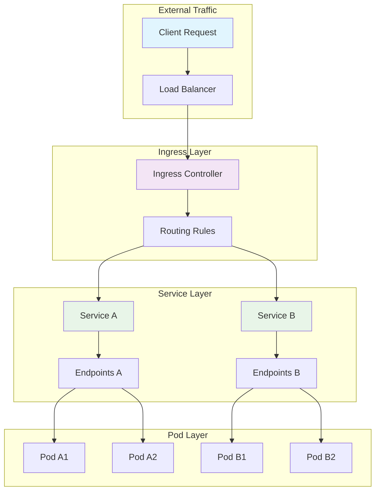

# Session 08: Services, Networking & Ingress

## 🎯 **Session Objectives**
By the end of this session, you will be able to:
- Understand Kubernetes networking fundamentals and service discovery
- Create and manage different types of services (ClusterIP, NodePort, LoadBalancer)
- Configure Ingress controllers for external traffic routing
- Implement network policies for security and microsegmentation
- Troubleshoot networking issues in Kubernetes clusters

---

## 📚 **Session Agenda** (4 hours)

### **Part 1: Kubernetes Networking Fundamentals (90 minutes)**
- Pod-to-pod communication and CNI
- Service discovery and DNS
- Network namespaces and isolation

### **Part 2: Services and Load Balancing (90 minutes)**
- Service types and use cases
- Endpoints and service mesh basics
- External service integration

### **Part 3: Ingress and Traffic Management (60 minutes)**
- Ingress controllers and routing rules
- SSL/TLS termination and certificates
- Advanced traffic management patterns

---

## 🔧 **Hands-on Labs**

### **Lab 1: Service Types and Discovery**

#### **Step 1: ClusterIP Service**
```bash
# Create namespace for networking labs
kubectl create namespace networking-lab

# Deploy backend application
cat > backend-deployment.yaml << EOF
apiVersion: apps/v1
kind: Deployment
metadata:
  name: backend-api
  namespace: networking-lab
spec:
  replicas: 3
  selector:
    matchLabels:
      app: backend-api
  template:
    metadata:
      labels:
        app: backend-api
        tier: backend
    spec:
      containers:
      - name: api
        image: nginx:1.21
        ports:
        - containerPort: 80
        env:
        - name: SERVICE_NAME
          value: "backend-api"
        - name: POD_IP
          valueFrom:
            fieldRef:
              fieldPath: status.podIP
        volumeMounts:
        - name: html-content
          mountPath: /usr/share/nginx/html
      volumes:
      - name: html-content
        configMap:
          name: backend-content
---
apiVersion: v1
kind: ConfigMap
metadata:
  name: backend-content
  namespace: networking-lab
data:
  index.html: |
    <!DOCTYPE html>
    <html>
    <head><title>Backend API</title></head>
    <body>
        <h1>Backend API Service</h1>
        <p>Pod IP: <span id="podip"></span></p>
        <p>Service: backend-api</p>
        <p>Timestamp: <span id="timestamp"></span></p>
        <script>
            document.getElementById('podip').textContent = window.location.hostname;
            document.getElementById('timestamp').textContent = new Date().toISOString();
        </script>
    </body>
    </html>
---
apiVersion: v1
kind: Service
metadata:
  name: backend-service
  namespace: networking-lab
spec:
  selector:
    app: backend-api
  ports:
  - protocol: TCP
    port: 80
    targetPort: 80
  type: ClusterIP
EOF

kubectl apply -f backend-deployment.yaml

# Test service discovery
kubectl run test-pod --image=busybox -n networking-lab --rm -it --restart=Never -- /bin/sh

# Inside the test pod:
# nslookup backend-service
# nslookup backend-service.networking-lab.svc.cluster.local
# wget -qO- http://backend-service/
# exit
```

#### **Step 2: NodePort Service**
```bash
# Create NodePort service for external access
cat > frontend-nodeport.yaml << EOF
apiVersion: apps/v1
kind: Deployment
metadata:
  name: frontend-web
  namespace: networking-lab
spec:
  replicas: 2
  selector:
    matchLabels:
      app: frontend-web
  template:
    metadata:
      labels:
        app: frontend-web
        tier: frontend
    spec:
      containers:
      - name: web
        image: nginx:1.21
        ports:
        - containerPort: 80
        volumeMounts:
        - name: html-content
          mountPath: /usr/share/nginx/html
      volumes:
      - name: html-content
        configMap:
          name: frontend-content
---
apiVersion: v1
kind: ConfigMap
metadata:
  name: frontend-content
  namespace: networking-lab
data:
  index.html: |
    <!DOCTYPE html>
    <html>
    <head><title>Corporate Frontend</title></head>
    <body>
        <h1>Corporate Web Application</h1>
        <button onclick="callBackend()">Call Backend API</button>
        <div id="result"></div>
        <script>
            async function callBackend() {
                try {
                    const response = await fetch('/api/');
                    const data = await response.text();
                    document.getElementById('result').innerHTML = data;
                } catch (error) {
                    document.getElementById('result').innerHTML = 'Error: ' + error;
                }
            }
        </script>
    </body>
    </html>
  nginx.conf: |
    events { worker_connections 1024; }
    http {
        upstream backend {
            server backend-service.networking-lab.svc.cluster.local:80;
        }
        server {
            listen 80;
            location / {
                root /usr/share/nginx/html;
                index index.html;
            }
            location /api/ {
                proxy_pass http://backend/;
            }
        }
    }
---
apiVersion: v1
kind: Service
metadata:
  name: frontend-nodeport
  namespace: networking-lab
spec:
  selector:
    app: frontend-web
  ports:
  - protocol: TCP
    port: 80
    targetPort: 80
    nodePort: 30080
  type: NodePort
EOF

kubectl apply -f frontend-nodeport.yaml

# Test NodePort access
curl http://localhost:30080
# Or open in browser: http://localhost:30080
```

### **Lab 2: Ingress Configuration**

#### **Step 1: Install Ingress Controller**
```bash
# Install NGINX Ingress Controller
kubectl apply -f https://raw.githubusercontent.com/kubernetes/ingress-nginx/controller-v1.8.1/deploy/static/provider/cloud/deploy.yaml

# Wait for ingress controller to be ready
kubectl wait --namespace ingress-nginx \
  --for=condition=ready pod \
  --selector=app.kubernetes.io/component=controller \
  --timeout=90s

# Verify ingress controller
kubectl get pods -n ingress-nginx
kubectl get services -n ingress-nginx
```

#### **Step 2: Create Ingress Resources**
```bash
# Create multiple services for ingress routing
cat > multi-service-ingress.yaml << EOF
apiVersion: apps/v1
kind: Deployment
metadata:
  name: api-v1
  namespace: networking-lab
spec:
  replicas: 2
  selector:
    matchLabels:
      app: api
      version: v1
  template:
    metadata:
      labels:
        app: api
        version: v1
    spec:
      containers:
      - name: api
        image: nginx:1.21
        ports:
        - containerPort: 80
        volumeMounts:
        - name: content
          mountPath: /usr/share/nginx/html
      volumes:
      - name: content
        configMap:
          name: api-v1-content
---
apiVersion: apps/v1
kind: Deployment
metadata:
  name: api-v2
  namespace: networking-lab
spec:
  replicas: 2
  selector:
    matchLabels:
      app: api
      version: v2
  template:
    metadata:
      labels:
        app: api
        version: v2
    spec:
      containers:
      - name: api
        image: nginx:1.21
        ports:
        - containerPort: 80
        volumeMounts:
        - name: content
          mountPath: /usr/share/nginx/html
      volumes:
      - name: content
        configMap:
          name: api-v2-content
---
apiVersion: v1
kind: ConfigMap
metadata:
  name: api-v1-content
  namespace: networking-lab
data:
  index.html: |
    <h1>API Version 1.0</h1>
    <p>This is the stable API version</p>
---
apiVersion: v1
kind: ConfigMap
metadata:
  name: api-v2-content
  namespace: networking-lab
data:
  index.html: |
    <h1>API Version 2.0</h1>
    <p>This is the new API version with enhanced features</p>
---
apiVersion: v1
kind: Service
metadata:
  name: api-v1-service
  namespace: networking-lab
spec:
  selector:
    app: api
    version: v1
  ports:
  - port: 80
    targetPort: 80
---
apiVersion: v1
kind: Service
metadata:
  name: api-v2-service
  namespace: networking-lab
spec:
  selector:
    app: api
    version: v2
  ports:
  - port: 80
    targetPort: 80
---
apiVersion: networking.k8s.io/v1
kind: Ingress
metadata:
  name: corporate-ingress
  namespace: networking-lab
  annotations:
    nginx.ingress.kubernetes.io/rewrite-target: /
    nginx.ingress.kubernetes.io/ssl-redirect: "false"
spec:
  ingressClassName: nginx
  rules:
  - host: corporate-api.local
    http:
      paths:
      - path: /v1
        pathType: Prefix
        backend:
          service:
            name: api-v1-service
            port:
              number: 80
      - path: /v2
        pathType: Prefix
        backend:
          service:
            name: api-v2-service
            port:
              number: 80
      - path: /
        pathType: Prefix
        backend:
          service:
            name: frontend-nodeport
            port:
              number: 80
EOF

kubectl apply -f multi-service-ingress.yaml

# Add host entry for local testing
echo "127.0.0.1 corporate-api.local" | sudo tee -a /etc/hosts

# Test ingress routing
curl http://corporate-api.local/v1
curl http://corporate-api.local/v2
curl http://corporate-api.local/
```

**Expected Output:**
```
<h1>API Version 1.0</h1>
<p>This is the stable API version</p>
```

---

## 📊 **Kubernetes Networking Flow**



---

## 🏢 **Real-World Use Case: Banking API Gateway**

### **Scenario: BFSI Microservices Network Architecture**
A bank implements Kubernetes networking for their digital banking platform:

**Multi-Tier Network Architecture:**
```yaml
# API Gateway with Ingress
apiVersion: networking.k8s.io/v1
kind: Ingress
metadata:
  name: banking-api-gateway
  namespace: banking-prod
  annotations:
    nginx.ingress.kubernetes.io/rate-limit: "100"
    nginx.ingress.kubernetes.io/ssl-redirect: "true"
    nginx.ingress.kubernetes.io/auth-tls-verify-client: "on"
    nginx.ingress.kubernetes.io/auth-tls-secret: "banking-prod/client-ca-secret"
spec:
  tls:
  - hosts:
    - api.bank.com
    secretName: banking-tls-secret
  rules:
  - host: api.bank.com
    http:
      paths:
      - path: /accounts
        pathType: Prefix
        backend:
          service:
            name: account-service
            port:
              number: 80
      - path: /payments
        pathType: Prefix
        backend:
          service:
            name: payment-service
            port:
              number: 80
      - path: /loans
        pathType: Prefix
        backend:
          service:
            name: loan-service
            port:
              number: 80
---
# Internal service mesh communication
apiVersion: v1
kind: Service
metadata:
  name: account-service
  namespace: banking-prod
  annotations:
    service.beta.kubernetes.io/aws-load-balancer-internal: "true"
spec:
  selector:
    app: account-service
  ports:
  - port: 80
    targetPort: 8080
  type: ClusterIP
---
# Database service with headless service
apiVersion: v1
kind: Service
metadata:
  name: postgres-primary
  namespace: banking-prod
spec:
  selector:
    app: postgres
    role: primary
  ports:
  - port: 5432
    targetPort: 5432
  clusterIP: None  # Headless service for StatefulSet
```

**Network Policies for Security:**
```yaml
apiVersion: networking.k8s.io/v1
kind: NetworkPolicy
metadata:
  name: banking-network-policy
  namespace: banking-prod
spec:
  podSelector:
    matchLabels:
      tier: backend
  policyTypes:
  - Ingress
  - Egress
  ingress:
  - from:
    - podSelector:
        matchLabels:
          tier: frontend
    ports:
    - protocol: TCP
      port: 8080
  egress:
  - to:
    - podSelector:
        matchLabels:
          app: postgres
    ports:
    - protocol: TCP
      port: 5432
  - to: []  # Allow DNS
    ports:
    - protocol: UDP
      port: 53
```

**Benefits Achieved:**
- **Security**: mTLS authentication and network policies
- **Scalability**: Load balancing across multiple service instances
- **Compliance**: Audit trails and encrypted communication
- **Performance**: Optimized routing and caching strategies

---

## 🔍 **Advanced Networking Concepts**

### **Service Mesh with Istio**
```bash
# Install Istio (simplified for demo)
curl -L https://istio.io/downloadIstio | sh -
cd istio-*
export PATH=$PWD/bin:$PATH

# Install Istio
istioctl install --set values.defaultRevision=default

# Enable sidecar injection
kubectl label namespace networking-lab istio-injection=enabled

# Create virtual service for traffic splitting
cat > virtual-service.yaml << EOF
apiVersion: networking.istio.io/v1alpha3
kind: VirtualService
metadata:
  name: api-virtual-service
  namespace: networking-lab
spec:
  hosts:
  - api-service
  http:
  - match:
    - headers:
        version:
          exact: v2
    route:
    - destination:
        host: api-service
        subset: v2
  - route:
    - destination:
        host: api-service
        subset: v1
      weight: 90
    - destination:
        host: api-service
        subset: v2
      weight: 10
---
apiVersion: networking.istio.io/v1alpha3
kind: DestinationRule
metadata:
  name: api-destination-rule
  namespace: networking-lab
spec:
  host: api-service
  subsets:
  - name: v1
    labels:
      version: v1
  - name: v2
    labels:
      version: v2
EOF

kubectl apply -f virtual-service.yaml
```

### **External Services Integration**
```bash
# External service without selector
cat > external-service.yaml << EOF
apiVersion: v1
kind: Service
metadata:
  name: external-database
  namespace: networking-lab
spec:
  ports:
  - port: 5432
    targetPort: 5432
  type: ClusterIP
---
apiVersion: v1
kind: Endpoints
metadata:
  name: external-database
  namespace: networking-lab
subsets:
- addresses:
  - ip: 10.0.1.100  # External database IP
  ports:
  - port: 5432
---
# ExternalName service for external APIs
apiVersion: v1
kind: Service
metadata:
  name: payment-gateway
  namespace: networking-lab
spec:
  type: ExternalName
  externalName: api.paymentgateway.com
  ports:
  - port: 443
    targetPort: 443
EOF

kubectl apply -f external-service.yaml
```

---

## 🛠 **Network Troubleshooting**

### **Common Networking Issues**

#### **Issue 1: Service Not Accessible**
```bash
# Check service and endpoints
kubectl get services -n networking-lab
kubectl get endpoints -n networking-lab

# Test DNS resolution
kubectl run debug-pod --image=busybox -n networking-lab --rm -it --restart=Never -- nslookup backend-service

# Check network connectivity
kubectl run debug-pod --image=nicolaka/netshoot -n networking-lab --rm -it --restart=Never -- /bin/bash
# Inside pod: telnet backend-service 80
```

#### **Issue 2: Ingress Not Working**
```bash
# Check ingress controller logs
kubectl logs -n ingress-nginx -l app.kubernetes.io/component=controller

# Verify ingress resource
kubectl describe ingress corporate-ingress -n networking-lab

# Check ingress controller service
kubectl get services -n ingress-nginx
```

#### **Issue 3: Network Policy Blocking Traffic**
```bash
# List network policies
kubectl get networkpolicies -n networking-lab

# Describe network policy
kubectl describe networkpolicy banking-network-policy -n banking-prod

# Test connectivity with temporary policy removal
kubectl delete networkpolicy banking-network-policy -n banking-prod
# Test connection
# Recreate policy
kubectl apply -f network-policy.yaml
```

---

## ✅ **Session 08 Checklist**

- [ ] Understood Kubernetes networking fundamentals
- [ ] Created and tested different service types (ClusterIP, NodePort, LoadBalancer)
- [ ] Configured Ingress controllers and routing rules
- [ ] Implemented network policies for security
- [ ] Practiced service discovery and DNS resolution
- [ ] Set up SSL/TLS termination with Ingress
- [ ] Troubleshot common networking issues
- [ ] Explored service mesh concepts with Istio

---

## 🎯 **Next Session Preview**

**Session 09: Storage, ConfigMaps & Secrets**
- Persistent volumes and storage classes
- ConfigMaps for application configuration
- Secrets management and security
- StatefulSets for stateful applications
- Backup and disaster recovery strategies

---

## 👨‍💻 **About the Author**

**Varun Kumar Manik** is a distinguished **Cloud Architect, Kubernetes Expert, and DevOps Specialist** with nearly **1.5 decades of hands-on experience** in designing, implementing, and optimizing cloud-native solutions across enterprise environments. As an **AWS Ambassador for 6+ years**, Varun has been officially recognized by Amazon Web Services for his outstanding contributions to the cloud community and deep expertise in AWS technologies.

### 🏆 **Professional Recognition**
- **AWS Ambassador Profile**: [View on AWS Partners Portal](https://aws.amazon.com/partners/ambassadors/)
- **Kubernetes Community Contributor**: Active in CNCF ecosystem
- **Corporate Training Specialist**: Delivered K8s training to 500+ professionals

### 💼 **Professional Expertise**

#### ☸️ **Kubernetes & Container Orchestration**
- Production Kubernetes deployments across Telco, BFSI, and Enterprise sectors
- Multi-cluster management and federation strategies
- Kubernetes security hardening and RBAC implementation
- Service mesh integration (Istio, Linkerd) for enterprise workloads

#### 🚀 **DevOps & CI/CD Excellence**
- GitOps workflows with ArgoCD and Flux
- Infrastructure as Code with Terraform and Helm
- Container security and compliance automation
- Enterprise CI/CD pipeline optimization

### 🌐 **Connect & Follow**

- **GitHub**: [https://github.com/manikcloud](https://github.com/manikcloud)
- **LinkedIn**: [https://www.linkedin.com/in/vkmanik/](https://www.linkedin.com/in/vkmanik/)
- **Email**: [varunmanik1@gmail.com](mailto:varunmanik1@gmail.com)

---

*Next: [Session 09 - Storage, ConfigMaps & Secrets](../session-09-k8s-storage-configmaps/)*
