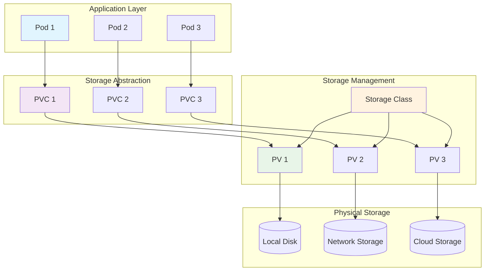

# Session 09: Storage, ConfigMaps & Secrets

## 🎯 **Session Objectives**
By the end of this session, you will be able to:
- Understand Kubernetes storage concepts and persistent volume lifecycle
- Create and manage ConfigMaps for application configuration
- Implement secure secrets management in Kubernetes
- Deploy StatefulSets for stateful applications with persistent storage
- Design backup and disaster recovery strategies for data persistence

---

## 📚 **Session Agenda** (4 hours)

### **Part 1: Storage Fundamentals (90 minutes)**
- Kubernetes storage architecture and concepts
- Persistent Volumes, Claims, and Storage Classes
- Volume types and access modes

### **Part 2: Configuration Management (90 minutes)**
- ConfigMaps for application configuration
- Secrets for sensitive data management
- Environment variables and volume mounts

### **Part 3: StatefulSets and Data Persistence (60 minutes)**
- StatefulSet concepts and use cases
- Ordered deployment and scaling
- Persistent storage for databases

---

## 📖 **Theoretical Foundation**

### **Kubernetes Storage Architecture**

Kubernetes provides a sophisticated storage system that abstracts underlying storage infrastructure while providing persistent data management for containerized applications.

#### **Core Storage Concepts:**

1. **Volumes**: Directories accessible to containers in a pod
2. **Persistent Volumes (PV)**: Cluster-wide storage resources
3. **Persistent Volume Claims (PVC)**: Requests for storage by users
4. **Storage Classes**: Dynamic provisioning templates
5. **Volume Snapshots**: Point-in-time copies of volumes

#### **Storage Lifecycle:**
```
Storage Provisioning → Volume Creation → Pod Attachment → 
Data Operations → Volume Detachment → Storage Cleanup
```

### **ConfigMaps vs Secrets**

| Aspect | ConfigMaps | Secrets |
|--------|------------|---------|
| **Purpose** | Non-sensitive configuration | Sensitive data (passwords, keys) |
| **Storage** | Plain text | Base64 encoded |
| **Size Limit** | 1MB | 1MB |
| **Encryption** | Not encrypted | Can be encrypted at rest |
| **Use Cases** | App config, environment variables | Passwords, certificates, tokens |

### **StatefulSets Characteristics**

StatefulSets are designed for applications that require:
- **Stable Network Identity**: Predictable pod names and DNS
- **Ordered Deployment**: Sequential pod creation and termination
- **Persistent Storage**: Each pod gets its own persistent volume
- **Ordered Scaling**: Controlled scaling operations

---

## 🔧 **Hands-on Labs**

### **Lab 1: Persistent Volumes and Claims**

#### **Step 1: Understanding Storage Classes**
```bash
# Create namespace for storage labs
kubectl create namespace storage-lab

# Check available storage classes
kubectl get storageclass
kubectl describe storageclass

# Create a custom storage class
cat > custom-storage-class.yaml << EOF
apiVersion: storage.k8s.io/v1
kind: StorageClass
metadata:
  name: fast-ssd
  annotations:
    storageclass.kubernetes.io/is-default-class: "false"
provisioner: kubernetes.io/no-provisioner
volumeBindingMode: WaitForFirstConsumer
allowVolumeExpansion: true
reclaimPolicy: Retain
parameters:
  type: ssd
  replication-type: none
EOF

kubectl apply -f custom-storage-class.yaml
kubectl get storageclass
```

#### **Step 2: Creating Persistent Volumes**
```bash
# Create a Persistent Volume
cat > persistent-volume.yaml << EOF
apiVersion: v1
kind: PersistentVolume
metadata:
  name: corporate-pv
  labels:
    type: local
    environment: development
spec:
  storageClassName: fast-ssd
  capacity:
    storage: 5Gi
  accessModes:
    - ReadWriteOnce
  persistentVolumeReclaimPolicy: Retain
  hostPath:
    path: /tmp/corporate-data
    type: DirectoryOrCreate
---
apiVersion: v1
kind: PersistentVolumeClaim
metadata:
  name: corporate-pvc
  namespace: storage-lab
spec:
  storageClassName: fast-ssd
  accessModes:
    - ReadWriteOnce
  resources:
    requests:
      storage: 3Gi
  selector:
    matchLabels:
      type: local
      environment: development
EOF

kubectl apply -f persistent-volume.yaml

# Verify PV and PVC creation
kubectl get pv
kubectl get pvc -n storage-lab
kubectl describe pv corporate-pv
kubectl describe pvc corporate-pvc -n storage-lab
```

#### **Step 3: Using Persistent Storage in Pods**
```bash
# Create pod with persistent storage
cat > pod-with-storage.yaml << EOF
apiVersion: v1
kind: Pod
metadata:
  name: data-processor
  namespace: storage-lab
  labels:
    app: data-processor
spec:
  containers:
  - name: processor
    image: nginx:1.21
    ports:
    - containerPort: 80
    volumeMounts:
    - name: data-volume
      mountPath: /usr/share/nginx/html
    - name: logs-volume
      mountPath: /var/log/nginx
    env:
    - name: DATA_PATH
      value: "/usr/share/nginx/html"
  volumes:
  - name: data-volume
    persistentVolumeClaim:
      claimName: corporate-pvc
  - name: logs-volume
    emptyDir:
      sizeLimit: 1Gi
EOF

kubectl apply -f pod-with-storage.yaml

# Test persistent storage
kubectl exec -it data-processor -n storage-lab -- /bin/bash
# Inside pod:
# echo "<h1>Persistent Data Test</h1>" > /usr/share/nginx/html/index.html
# echo "Data written at $(date)" >> /usr/share/nginx/html/index.html
# exit

# Delete and recreate pod to test persistence
kubectl delete pod data-processor -n storage-lab
kubectl apply -f pod-with-storage.yaml

# Verify data persistence
kubectl exec -it data-processor -n storage-lab -- cat /usr/share/nginx/html/index.html
```

### **Lab 2: ConfigMaps for Application Configuration**

#### **Step 1: Creating ConfigMaps**
```bash
# Create ConfigMap from literal values
kubectl create configmap app-config \
  --from-literal=database_host=postgres.corporate.com \
  --from-literal=database_port=5432 \
  --from-literal=log_level=INFO \
  --from-literal=max_connections=100 \
  -n storage-lab

# Create ConfigMap from file
cat > application.properties << EOF
# Corporate Application Configuration
app.name=Corporate Banking System
app.version=2.1.0
app.environment=production

# Database Configuration
database.url=jdbc:postgresql://postgres.corporate.com:5432/banking
database.pool.min=5
database.pool.max=20
database.timeout=30

# Security Configuration
security.jwt.secret=corporate-jwt-secret-key
security.session.timeout=3600
security.encryption.algorithm=AES-256

# Logging Configuration
logging.level=INFO
logging.file=/var/log/corporate-app.log
logging.max-size=100MB
logging.max-files=10
EOF

kubectl create configmap app-properties \
  --from-file=application.properties \
  -n storage-lab

# Create ConfigMap from directory
mkdir -p config-files
cat > config-files/nginx.conf << EOF
events {
    worker_connections 1024;
}

http {
    upstream backend {
        server backend-service:8080;
    }
    
    server {
        listen 80;
        server_name corporate-app.local;
        
        location / {
            proxy_pass http://backend;
            proxy_set_header Host \$host;
            proxy_set_header X-Real-IP \$remote_addr;
        }
        
        location /health {
            access_log off;
            return 200 "healthy\n";
        }
    }
}
EOF

cat > config-files/redis.conf << EOF
# Redis Configuration for Corporate App
port 6379
bind 0.0.0.0
timeout 300
tcp-keepalive 60
maxmemory 256mb
maxmemory-policy allkeys-lru
save 900 1
save 300 10
save 60 10000
EOF

kubectl create configmap nginx-config \
  --from-file=config-files/ \
  -n storage-lab

# View ConfigMaps
kubectl get configmaps -n storage-lab
kubectl describe configmap app-config -n storage-lab
kubectl get configmap app-properties -o yaml -n storage-lab
```

#### **Step 2: Using ConfigMaps in Applications**
```bash
# Create deployment using ConfigMaps
cat > app-with-configmap.yaml << EOF
apiVersion: apps/v1
kind: Deployment
metadata:
  name: corporate-app
  namespace: storage-lab
spec:
  replicas: 2
  selector:
    matchLabels:
      app: corporate-app
  template:
    metadata:
      labels:
        app: corporate-app
    spec:
      containers:
      - name: app
        image: nginx:1.21
        ports:
        - containerPort: 80
        env:
        # Environment variables from ConfigMap
        - name: DATABASE_HOST
          valueFrom:
            configMapKeyRef:
              name: app-config
              key: database_host
        - name: DATABASE_PORT
          valueFrom:
            configMapKeyRef:
              name: app-config
              key: database_port
        - name: LOG_LEVEL
          valueFrom:
            configMapKeyRef:
              name: app-config
              key: log_level
        # All keys from ConfigMap as environment variables
        envFrom:
        - configMapRef:
            name: app-config
            prefix: APP_
        volumeMounts:
        # Mount ConfigMap as files
        - name: app-properties
          mountPath: /etc/config
          readOnly: true
        - name: nginx-config
          mountPath: /etc/nginx/nginx.conf
          subPath: nginx.conf
          readOnly: true
        resources:
          requests:
            memory: "128Mi"
            cpu: "100m"
          limits:
            memory: "256Mi"
            cpu: "200m"
      volumes:
      - name: app-properties
        configMap:
          name: app-properties
      - name: nginx-config
        configMap:
          name: nginx-config
          items:
          - key: nginx.conf
            path: nginx.conf
EOF

kubectl apply -f app-with-configmap.yaml

# Verify ConfigMap usage
kubectl get pods -n storage-lab -l app=corporate-app
kubectl exec -it deployment/corporate-app -n storage-lab -- env | grep -E "(DATABASE|LOG|APP_)"
kubectl exec -it deployment/corporate-app -n storage-lab -- cat /etc/config/application.properties
kubectl exec -it deployment/corporate-app -n storage-lab -- cat /etc/nginx/nginx.conf
```

### **Lab 3: Secrets Management**

#### **Step 1: Creating and Managing Secrets**
```bash
# Create secret from literal values
kubectl create secret generic database-credentials \
  --from-literal=username=corporate_user \
  --from-literal=password=SecureP@ssw0rd123 \
  --from-literal=admin-password=AdminP@ssw0rd456 \
  -n storage-lab

# Create secret from files
echo -n "corporate_user" > username.txt
echo -n "SecureP@ssw0rd123" > password.txt

kubectl create secret generic db-file-secret \
  --from-file=username.txt \
  --from-file=password.txt \
  -n storage-lab

# Create TLS secret for HTTPS
openssl req -x509 -nodes -days 365 -newkey rsa:2048 \
  -keyout tls.key -out tls.crt \
  -subj "/CN=corporate-app.local/O=corporate-app"

kubectl create secret tls corporate-tls-secret \
  --cert=tls.crt \
  --key=tls.key \
  -n storage-lab

# Create Docker registry secret
kubectl create secret docker-registry corporate-registry-secret \
  --docker-server=registry.corporate.com \
  --docker-username=corporate-user \
  --docker-password=registry-password \
  --docker-email=admin@corporate.com \
  -n storage-lab

# View secrets (note: data is base64 encoded)
kubectl get secrets -n storage-lab
kubectl describe secret database-credentials -n storage-lab
kubectl get secret database-credentials -o yaml -n storage-lab

# Decode secret values
kubectl get secret database-credentials -n storage-lab -o jsonpath='{.data.username}' | base64 --decode
kubectl get secret database-credentials -n storage-lab -o jsonpath='{.data.password}' | base64 --decode
```

#### **Step 2: Using Secrets in Applications**
```bash
# Create application using secrets
cat > app-with-secrets.yaml << EOF
apiVersion: apps/v1
kind: Deployment
metadata:
  name: secure-app
  namespace: storage-lab
spec:
  replicas: 2
  selector:
    matchLabels:
      app: secure-app
  template:
    metadata:
      labels:
        app: secure-app
    spec:
      imagePullSecrets:
      - name: corporate-registry-secret
      containers:
      - name: app
        image: nginx:1.21
        ports:
        - containerPort: 80
        env:
        # Environment variables from secrets
        - name: DB_USERNAME
          valueFrom:
            secretKeyRef:
              name: database-credentials
              key: username
        - name: DB_PASSWORD
          valueFrom:
            secretKeyRef:
              name: database-credentials
              key: password
        volumeMounts:
        # Mount secrets as files
        - name: db-credentials
          mountPath: /etc/secrets/db
          readOnly: true
        - name: tls-certs
          mountPath: /etc/ssl/certs
          readOnly: true
        resources:
          requests:
            memory: "128Mi"
            cpu: "100m"
          limits:
            memory: "256Mi"
            cpu: "200m"
      volumes:
      - name: db-credentials
        secret:
          secretName: database-credentials
          defaultMode: 0400  # Read-only for owner
      - name: tls-certs
        secret:
          secretName: corporate-tls-secret
          items:
          - key: tls.crt
            path: server.crt
          - key: tls.key
            path: server.key
            mode: 0400
EOF

kubectl apply -f app-with-secrets.yaml

# Verify secret usage
kubectl exec -it deployment/secure-app -n storage-lab -- env | grep DB_
kubectl exec -it deployment/secure-app -n storage-lab -- ls -la /etc/secrets/db/
kubectl exec -it deployment/secure-app -n storage-lab -- cat /etc/secrets/db/username
kubectl exec -it deployment/secure-app -n storage-lab -- ls -la /etc/ssl/certs/
```

### **Lab 4: StatefulSets with Persistent Storage**

#### **Step 1: PostgreSQL StatefulSet**
```bash
# Create PostgreSQL StatefulSet with persistent storage
cat > postgres-statefulset.yaml << EOF
apiVersion: v1
kind: Service
metadata:
  name: postgres-headless
  namespace: storage-lab
  labels:
    app: postgres
spec:
  ports:
  - port: 5432
    name: postgres
  clusterIP: None
  selector:
    app: postgres
---
apiVersion: apps/v1
kind: StatefulSet
metadata:
  name: postgres
  namespace: storage-lab
spec:
  serviceName: postgres-headless
  replicas: 3
  selector:
    matchLabels:
      app: postgres
  template:
    metadata:
      labels:
        app: postgres
    spec:
      containers:
      - name: postgres
        image: postgres:14
        ports:
        - containerPort: 5432
          name: postgres
        env:
        - name: POSTGRES_DB
          value: corporate_db
        - name: POSTGRES_USER
          valueFrom:
            secretKeyRef:
              name: database-credentials
              key: username
        - name: POSTGRES_PASSWORD
          valueFrom:
            secretKeyRef:
              name: database-credentials
              key: password
        - name: PGDATA
          value: /var/lib/postgresql/data/pgdata
        volumeMounts:
        - name: postgres-storage
          mountPath: /var/lib/postgresql/data
        - name: postgres-config
          mountPath: /etc/postgresql/postgresql.conf
          subPath: postgresql.conf
        resources:
          requests:
            memory: "512Mi"
            cpu: "250m"
          limits:
            memory: "1Gi"
            cpu: "500m"
        livenessProbe:
          exec:
            command:
            - pg_isready
            - -U
            - \$(POSTGRES_USER)
            - -d
            - \$(POSTGRES_DB)
          initialDelaySeconds: 30
          periodSeconds: 10
        readinessProbe:
          exec:
            command:
            - pg_isready
            - -U
            - \$(POSTGRES_USER)
            - -d
            - \$(POSTGRES_DB)
          initialDelaySeconds: 5
          periodSeconds: 5
      volumes:
      - name: postgres-config
        configMap:
          name: postgres-config
  volumeClaimTemplates:
  - metadata:
      name: postgres-storage
    spec:
      accessModes: ["ReadWriteOnce"]
      storageClassName: fast-ssd
      resources:
        requests:
          storage: 10Gi
---
apiVersion: v1
kind: ConfigMap
metadata:
  name: postgres-config
  namespace: storage-lab
data:
  postgresql.conf: |
    # PostgreSQL Configuration
    listen_addresses = '*'
    port = 5432
    max_connections = 100
    shared_buffers = 128MB
    effective_cache_size = 256MB
    maintenance_work_mem = 64MB
    checkpoint_completion_target = 0.9
    wal_buffers = 16MB
    default_statistics_target = 100
    random_page_cost = 1.1
    effective_io_concurrency = 200
    work_mem = 4MB
    min_wal_size = 1GB
    max_wal_size = 4GB
    log_destination = 'stderr'
    logging_collector = on
    log_directory = 'log'
    log_filename = 'postgresql-%Y-%m-%d_%H%M%S.log'
    log_statement = 'all'
    log_min_duration_statement = 1000
EOF

kubectl apply -f postgres-statefulset.yaml

# Monitor StatefulSet deployment
kubectl get statefulsets -n storage-lab -w
kubectl get pods -n storage-lab -l app=postgres
kubectl get pvc -n storage-lab

# Test StatefulSet scaling
kubectl scale statefulset postgres --replicas=2 -n storage-lab
kubectl get pods -n storage-lab -l app=postgres -w

# Test ordered deployment
kubectl delete pod postgres-1 -n storage-lab
kubectl get pods -n storage-lab -l app=postgres -w
```

#### **Step 2: Testing Data Persistence**
```bash
# Connect to PostgreSQL and create test data
kubectl exec -it postgres-0 -n storage-lab -- psql -U corporate_user -d corporate_db

# Inside PostgreSQL:
# CREATE TABLE customers (
#     id SERIAL PRIMARY KEY,
#     name VARCHAR(100) NOT NULL,
#     email VARCHAR(100) UNIQUE NOT NULL,
#     created_at TIMESTAMP DEFAULT CURRENT_TIMESTAMP
# );
# 
# INSERT INTO customers (name, email) VALUES 
# ('John Doe', 'john@corporate.com'),
# ('Jane Smith', 'jane@corporate.com'),
# ('Bob Johnson', 'bob@corporate.com');
# 
# SELECT * FROM customers;
# \q

# Delete pod to test persistence
kubectl delete pod postgres-0 -n storage-lab

# Wait for pod to be recreated and verify data
kubectl wait --for=condition=ready pod postgres-0 -n storage-lab --timeout=60s
kubectl exec -it postgres-0 -n storage-lab -- psql -U corporate_user -d corporate_db -c "SELECT * FROM customers;"
```

---

## 📊 **Storage Architecture Diagram**



---

## 🏢 **Real-World Use Case: Banking Data Management**

### **Scenario: BFSI Compliant Data Storage**
A bank implements Kubernetes storage for their core banking system with strict compliance requirements:

**Requirements:**
- **Data Persistence**: Customer data must survive pod restarts
- **Encryption**: Data at rest and in transit encryption
- **Backup**: Automated backup and point-in-time recovery
- **Compliance**: SOX, PCI DSS, and GDPR compliance
- **High Availability**: Multi-zone data replication

**Implementation:**
```yaml
# Encrypted Storage Class for sensitive data
apiVersion: storage.k8s.io/v1
kind: StorageClass
metadata:
  name: encrypted-ssd
  annotations:
    storageclass.kubernetes.io/is-default-class: "false"
provisioner: kubernetes.io/aws-ebs
parameters:
  type: gp3
  encrypted: "true"
  kmsKeyId: "arn:aws:kms:us-west-2:123456789012:key/12345678-1234-1234-1234-123456789012"
volumeBindingMode: WaitForFirstConsumer
allowVolumeExpansion: true
reclaimPolicy: Retain
---
# Banking Database StatefulSet
apiVersion: apps/v1
kind: StatefulSet
metadata:
  name: banking-database
  namespace: banking-prod
spec:
  serviceName: banking-db-headless
  replicas: 3
  selector:
    matchLabels:
      app: banking-database
  template:
    metadata:
      labels:
        app: banking-database
        compliance: pci-dss
    spec:
      securityContext:
        runAsNonRoot: true
        runAsUser: 999
        fsGroup: 999
      containers:
      - name: postgres
        image: postgres:14-alpine
        securityContext:
          allowPrivilegeEscalation: false
          readOnlyRootFilesystem: true
          capabilities:
            drop:
            - ALL
        env:
        - name: POSTGRES_DB
          value: banking_core
        - name: POSTGRES_USER
          valueFrom:
            secretKeyRef:
              name: banking-db-credentials
              key: username
        - name: POSTGRES_PASSWORD
          valueFrom:
            secretKeyRef:
              name: banking-db-credentials
              key: password
        volumeMounts:
        - name: postgres-data
          mountPath: /var/lib/postgresql/data
        - name: postgres-config
          mountPath: /etc/postgresql
        - name: tmp-volume
          mountPath: /tmp
        resources:
          requests:
            memory: "2Gi"
            cpu: "1000m"
          limits:
            memory: "4Gi"
            cpu: "2000m"
      volumes:
      - name: postgres-config
        configMap:
          name: banking-postgres-config
      - name: tmp-volume
        emptyDir: {}
  volumeClaimTemplates:
  - metadata:
      name: postgres-data
    spec:
      accessModes: ["ReadWriteOnce"]
      storageClassName: encrypted-ssd
      resources:
        requests:
          storage: 100Gi
```

**Benefits Achieved:**
- **Compliance**: Encrypted storage meets regulatory requirements
- **Data Integrity**: StatefulSets ensure ordered operations
- **Scalability**: Dynamic storage provisioning
- **Security**: Pod security contexts and read-only filesystems

---

## 🛠 **Backup and Disaster Recovery**

### **Volume Snapshots**
```bash
# Create VolumeSnapshotClass
cat > volume-snapshot-class.yaml << EOF
apiVersion: snapshot.storage.k8s.io/v1
kind: VolumeSnapshotClass
metadata:
  name: corporate-snapshot-class
driver: kubernetes.io/host-path
deletionPolicy: Retain
EOF

kubectl apply -f volume-snapshot-class.yaml

# Create Volume Snapshot
cat > volume-snapshot.yaml << EOF
apiVersion: snapshot.storage.k8s.io/v1
kind: VolumeSnapshot
metadata:
  name: postgres-snapshot-$(date +%Y%m%d-%H%M%S)
  namespace: storage-lab
spec:
  volumeSnapshotClassName: corporate-snapshot-class
  source:
    persistentVolumeClaimName: postgres-storage-postgres-0
EOF

kubectl apply -f volume-snapshot.yaml
kubectl get volumesnapshots -n storage-lab
```

### **Automated Backup Strategy**
```bash
# Create backup CronJob
cat > backup-cronjob.yaml << EOF
apiVersion: batch/v1
kind: CronJob
metadata:
  name: postgres-backup
  namespace: storage-lab
spec:
  schedule: "0 2 * * *"  # Daily at 2 AM
  jobTemplate:
    spec:
      template:
        spec:
          containers:
          - name: postgres-backup
            image: postgres:14
            command:
            - /bin/bash
            - -c
            - |
              BACKUP_FILE="/backup/postgres-backup-$(date +%Y%m%d-%H%M%S).sql"
              pg_dump -h postgres-0.postgres-headless -U \$POSTGRES_USER -d \$POSTGRES_DB > \$BACKUP_FILE
              echo "Backup completed: \$BACKUP_FILE"
            env:
            - name: POSTGRES_USER
              valueFrom:
                secretKeyRef:
                  name: database-credentials
                  key: username
            - name: POSTGRES_DB
              value: corporate_db
            - name: PGPASSWORD
              valueFrom:
                secretKeyRef:
                  name: database-credentials
                  key: password
            volumeMounts:
            - name: backup-storage
              mountPath: /backup
          volumes:
          - name: backup-storage
            persistentVolumeClaim:
              claimName: backup-pvc
          restartPolicy: OnFailure
---
apiVersion: v1
kind: PersistentVolumeClaim
metadata:
  name: backup-pvc
  namespace: storage-lab
spec:
  accessModes:
  - ReadWriteOnce
  resources:
    requests:
      storage: 50Gi
EOF

kubectl apply -f backup-cronjob.yaml
```

---

## ✅ **Session 09 Checklist**

- [ ] Understood Kubernetes storage architecture and concepts
- [ ] Created and managed Persistent Volumes and Claims
- [ ] Implemented ConfigMaps for application configuration
- [ ] Managed secrets securely with proper access controls
- [ ] Deployed StatefulSets with persistent storage
- [ ] Configured volume snapshots and backup strategies
- [ ] Applied storage best practices for enterprise environments
- [ ] Tested data persistence and disaster recovery procedures

---

## 🎯 **Next Session Preview**

**Session 10: Advanced K8s Concepts & Scheduling**
- Advanced pod scheduling and node affinity
- Taints, tolerations, and pod disruption budgets
- Resource quotas and limit ranges
- Custom resources and operators
- Horizontal and vertical pod autoscaling

---

## 👨‍💻 **About the Author**

**Varun Kumar Manik** is a distinguished **Cloud Architect, Kubernetes Expert, and DevOps Specialist** with nearly **1.5 decades of hands-on experience** in designing, implementing, and optimizing cloud-native solutions across enterprise environments. As an **AWS Ambassador for 6+ years**, Varun has been officially recognized by Amazon Web Services for his outstanding contributions to the cloud community and deep expertise in AWS technologies.

### 🏆 **Professional Recognition**
- **AWS Ambassador Profile**: [View on AWS Partners Portal](https://aws.amazon.com/partners/ambassadors/)
- **Kubernetes Community Contributor**: Active in CNCF ecosystem
- **Corporate Training Specialist**: Delivered K8s training to 500+ professionals

### 💼 **Professional Expertise**

#### ☸️ **Kubernetes & Container Orchestration**
- Production Kubernetes deployments across Telco, BFSI, and Enterprise sectors
- Multi-cluster management and federation strategies
- Kubernetes security hardening and RBAC implementation
- Service mesh integration (Istio, Linkerd) for enterprise workloads

#### 🚀 **DevOps & CI/CD Excellence**
- GitOps workflows with ArgoCD and Flux
- Infrastructure as Code with Terraform and Helm
- Container security and compliance automation
- Enterprise CI/CD pipeline optimization

### 🌐 **Connect & Follow**

- **GitHub**: [https://github.com/manikcloud](https://github.com/manikcloud)
- **LinkedIn**: [https://www.linkedin.com/in/vkmanik/](https://www.linkedin.com/in/vkmanik/)
- **Email**: [varunmanik1@gmail.com](mailto:varunmanik1@gmail.com)

---

*Next: [Session 10 - Advanced K8s Concepts & Scheduling](../session-10-k8s-advanced-concepts/)*
