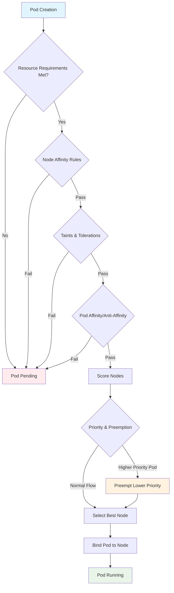

# Session 10: Advanced K8s Concepts & Scheduling

## 🎯 **Session Objectives**
By the end of this session, you will be able to:
- Master advanced pod scheduling techniques and node affinity rules
- Implement taints, tolerations, and pod disruption budgets
- Configure resource quotas and limit ranges for multi-tenancy
- Understand custom resources and operator patterns
- Deploy horizontal and vertical pod autoscaling solutions

---

## 📚 **Session Agenda** (4 hours)

### **Part 1: Advanced Scheduling (90 minutes)**
- Node affinity and anti-affinity rules
- Taints and tolerations for node specialization
- Pod priority and preemption

### **Part 2: Resource Management (90 minutes)**
- Resource quotas and limit ranges
- Quality of Service classes
- Pod disruption budgets

### **Part 3: Autoscaling and Custom Resources (60 minutes)**
- Horizontal and Vertical Pod Autoscaling
- Custom Resource Definitions (CRDs)
- Operator pattern introduction

---

## 📖 **Theoretical Foundation**

### **Kubernetes Scheduler Architecture**

The Kubernetes scheduler is responsible for placing pods on nodes based on various constraints and policies. It operates in two phases:

1. **Filtering Phase**: Eliminates nodes that don't meet pod requirements
2. **Scoring Phase**: Ranks remaining nodes and selects the best fit

#### **Scheduling Factors:**
- **Resource Requirements**: CPU, memory, storage requests
- **Node Affinity**: Preferences for specific nodes
- **Pod Affinity/Anti-affinity**: Relationships between pods
- **Taints and Tolerations**: Node specialization and exclusions
- **Priority Classes**: Pod importance and preemption

### **Node Affinity vs Pod Affinity**

| Aspect | Node Affinity | Pod Affinity |
|--------|---------------|--------------|
| **Purpose** | Schedule pods on specific nodes | Schedule pods relative to other pods |
| **Scope** | Node labels | Pod labels |
| **Use Cases** | Hardware requirements, zones | Co-location, separation |
| **Types** | Required, Preferred | Required, Preferred |

### **Quality of Service (QoS) Classes**

Kubernetes assigns QoS classes based on resource specifications:

1. **Guaranteed**: Requests = Limits for all containers
2. **Burstable**: Some containers have requests < limits
3. **BestEffort**: No requests or limits specified

### **Autoscaling Types**

- **Horizontal Pod Autoscaler (HPA)**: Scales number of pod replicas
- **Vertical Pod Autoscaler (VPA)**: Adjusts resource requests/limits
- **Cluster Autoscaler**: Scales number of nodes in cluster

---

## 🔧 **Hands-on Labs**

### **Lab 1: Advanced Pod Scheduling**

#### **Step 1: Node Affinity and Anti-Affinity**
```bash
# Create namespace for scheduling labs
kubectl create namespace scheduling-lab

# Label nodes for affinity testing
kubectl get nodes
kubectl label nodes docker-desktop zone=us-west-1a
kubectl label nodes docker-desktop instance-type=compute-optimized
kubectl label nodes docker-desktop storage-type=ssd

# Create deployment with node affinity
cat > node-affinity-deployment.yaml << EOF
apiVersion: apps/v1
kind: Deployment
metadata:
  name: compute-intensive-app
  namespace: scheduling-lab
spec:
  replicas: 3
  selector:
    matchLabels:
      app: compute-intensive
  template:
    metadata:
      labels:
        app: compute-intensive
        tier: compute
    spec:
      affinity:
        nodeAffinity:
          requiredDuringSchedulingIgnoredDuringExecution:
            nodeSelectorTerms:
            - matchExpressions:
              - key: instance-type
                operator: In
                values:
                - compute-optimized
                - memory-optimized
          preferredDuringSchedulingIgnoredDuringExecution:
          - weight: 100
            preference:
              matchExpressions:
              - key: zone
                operator: In
                values:
                - us-west-1a
          - weight: 50
            preference:
              matchExpressions:
              - key: storage-type
                operator: In
                values:
                - ssd
      containers:
      - name: compute-app
        image: nginx:1.21
        resources:
          requests:
            cpu: "500m"
            memory: "512Mi"
          limits:
            cpu: "1000m"
            memory: "1Gi"
EOF

kubectl apply -f node-affinity-deployment.yaml

# Verify pod placement
kubectl get pods -n scheduling-lab -o wide
kubectl describe pod -n scheduling-lab -l app=compute-intensive
```

#### **Step 2: Pod Affinity and Anti-Affinity**
```bash
# Create web tier with pod affinity
cat > pod-affinity-deployment.yaml << EOF
apiVersion: apps/v1
kind: Deployment
metadata:
  name: web-frontend
  namespace: scheduling-lab
spec:
  replicas: 3
  selector:
    matchLabels:
      app: web-frontend
  template:
    metadata:
      labels:
        app: web-frontend
        tier: frontend
    spec:
      affinity:
        podAffinity:
          preferredDuringSchedulingIgnoredDuringExecution:
          - weight: 100
            podAffinityTerm:
              labelSelector:
                matchExpressions:
                - key: tier
                  operator: In
                  values:
                  - compute
              topologyKey: kubernetes.io/hostname
        podAntiAffinity:
          requiredDuringSchedulingIgnoredDuringExecution:
          - labelSelector:
              matchExpressions:
              - key: app
                operator: In
                values:
                - web-frontend
            topologyKey: kubernetes.io/hostname
      containers:
      - name: web
        image: nginx:1.21
        resources:
          requests:
            cpu: "100m"
            memory: "128Mi"
          limits:
            cpu: "200m"
            memory: "256Mi"
EOF

kubectl apply -f pod-affinity-deployment.yaml

# Check pod distribution
kubectl get pods -n scheduling-lab -o wide
kubectl describe pod -n scheduling-lab -l app=web-frontend | grep -A 10 "Node-Selectors"
```

#### **Step 3: Taints and Tolerations**
```bash
# Add taint to node
kubectl taint nodes docker-desktop dedicated=gpu-workload:NoSchedule

# Create deployment that tolerates the taint
cat > toleration-deployment.yaml << EOF
apiVersion: apps/v1
kind: Deployment
metadata:
  name: gpu-workload
  namespace: scheduling-lab
spec:
  replicas: 2
  selector:
    matchLabels:
      app: gpu-workload
  template:
    metadata:
      labels:
        app: gpu-workload
    spec:
      tolerations:
      - key: "dedicated"
        operator: "Equal"
        value: "gpu-workload"
        effect: "NoSchedule"
      containers:
      - name: gpu-app
        image: nginx:1.21
        resources:
          requests:
            cpu: "200m"
            memory: "256Mi"
          limits:
            cpu: "400m"
            memory: "512Mi"
EOF

kubectl apply -f toleration-deployment.yaml

# Create deployment without toleration (should remain pending)
cat > no-toleration-deployment.yaml << EOF
apiVersion: apps/v1
kind: Deployment
metadata:
  name: regular-workload
  namespace: scheduling-lab
spec:
  replicas: 1
  selector:
    matchLabels:
      app: regular-workload
  template:
    metadata:
      labels:
        app: regular-workload
    spec:
      containers:
      - name: regular-app
        image: nginx:1.21
        resources:
          requests:
            cpu: "100m"
            memory: "128Mi"
EOF

kubectl apply -f no-toleration-deployment.yaml

# Check pod status
kubectl get pods -n scheduling-lab
kubectl describe pod -n scheduling-lab -l app=regular-workload

# Remove taint for next labs
kubectl taint nodes docker-desktop dedicated=gpu-workload:NoSchedule-
```

### **Lab 2: Resource Management and QoS**

#### **Step 1: Resource Quotas and Limit Ranges**
```bash
# Create resource quota
cat > resource-quota.yaml << EOF
apiVersion: v1
kind: ResourceQuota
metadata:
  name: scheduling-lab-quota
  namespace: scheduling-lab
spec:
  hard:
    requests.cpu: "4"
    requests.memory: 8Gi
    limits.cpu: "8"
    limits.memory: 16Gi
    pods: "10"
    services: "5"
    persistentvolumeclaims: "3"
    secrets: "10"
    configmaps: "10"
    count/deployments.apps: "5"
    count/services.loadbalancers: "1"
EOF

kubectl apply -f resource-quota.yaml

# Create limit range
cat > limit-range.yaml << EOF
apiVersion: v1
kind: LimitRange
metadata:
  name: scheduling-lab-limits
  namespace: scheduling-lab
spec:
  limits:
  - type: Container
    default:
      cpu: "200m"
      memory: "256Mi"
    defaultRequest:
      cpu: "100m"
      memory: "128Mi"
    min:
      cpu: "50m"
      memory: "64Mi"
    max:
      cpu: "2000m"
      memory: "4Gi"
  - type: Pod
    max:
      cpu: "4000m"
      memory: "8Gi"
  - type: PersistentVolumeClaim
    min:
      storage: "1Gi"
    max:
      storage: "100Gi"
EOF

kubectl apply -f limit-range.yaml

# Verify resource constraints
kubectl describe quota scheduling-lab-quota -n scheduling-lab
kubectl describe limitrange scheduling-lab-limits -n scheduling-lab
```

#### **Step 2: Quality of Service Classes**
```bash
# Create Guaranteed QoS pod
cat > qos-guaranteed.yaml << EOF
apiVersion: v1
kind: Pod
metadata:
  name: qos-guaranteed
  namespace: scheduling-lab
  labels:
    qos: guaranteed
spec:
  containers:
  - name: app
    image: nginx:1.21
    resources:
      requests:
        cpu: "500m"
        memory: "512Mi"
      limits:
        cpu: "500m"
        memory: "512Mi"
EOF

# Create Burstable QoS pod
cat > qos-burstable.yaml << EOF
apiVersion: v1
kind: Pod
metadata:
  name: qos-burstable
  namespace: scheduling-lab
  labels:
    qos: burstable
spec:
  containers:
  - name: app
    image: nginx:1.21
    resources:
      requests:
        cpu: "200m"
        memory: "256Mi"
      limits:
        cpu: "500m"
        memory: "512Mi"
EOF

# Create BestEffort QoS pod
cat > qos-besteffort.yaml << EOF
apiVersion: v1
kind: Pod
metadata:
  name: qos-besteffort
  namespace: scheduling-lab
  labels:
    qos: besteffort
spec:
  containers:
  - name: app
    image: nginx:1.21
EOF

kubectl apply -f qos-guaranteed.yaml
kubectl apply -f qos-burstable.yaml
kubectl apply -f qos-besteffort.yaml

# Check QoS classes
kubectl get pods -n scheduling-lab -o custom-columns=NAME:.metadata.name,QOS:.status.qosClass
kubectl describe pod qos-guaranteed -n scheduling-lab | grep "QoS Class"
kubectl describe pod qos-burstable -n scheduling-lab | grep "QoS Class"
kubectl describe pod qos-besteffort -n scheduling-lab | grep "QoS Class"
```

#### **Step 3: Pod Disruption Budgets**
```bash
# Create deployment for PDB testing
cat > pdb-deployment.yaml << EOF
apiVersion: apps/v1
kind: Deployment
metadata:
  name: critical-service
  namespace: scheduling-lab
spec:
  replicas: 5
  selector:
    matchLabels:
      app: critical-service
  template:
    metadata:
      labels:
        app: critical-service
    spec:
      containers:
      - name: service
        image: nginx:1.21
        resources:
          requests:
            cpu: "100m"
            memory: "128Mi"
          limits:
            cpu: "200m"
            memory: "256Mi"
        readinessProbe:
          httpGet:
            path: /
            port: 80
          initialDelaySeconds: 5
          periodSeconds: 5
---
apiVersion: policy/v1
kind: PodDisruptionBudget
metadata:
  name: critical-service-pdb
  namespace: scheduling-lab
spec:
  minAvailable: 3
  selector:
    matchLabels:
      app: critical-service
EOF

kubectl apply -f pdb-deployment.yaml

# Verify PDB status
kubectl get pdb -n scheduling-lab
kubectl describe pdb critical-service-pdb -n scheduling-lab

# Test PDB by trying to drain node (simulation)
kubectl get pods -n scheduling-lab -l app=critical-service
# kubectl drain docker-desktop --ignore-daemonsets --delete-emptydir-data --force
# (This would be blocked by PDB in a real multi-node cluster)
```

### **Lab 3: Autoscaling**

#### **Step 1: Horizontal Pod Autoscaler (HPA)**
```bash
# Create deployment for HPA testing
cat > hpa-deployment.yaml << EOF
apiVersion: apps/v1
kind: Deployment
metadata:
  name: scalable-app
  namespace: scheduling-lab
spec:
  replicas: 2
  selector:
    matchLabels:
      app: scalable-app
  template:
    metadata:
      labels:
        app: scalable-app
    spec:
      containers:
      - name: app
        image: nginx:1.21
        resources:
          requests:
            cpu: "100m"
            memory: "128Mi"
          limits:
            cpu: "200m"
            memory: "256Mi"
        ports:
        - containerPort: 80
---
apiVersion: v1
kind: Service
metadata:
  name: scalable-app-service
  namespace: scheduling-lab
spec:
  selector:
    app: scalable-app
  ports:
  - port: 80
    targetPort: 80
EOF

kubectl apply -f hpa-deployment.yaml

# Create HPA
kubectl autoscale deployment scalable-app --cpu-percent=50 --min=2 --max=10 -n scheduling-lab

# Create HPA with YAML for more control
cat > hpa-advanced.yaml << EOF
apiVersion: autoscaling/v2
kind: HorizontalPodAutoscaler
metadata:
  name: scalable-app-hpa-v2
  namespace: scheduling-lab
spec:
  scaleTargetRef:
    apiVersion: apps/v1
    kind: Deployment
    name: scalable-app
  minReplicas: 2
  maxReplicas: 15
  metrics:
  - type: Resource
    resource:
      name: cpu
      target:
        type: Utilization
        averageUtilization: 70
  - type: Resource
    resource:
      name: memory
      target:
        type: Utilization
        averageUtilization: 80
  behavior:
    scaleDown:
      stabilizationWindowSeconds: 300
      policies:
      - type: Percent
        value: 50
        periodSeconds: 60
    scaleUp:
      stabilizationWindowSeconds: 60
      policies:
      - type: Percent
        value: 100
        periodSeconds: 15
      - type: Pods
        value: 2
        periodSeconds: 60
      selectPolicy: Max
EOF

kubectl apply -f hpa-advanced.yaml

# Monitor HPA
kubectl get hpa -n scheduling-lab
kubectl describe hpa scalable-app-hpa-v2 -n scheduling-lab

# Generate load to test scaling
kubectl run load-generator --image=busybox -n scheduling-lab --rm -it --restart=Never -- /bin/sh -c "while true; do wget -q -O- http://scalable-app-service.scheduling-lab.svc.cluster.local; done"

# In another terminal, watch scaling
kubectl get hpa -n scheduling-lab -w
kubectl get pods -n scheduling-lab -l app=scalable-app -w
```

#### **Step 2: Vertical Pod Autoscaler (VPA)**
```bash
# Install VPA (if not already installed)
# Note: VPA requires metrics-server and may conflict with HPA
cat > vpa-deployment.yaml << EOF
apiVersion: apps/v1
kind: Deployment
metadata:
  name: vpa-test-app
  namespace: scheduling-lab
spec:
  replicas: 2
  selector:
    matchLabels:
      app: vpa-test-app
  template:
    metadata:
      labels:
        app: vpa-test-app
    spec:
      containers:
      - name: app
        image: nginx:1.21
        resources:
          requests:
            cpu: "100m"
            memory: "128Mi"
          limits:
            cpu: "200m"
            memory: "256Mi"
---
apiVersion: autoscaling.k8s.io/v1
kind: VerticalPodAutoscaler
metadata:
  name: vpa-test-app-vpa
  namespace: scheduling-lab
spec:
  targetRef:
    apiVersion: apps/v1
    kind: Deployment
    name: vpa-test-app
  updatePolicy:
    updateMode: "Auto"  # Can be "Off", "Initial", or "Auto"
  resourcePolicy:
    containerPolicies:
    - containerName: app
      minAllowed:
        cpu: "50m"
        memory: "64Mi"
      maxAllowed:
        cpu: "500m"
        memory: "512Mi"
      controlledResources: ["cpu", "memory"]
EOF

# Note: VPA may not work in single-node clusters like Docker Desktop
# kubectl apply -f vpa-deployment.yaml
# kubectl get vpa -n scheduling-lab
# kubectl describe vpa vpa-test-app-vpa -n scheduling-lab
```

### **Lab 4: Priority Classes and Preemption**

#### **Step 1: Priority Classes**
```bash
# Create priority classes
cat > priority-classes.yaml << EOF
apiVersion: scheduling.k8s.io/v1
kind: PriorityClass
metadata:
  name: high-priority
value: 1000
globalDefault: false
description: "High priority class for critical workloads"
---
apiVersion: scheduling.k8s.io/v1
kind: PriorityClass
metadata:
  name: medium-priority
value: 500
globalDefault: false
description: "Medium priority class for standard workloads"
---
apiVersion: scheduling.k8s.io/v1
kind: PriorityClass
metadata:
  name: low-priority
value: 100
globalDefault: true
description: "Low priority class for batch workloads"
EOF

kubectl apply -f priority-classes.yaml
kubectl get priorityclasses

# Create pods with different priorities
cat > priority-pods.yaml << EOF
apiVersion: v1
kind: Pod
metadata:
  name: high-priority-pod
  namespace: scheduling-lab
spec:
  priorityClassName: high-priority
  containers:
  - name: app
    image: nginx:1.21
    resources:
      requests:
        cpu: "500m"
        memory: "512Mi"
---
apiVersion: v1
kind: Pod
metadata:
  name: medium-priority-pod
  namespace: scheduling-lab
spec:
  priorityClassName: medium-priority
  containers:
  - name: app
    image: nginx:1.21
    resources:
      requests:
        cpu: "300m"
        memory: "256Mi"
---
apiVersion: v1
kind: Pod
metadata:
  name: low-priority-pod
  namespace: scheduling-lab
spec:
  priorityClassName: low-priority
  containers:
  - name: app
    image: nginx:1.21
    resources:
      requests:
        cpu: "100m"
        memory: "128Mi"
EOF

kubectl apply -f priority-pods.yaml

# Check pod priorities
kubectl get pods -n scheduling-lab -o custom-columns=NAME:.metadata.name,PRIORITY:.spec.priority,PRIORITY_CLASS:.spec.priorityClassName
```

---

## 📊 **Advanced Scheduling Flow**



---

## 🏢 **Real-World Use Case: Telecom 5G Network Slicing**

### **Scenario: 5G Network Function Scheduling**
A telecom operator implements advanced scheduling for 5G network functions with different SLA requirements:

**Network Slice Requirements:**
- **eMBB (Enhanced Mobile Broadband)**: High throughput, moderate latency
- **URLLC (Ultra-Reliable Low Latency)**: Ultra-low latency, high reliability
- **mMTC (Massive Machine Type Communications)**: High connection density, low power

**Implementation:**
```yaml
# Priority classes for network slices
apiVersion: scheduling.k8s.io/v1
kind: PriorityClass
metadata:
  name: urllc-critical
value: 2000
globalDefault: false
description: "Ultra-reliable low latency communications - highest priority"
---
apiVersion: scheduling.k8s.io/v1
kind: PriorityClass
metadata:
  name: embb-high
value: 1000
globalDefault: false
description: "Enhanced mobile broadband - high priority"
---
apiVersion: scheduling.k8s.io/v1
kind: PriorityClass
metadata:
  name: mmtc-standard
value: 500
globalDefault: false
description: "Massive machine type communications - standard priority"
---
# URLLC Network Function with strict scheduling
apiVersion: apps/v1
kind: Deployment
metadata:
  name: urllc-upf
  namespace: telco-5g
spec:
  replicas: 3
  selector:
    matchLabels:
      app: urllc-upf
      slice: urllc
  template:
    metadata:
      labels:
        app: urllc-upf
        slice: urllc
    spec:
      priorityClassName: urllc-critical
      affinity:
        nodeAffinity:
          requiredDuringSchedulingIgnoredDuringExecution:
            nodeSelectorTerms:
            - matchExpressions:
              - key: node-type
                operator: In
                values:
                - edge-compute
              - key: latency-zone
                operator: In
                values:
                - ultra-low
        podAntiAffinity:
          requiredDuringSchedulingIgnoredDuringExecution:
          - labelSelector:
              matchExpressions:
              - key: app
                operator: In
                values:
                - urllc-upf
            topologyKey: kubernetes.io/hostname
      tolerations:
      - key: "dedicated"
        operator: "Equal"
        value: "5g-urllc"
        effect: "NoSchedule"
      containers:
      - name: upf
        image: telco-registry/5g-upf:urllc-v2.1
        resources:
          requests:
            cpu: "2000m"
            memory: "4Gi"
            hugepages-1Gi: "2Gi"
          limits:
            cpu: "4000m"
            memory: "8Gi"
            hugepages-1Gi: "4Gi"
        env:
        - name: SLICE_TYPE
          value: "URLLC"
        - name: LATENCY_TARGET
          value: "1ms"
---
# Pod Disruption Budget for URLLC
apiVersion: policy/v1
kind: PodDisruptionBudget
metadata:
  name: urllc-upf-pdb
  namespace: telco-5g
spec:
  minAvailable: 2
  selector:
    matchLabels:
      app: urllc-upf
      slice: urllc
```

**Benefits Achieved:**
- **SLA Compliance**: Different priority classes ensure SLA requirements
- **Resource Isolation**: Node affinity and taints separate workloads
- **High Availability**: Pod disruption budgets maintain service levels
- **Efficient Scaling**: HPA based on network traffic patterns

---

## 🛠 **Custom Resources and Operators**

### **Custom Resource Definition (CRD)**
```bash
# Create a simple CRD for application configuration
cat > app-config-crd.yaml << EOF
apiVersion: apiextensions.k8s.io/v1
kind: CustomResourceDefinition
metadata:
  name: appconfigs.corporate.com
spec:
  group: corporate.com
  versions:
  - name: v1
    served: true
    storage: true
    schema:
      openAPIV3Schema:
        type: object
        properties:
          spec:
            type: object
            properties:
              appName:
                type: string
              replicas:
                type: integer
                minimum: 1
                maximum: 100
              resources:
                type: object
                properties:
                  cpu:
                    type: string
                  memory:
                    type: string
              environment:
                type: string
                enum: ["development", "staging", "production"]
          status:
            type: object
            properties:
              phase:
                type: string
              message:
                type: string
  scope: Namespaced
  names:
    plural: appconfigs
    singular: appconfig
    kind: AppConfig
    shortNames:
    - ac
EOF

kubectl apply -f app-config-crd.yaml

# Create custom resource instance
cat > my-app-config.yaml << EOF
apiVersion: corporate.com/v1
kind: AppConfig
metadata:
  name: my-corporate-app
  namespace: scheduling-lab
spec:
  appName: "Corporate Banking API"
  replicas: 3
  resources:
    cpu: "500m"
    memory: "512Mi"
  environment: "production"
EOF

kubectl apply -f my-app-config.yaml

# Verify custom resource
kubectl get appconfigs -n scheduling-lab
kubectl describe appconfig my-corporate-app -n scheduling-lab
```

---

## ✅ **Session 10 Checklist**

- [ ] Mastered advanced pod scheduling with node and pod affinity
- [ ] Implemented taints, tolerations, and node specialization
- [ ] Configured resource quotas and limit ranges for multi-tenancy
- [ ] Understood Quality of Service classes and their implications
- [ ] Set up Pod Disruption Budgets for high availability
- [ ] Deployed Horizontal Pod Autoscaler with advanced metrics
- [ ] Created priority classes and understood preemption
- [ ] Explored Custom Resource Definitions and operator patterns

---

## 🎯 **Next Session Preview**

**Session 11: Monitoring, Logging & Observability**
- Prometheus and Grafana monitoring stack
- Centralized logging with ELK/EFK stack
- Distributed tracing with Jaeger
- Custom metrics and alerting
- Observability best practices for production

---

## 👨‍💻 **About the Author**

**Varun Kumar Manik** is a distinguished **Cloud Architect, Kubernetes Expert, and DevOps Specialist** with nearly **1.5 decades of hands-on experience** in designing, implementing, and optimizing cloud-native solutions across enterprise environments. As an **AWS Ambassador for 6+ years**, Varun has been officially recognized by Amazon Web Services for his outstanding contributions to the cloud community and deep expertise in AWS technologies.

### 🏆 **Professional Recognition**
- **AWS Ambassador Profile**: [View on AWS Partners Portal](https://aws.amazon.com/partners/ambassadors/)
- **Kubernetes Community Contributor**: Active in CNCF ecosystem
- **Corporate Training Specialist**: Delivered K8s training to 500+ professionals

### 💼 **Professional Expertise**

#### ☸️ **Kubernetes & Container Orchestration**
- Production Kubernetes deployments across Telco, BFSI, and Enterprise sectors
- Multi-cluster management and federation strategies
- Kubernetes security hardening and RBAC implementation
- Service mesh integration (Istio, Linkerd) for enterprise workloads

#### 🚀 **DevOps & CI/CD Excellence**
- GitOps workflows with ArgoCD and Flux
- Infrastructure as Code with Terraform and Helm
- Container security and compliance automation
- Enterprise CI/CD pipeline optimization

### 🌐 **Connect & Follow**

- **GitHub**: [https://github.com/manikcloud](https://github.com/manikcloud)
- **LinkedIn**: [https://www.linkedin.com/in/vkmanik/](https://www.linkedin.com/in/vkmanik/)
- **Email**: [varunmanik1@gmail.com](mailto:varunmanik1@gmail.com)

---

*Next: [Session 11 - Monitoring, Logging & Observability](../session-11-k8s-monitoring-logging/)*
