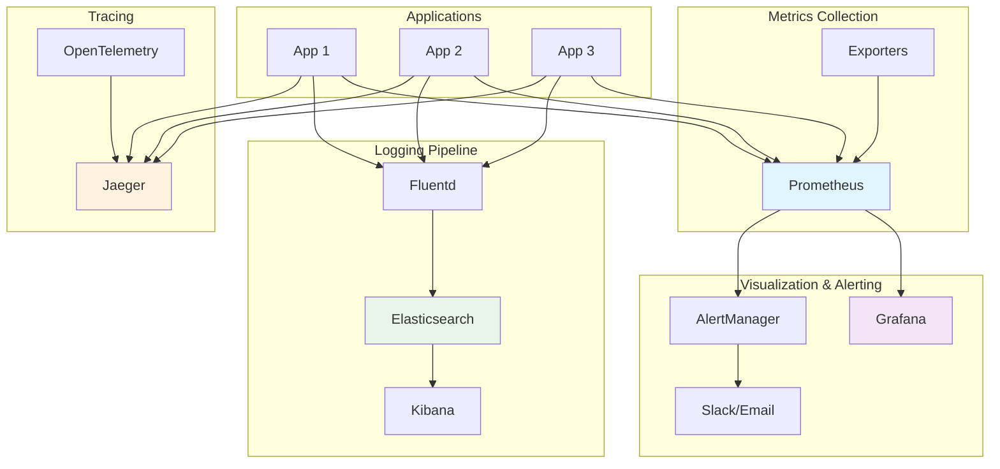

# Session 11: Monitoring, Logging & Observability

## 🎯 **Session Objectives**
By the end of this session, you will be able to:
- Deploy and configure Prometheus and Grafana monitoring stack
- Implement centralized logging with ELK/EFK stack
- Set up distributed tracing with Jaeger for microservices
- Create custom metrics, dashboards, and alerting rules
- Apply observability best practices for production environments

---

## 📚 **Session Agenda** (4 hours)

### **Part 1: Monitoring with Prometheus & Grafana (120 minutes)**
- Prometheus architecture and data model
- Grafana dashboard creation and visualization
- ServiceMonitors and custom metrics

### **Part 2: Centralized Logging (90 minutes)**
- ELK/EFK stack deployment and configuration
- Log aggregation and parsing strategies
- Log-based alerting and analysis

### **Part 3: Distributed Tracing & Observability (30 minutes)**
- Jaeger tracing implementation
- OpenTelemetry integration
- Observability best practices

---

## 📖 **Theoretical Foundation**

### **The Three Pillars of Observability**

Observability in distributed systems relies on three fundamental pillars:

1. **Metrics**: Numerical measurements over time (CPU, memory, request rate)
2. **Logs**: Discrete events with timestamps (application logs, audit trails)
3. **Traces**: Request flows through distributed systems (microservice calls)

### **Prometheus Architecture**

Prometheus follows a pull-based model with these components:
- **Prometheus Server**: Scrapes and stores metrics
- **Pushgateway**: For short-lived jobs
- **Exporters**: Expose metrics from third-party systems
- **Alertmanager**: Handles alerts and notifications
- **Client Libraries**: Instrument applications

### **Monitoring Strategy Levels**

| Level | Focus | Examples | Tools |
|-------|-------|----------|-------|
| **Infrastructure** | Hardware, OS, Network | CPU, Memory, Disk | Node Exporter, cAdvisor |
| **Platform** | Kubernetes, Containers | Pod status, Resource usage | kube-state-metrics |
| **Application** | Business metrics, SLIs | Request rate, Error rate | Custom metrics |
| **User Experience** | End-user perspective | Page load time, Availability | Synthetic monitoring |

### **SLI, SLO, and SLA Concepts**

- **SLI (Service Level Indicator)**: Quantitative measure of service level
- **SLO (Service Level Objective)**: Target value for SLI
- **SLA (Service Level Agreement)**: Business agreement based on SLOs

---

## 🔧 **Hands-on Labs**

### **Lab 1: Prometheus and Grafana Setup**

#### **Step 1: Deploy Prometheus Stack**
```bash
# Create monitoring namespace
kubectl create namespace monitoring

# Add Prometheus Helm repository
helm repo add prometheus-community https://prometheus-community.github.io/helm-charts
helm repo update

# Install kube-prometheus-stack
helm install prometheus prometheus-community/kube-prometheus-stack \
  --namespace monitoring \
  --set prometheus.prometheusSpec.serviceMonitorSelectorNilUsesHelmValues=false \
  --set prometheus.prometheusSpec.podMonitorSelectorNilUsesHelmValues=false \
  --set prometheus.prometheusSpec.retention=30d \
  --set prometheus.prometheusSpec.storageSpec.volumeClaimTemplate.spec.resources.requests.storage=50Gi \
  --set grafana.adminPassword=admin123 \
  --set grafana.persistence.enabled=true \
  --set grafana.persistence.size=10Gi \
  --set alertmanager.alertmanagerSpec.storage.volumeClaimTemplate.spec.resources.requests.storage=10Gi

# Wait for deployment
kubectl get pods -n monitoring -w

# Port forward to access services
kubectl port-forward -n monitoring svc/prometheus-kube-prometheus-prometheus 9090:9090 &
kubectl port-forward -n monitoring svc/prometheus-grafana 3000:80 &

# Access URLs:
# Prometheus: http://localhost:9090
# Grafana: http://localhost:3000 (admin/admin123)
```

#### **Step 2: Create Custom Application with Metrics**
```bash
# Create application namespace
kubectl create namespace app-monitoring

# Create sample application with metrics endpoint
cat > sample-app-with-metrics.yaml << EOF
apiVersion: apps/v1
kind: Deployment
metadata:
  name: sample-metrics-app
  namespace: app-monitoring
  labels:
    app: sample-metrics-app
spec:
  replicas: 3
  selector:
    matchLabels:
      app: sample-metrics-app
  template:
    metadata:
      labels:
        app: sample-metrics-app
    spec:
      containers:
      - name: metrics-app
        image: nginx:1.21
        ports:
        - containerPort: 80
          name: http
        - containerPort: 8080
          name: metrics
        volumeMounts:
        - name: nginx-config
          mountPath: /etc/nginx/conf.d
        - name: metrics-script
          mountPath: /usr/local/bin
        command: ["/bin/sh"]
        args:
        - -c
        - |
          # Start metrics endpoint
          chmod +x /usr/local/bin/metrics-server.sh
          /usr/local/bin/metrics-server.sh &
          # Start nginx
          nginx -g 'daemon off;'
        resources:
          requests:
            cpu: "100m"
            memory: "128Mi"
          limits:
            cpu: "200m"
            memory: "256Mi"
      volumes:
      - name: nginx-config
        configMap:
          name: nginx-config
      - name: metrics-script
        configMap:
          name: metrics-script
          defaultMode: 0755
---
apiVersion: v1
kind: ConfigMap
metadata:
  name: nginx-config
  namespace: app-monitoring
data:
  default.conf: |
    server {
        listen 80;
        server_name localhost;
        
        location / {
            root /usr/share/nginx/html;
            index index.html;
        }
        
        location /health {
            access_log off;
            return 200 "healthy\n";
            add_header Content-Type text/plain;
        }
        
        location /api {
            return 200 '{"status":"ok","timestamp":"'"\$(date -Iseconds)"'"}';
            add_header Content-Type application/json;
        }
    }
---
apiVersion: v1
kind: ConfigMap
metadata:
  name: metrics-script
  namespace: app-monitoring
data:
  metrics-server.sh: |
    #!/bin/sh
    # Simple metrics server using netcat
    while true; do
      TIMESTAMP=\$(date +%s)
      CPU_USAGE=\$(awk '{print \$1}' /proc/loadavg)
      MEMORY_USAGE=\$(free | awk '/^Mem:/{printf "%.2f", \$3/\$2 * 100.0}')
      REQUEST_COUNT=\$((RANDOM % 100 + 50))
      
      METRICS="# HELP http_requests_total Total HTTP requests
    # TYPE http_requests_total counter
    http_requests_total{method=\"GET\",status=\"200\"} \$REQUEST_COUNT
    http_requests_total{method=\"POST\",status=\"200\"} \$((REQUEST_COUNT / 4))
    http_requests_total{method=\"GET\",status=\"404\"} \$((REQUEST_COUNT / 20))
    
    # HELP cpu_usage_percent CPU usage percentage
    # TYPE cpu_usage_percent gauge
    cpu_usage_percent \$CPU_USAGE
    
    # HELP memory_usage_percent Memory usage percentage
    # TYPE memory_usage_percent gauge
    memory_usage_percent \$MEMORY_USAGE
    
    # HELP app_uptime_seconds Application uptime in seconds
    # TYPE app_uptime_seconds counter
    app_uptime_seconds \$TIMESTAMP"
    
      echo -e "HTTP/1.1 200 OK\r\nContent-Type: text/plain\r\nContent-Length: \${#METRICS}\r\n\r\n\$METRICS" | nc -l -p 8080 -q 1
    done
---
apiVersion: v1
kind: Service
metadata:
  name: sample-metrics-app
  namespace: app-monitoring
  labels:
    app: sample-metrics-app
spec:
  selector:
    app: sample-metrics-app
  ports:
  - name: http
    port: 80
    targetPort: 80
  - name: metrics
    port: 8080
    targetPort: 8080
EOF

kubectl apply -f sample-app-with-metrics.yaml

# Verify metrics endpoint
kubectl port-forward -n app-monitoring svc/sample-metrics-app 8080:8080 &
curl http://localhost:8080
```

#### **Step 3: Create ServiceMonitor**
```bash
# Create ServiceMonitor to scrape custom metrics
cat > servicemonitor.yaml << EOF
apiVersion: monitoring.coreos.com/v1
kind: ServiceMonitor
metadata:
  name: sample-app-metrics
  namespace: app-monitoring
  labels:
    app: sample-metrics-app
spec:
  selector:
    matchLabels:
      app: sample-metrics-app
  endpoints:
  - port: metrics
    path: /
    interval: 30s
    scrapeTimeout: 10s
  namespaceSelector:
    matchNames:
    - app-monitoring
EOF

kubectl apply -f servicemonitor.yaml

# Verify ServiceMonitor is discovered by Prometheus
# Go to Prometheus UI: http://localhost:9090
# Check Status > Targets to see if the new target is discovered
```

### **Lab 2: Custom Grafana Dashboards**

#### **Step 1: Create Custom Dashboard**
```bash
# Create Grafana dashboard ConfigMap
cat > grafana-dashboard.yaml << EOF
apiVersion: v1
kind: ConfigMap
metadata:
  name: sample-app-dashboard
  namespace: monitoring
  labels:
    grafana_dashboard: "1"
data:
  sample-app-dashboard.json: |
    {
      "dashboard": {
        "id": null,
        "title": "Sample Application Metrics",
        "tags": ["kubernetes", "application"],
        "timezone": "browser",
        "panels": [
          {
            "id": 1,
            "title": "HTTP Requests Rate",
            "type": "graph",
            "targets": [
              {
                "expr": "rate(http_requests_total[5m])",
                "legendFormat": "{{method}} {{status}}"
              }
            ],
            "yAxes": [
              {
                "label": "Requests/sec"
              }
            ],
            "gridPos": {
              "h": 8,
              "w": 12,
              "x": 0,
              "y": 0
            }
          },
          {
            "id": 2,
            "title": "CPU Usage",
            "type": "singlestat",
            "targets": [
              {
                "expr": "avg(cpu_usage_percent)",
                "legendFormat": "CPU %"
              }
            ],
            "gridPos": {
              "h": 8,
              "w": 12,
              "x": 12,
              "y": 0
            }
          },
          {
            "id": 3,
            "title": "Memory Usage",
            "type": "singlestat",
            "targets": [
              {
                "expr": "avg(memory_usage_percent)",
                "legendFormat": "Memory %"
              }
            ],
            "gridPos": {
              "h": 8,
              "w": 12,
              "x": 0,
              "y": 8
            }
          },
          {
            "id": 4,
            "title": "Application Uptime",
            "type": "singlestat",
            "targets": [
              {
                "expr": "max(app_uptime_seconds)",
                "legendFormat": "Uptime"
              }
            ],
            "gridPos": {
              "h": 8,
              "w": 12,
              "x": 12,
              "y": 8
            }
          }
        ],
        "time": {
          "from": "now-1h",
          "to": "now"
        },
        "refresh": "30s"
      }
    }
EOF

kubectl apply -f grafana-dashboard.yaml

# The dashboard will be automatically imported by Grafana
# Access Grafana at http://localhost:3000 and look for "Sample Application Metrics" dashboard
```

### **Lab 3: Alerting Rules**

#### **Step 1: Create PrometheusRule**
```bash
# Create alerting rules
cat > prometheus-rules.yaml << EOF
apiVersion: monitoring.coreos.com/v1
kind: PrometheusRule
metadata:
  name: sample-app-alerts
  namespace: app-monitoring
  labels:
    app: sample-metrics-app
spec:
  groups:
  - name: sample-app.rules
    rules:
    - alert: HighCPUUsage
      expr: cpu_usage_percent > 80
      for: 5m
      labels:
        severity: warning
        service: sample-app
      annotations:
        summary: "High CPU usage detected"
        description: "CPU usage is above 80% for more than 5 minutes"
    
    - alert: HighMemoryUsage
      expr: memory_usage_percent > 85
      for: 5m
      labels:
        severity: warning
        service: sample-app
      annotations:
        summary: "High memory usage detected"
        description: "Memory usage is above 85% for more than 5 minutes"
    
    - alert: HighErrorRate
      expr: rate(http_requests_total{status=~"4..|5.."}[5m]) > 0.1
      for: 2m
      labels:
        severity: critical
        service: sample-app
      annotations:
        summary: "High error rate detected"
        description: "Error rate is above 10% for more than 2 minutes"
    
    - alert: ApplicationDown
      expr: up{job="sample-metrics-app"} == 0
      for: 1m
      labels:
        severity: critical
        service: sample-app
      annotations:
        summary: "Application is down"
        description: "Sample application has been down for more than 1 minute"
EOF

kubectl apply -f prometheus-rules.yaml

# Check alerts in Prometheus UI: http://localhost:9090/alerts
```

### **Lab 4: ELK Stack for Logging**

#### **Step 1: Deploy Elasticsearch**
```bash
# Create logging namespace
kubectl create namespace logging

# Deploy Elasticsearch
cat > elasticsearch.yaml << EOF
apiVersion: apps/v1
kind: StatefulSet
metadata:
  name: elasticsearch
  namespace: logging
spec:
  serviceName: elasticsearch
  replicas: 1
  selector:
    matchLabels:
      app: elasticsearch
  template:
    metadata:
      labels:
        app: elasticsearch
    spec:
      containers:
      - name: elasticsearch
        image: docker.elastic.co/elasticsearch/elasticsearch:7.17.0
        ports:
        - containerPort: 9200
        - containerPort: 9300
        env:
        - name: discovery.type
          value: single-node
        - name: ES_JAVA_OPTS
          value: "-Xms512m -Xmx512m"
        - name: xpack.security.enabled
          value: "false"
        volumeMounts:
        - name: elasticsearch-data
          mountPath: /usr/share/elasticsearch/data
        resources:
          requests:
            memory: "1Gi"
            cpu: "500m"
          limits:
            memory: "2Gi"
            cpu: "1000m"
  volumeClaimTemplates:
  - metadata:
      name: elasticsearch-data
    spec:
      accessModes: ["ReadWriteOnce"]
      resources:
        requests:
          storage: 10Gi
---
apiVersion: v1
kind: Service
metadata:
  name: elasticsearch
  namespace: logging
spec:
  selector:
    app: elasticsearch
  ports:
  - port: 9200
    targetPort: 9200
EOF

kubectl apply -f elasticsearch.yaml
```

#### **Step 2: Deploy Kibana**
```bash
# Deploy Kibana
cat > kibana.yaml << EOF
apiVersion: apps/v1
kind: Deployment
metadata:
  name: kibana
  namespace: logging
spec:
  replicas: 1
  selector:
    matchLabels:
      app: kibana
  template:
    metadata:
      labels:
        app: kibana
    spec:
      containers:
      - name: kibana
        image: docker.elastic.co/kibana/kibana:7.17.0
        ports:
        - containerPort: 5601
        env:
        - name: ELASTICSEARCH_HOSTS
          value: "http://elasticsearch:9200"
        resources:
          requests:
            memory: "512Mi"
            cpu: "250m"
          limits:
            memory: "1Gi"
            cpu: "500m"
---
apiVersion: v1
kind: Service
metadata:
  name: kibana
  namespace: logging
spec:
  selector:
    app: kibana
  ports:
  - port: 5601
    targetPort: 5601
  type: NodePort
EOF

kubectl apply -f kibana.yaml

# Port forward to access Kibana
kubectl port-forward -n logging svc/kibana 5601:5601 &
# Access Kibana at http://localhost:5601
```

#### **Step 3: Deploy Fluentd**
```bash
# Create Fluentd DaemonSet for log collection
cat > fluentd.yaml << EOF
apiVersion: v1
kind: ServiceAccount
metadata:
  name: fluentd
  namespace: logging
---
apiVersion: rbac.authorization.k8s.io/v1
kind: ClusterRole
metadata:
  name: fluentd
rules:
- apiGroups:
  - ""
  resources:
  - pods
  - namespaces
  verbs:
  - get
  - list
  - watch
---
apiVersion: rbac.authorization.k8s.io/v1
kind: ClusterRoleBinding
metadata:
  name: fluentd
roleRef:
  kind: ClusterRole
  name: fluentd
  apiGroup: rbac.authorization.k8s.io
subjects:
- kind: ServiceAccount
  name: fluentd
  namespace: logging
---
apiVersion: apps/v1
kind: DaemonSet
metadata:
  name: fluentd
  namespace: logging
spec:
  selector:
    matchLabels:
      name: fluentd
  template:
    metadata:
      labels:
        name: fluentd
    spec:
      serviceAccount: fluentd
      serviceAccountName: fluentd
      tolerations:
      - key: node-role.kubernetes.io/master
        effect: NoSchedule
      containers:
      - name: fluentd
        image: fluent/fluentd-kubernetes-daemonset:v1-debian-elasticsearch
        env:
        - name: FLUENT_ELASTICSEARCH_HOST
          value: "elasticsearch.logging.svc.cluster.local"
        - name: FLUENT_ELASTICSEARCH_PORT
          value: "9200"
        - name: FLUENT_ELASTICSEARCH_SCHEME
          value: "http"
        - name: FLUENTD_SYSTEMD_CONF
          value: disable
        resources:
          limits:
            memory: 512Mi
          requests:
            cpu: 100m
            memory: 200Mi
        volumeMounts:
        - name: varlog
          mountPath: /var/log
        - name: varlibdockercontainers
          mountPath: /var/lib/docker/containers
          readOnly: true
      terminationGracePeriodSeconds: 30
      volumes:
      - name: varlog
        hostPath:
          path: /var/log
      - name: varlibdockercontainers
        hostPath:
          path: /var/lib/docker/containers
EOF

kubectl apply -f fluentd.yaml

# Verify Fluentd is collecting logs
kubectl get pods -n logging
kubectl logs -n logging -l name=fluentd
```

---

## 📊 **Observability Architecture**



---

## 🏢 **Real-World Use Case: Banking System Observability**

### **Scenario: BFSI Comprehensive Monitoring**
A bank implements full observability for their digital banking platform:

**Monitoring Requirements:**
- **Compliance**: SOX, PCI DSS audit trails
- **SLA Monitoring**: 99.99% availability tracking
- **Security**: Fraud detection and anomaly monitoring
- **Performance**: Sub-200ms response time monitoring

**Implementation:**
```yaml
# Banking-specific PrometheusRule
apiVersion: monitoring.coreos.com/v1
kind: PrometheusRule
metadata:
  name: banking-sla-alerts
  namespace: banking-prod
spec:
  groups:
  - name: banking.sla
    rules:
    - alert: TransactionLatencyHigh
      expr: histogram_quantile(0.95, rate(http_request_duration_seconds_bucket{service="payment-service"}[5m])) > 0.2
      for: 2m
      labels:
        severity: critical
        compliance: pci-dss
      annotations:
        summary: "Payment service latency exceeds SLA"
        description: "95th percentile latency is {{ $value }}s, exceeding 200ms SLA"
    
    - alert: FailedTransactionRate
      expr: rate(transaction_total{status="failed"}[5m]) / rate(transaction_total[5m]) > 0.01
      for: 1m
      labels:
        severity: critical
        compliance: sox
      annotations:
        summary: "High transaction failure rate"
        description: "Transaction failure rate is {{ $value | humanizePercentage }}"
    
    - alert: SecurityAnomalyDetected
      expr: increase(security_events_total{type="suspicious"}[5m]) > 10
      for: 0m
      labels:
        severity: critical
        security: fraud-detection
      annotations:
        summary: "Security anomaly detected"
        description: "{{ $value }} suspicious events in the last 5 minutes"
```

**Custom Metrics for Banking:**
```yaml
# Banking application with custom metrics
apiVersion: apps/v1
kind: Deployment
metadata:
  name: payment-service
  namespace: banking-prod
spec:
  template:
    spec:
      containers:
      - name: payment-service
        image: banking/payment-service:v2.1
        env:
        - name: METRICS_ENABLED
          value: "true"
        - name: COMPLIANCE_MODE
          value: "pci-dss"
        ports:
        - containerPort: 8080
          name: http
        - containerPort: 9090
          name: metrics
        # Custom metrics exposed:
        # - transaction_total{status, type, amount_range}
        # - transaction_duration_seconds{status, type}
        # - account_balance_changes_total{account_type}
        # - security_events_total{type, severity}
        # - compliance_audit_events_total{regulation}
```

**Benefits Achieved:**
- **Compliance**: Automated audit trail generation
- **SLA Monitoring**: Real-time SLA tracking and alerting
- **Security**: Proactive fraud detection
- **Cost Optimization**: Resource usage optimization based on metrics

---

## 🛠 **Advanced Observability Patterns**

### **SLI/SLO Implementation**
```yaml
# SLI/SLO recording rules
apiVersion: monitoring.coreos.com/v1
kind: PrometheusRule
metadata:
  name: sli-slo-rules
  namespace: monitoring
spec:
  groups:
  - name: sli.rules
    interval: 30s
    rules:
    # Availability SLI
    - record: sli:availability:rate5m
      expr: |
        (
          sum(rate(http_requests_total{code!~"5.."}[5m])) by (service)
          /
          sum(rate(http_requests_total[5m])) by (service)
        )
    
    # Latency SLI
    - record: sli:latency:p99:5m
      expr: |
        histogram_quantile(0.99,
          sum(rate(http_request_duration_seconds_bucket[5m])) by (service, le)
        )
    
    # Error budget calculation
    - record: slo:error_budget:availability
      expr: |
        1 - (
          (1 - 0.999) - # 99.9% SLO
          (1 - sli:availability:rate5m)
        ) / (1 - 0.999)
```

### **Log-based Metrics**
```yaml
# Fluentd configuration for log-based metrics
apiVersion: v1
kind: ConfigMap
metadata:
  name: fluentd-config
  namespace: logging
data:
  fluent.conf: |
    <source>
      @type tail
      path /var/log/containers/*.log
      pos_file /var/log/fluentd-containers.log.pos
      tag kubernetes.*
      format json
      time_key time
      time_format %Y-%m-%dT%H:%M:%S.%NZ
    </source>
    
    <filter kubernetes.**>
      @type kubernetes_metadata
    </filter>
    
    # Extract metrics from logs
    <filter kubernetes.**>
      @type prometheus
      <metric>
        name log_error_total
        type counter
        desc Total number of error logs
        key error
        <labels>
          namespace ${record['kubernetes']['namespace_name']}
          pod ${record['kubernetes']['pod_name']}
        </labels>
      </metric>
    </filter>
    
    <match kubernetes.**>
      @type elasticsearch
      host elasticsearch.logging.svc.cluster.local
      port 9200
      index_name kubernetes
      type_name _doc
    </match>
```

---

## ✅ **Session 11 Checklist**

- [ ] Deployed Prometheus and Grafana monitoring stack
- [ ] Created custom metrics and ServiceMonitors
- [ ] Built comprehensive Grafana dashboards
- [ ] Implemented alerting rules and notifications
- [ ] Set up ELK stack for centralized logging
- [ ] Configured log aggregation with Fluentd
- [ ] Implemented SLI/SLO monitoring patterns
- [ ] Applied observability best practices for production

---

## 🎯 **Next Session Preview**

**Session 12: Security, RBAC & Best Practices**
- Role-Based Access Control (RBAC) implementation
- Pod Security Policies and Standards
- Container image security and scanning
- Network policies and microsegmentation
- Security compliance and audit strategies

---

## 👨‍💻 **About the Author**

**Varun Kumar Manik** is a distinguished **Cloud Architect, Kubernetes Expert, and DevOps Specialist** with nearly **1.5 decades of hands-on experience** in designing, implementing, and optimizing cloud-native solutions across enterprise environments. As an **AWS Ambassador for 6+ years**, Varun has been officially recognized by Amazon Web Services for his outstanding contributions to the cloud community and deep expertise in AWS technologies.

### 🏆 **Professional Recognition**
- **AWS Ambassador Profile**: [View on AWS Partners Portal](https://aws.amazon.com/partners/ambassadors/)
- **Kubernetes Community Contributor**: Active in CNCF ecosystem
- **Corporate Training Specialist**: Delivered K8s training to 500+ professionals

### 💼 **Professional Expertise**

#### ☸️ **Kubernetes & Container Orchestration**
- Production Kubernetes deployments across Telco, BFSI, and Enterprise sectors
- Multi-cluster management and federation strategies
- Kubernetes security hardening and RBAC implementation
- Service mesh integration (Istio, Linkerd) for enterprise workloads

#### 🚀 **DevOps & CI/CD Excellence**
- GitOps workflows with ArgoCD and Flux
- Infrastructure as Code with Terraform and Helm
- Container security and compliance automation
- Enterprise CI/CD pipeline optimization

### 🌐 **Connect & Follow**

- **GitHub**: [https://github.com/manikcloud](https://github.com/manikcloud)
- **LinkedIn**: [https://www.linkedin.com/in/vkmanik/](https://www.linkedin.com/in/vkmanik/)
- **Email**: [varunmanik1@gmail.com](mailto:varunmanik1@gmail.com)

---

*Next: [Session 12 - Security, RBAC & Best Practices](../session-12-k8s-security-rbac/)*
