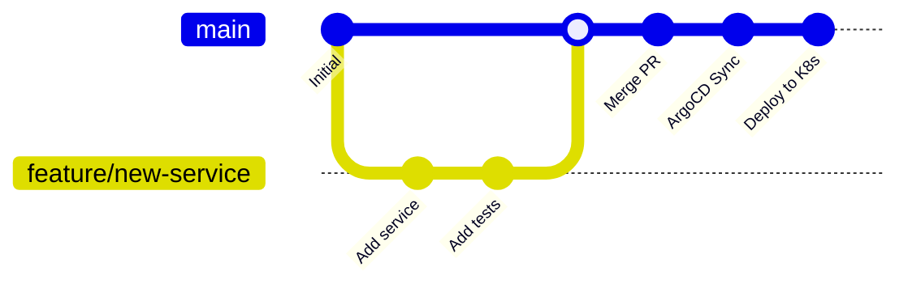

# Session 13: CI/CD Integration & GitOps

## 🎯 **Session Objectives**
By the end of this session, you will be able to:
- Implement GitOps workflows with ArgoCD and Flux
- Integrate Kubernetes with CI/CD pipelines (Jenkins, GitHub Actions)
- Configure automated testing and deployment strategies
- Deploy blue-green and canary deployment patterns
- Set up multi-environment promotion workflows

## 📖 **Theoretical Foundation**

### **GitOps Principles**
1. **Declarative**: System state described declaratively
2. **Versioned**: Configuration stored in Git with full history
3. **Automated**: Changes automatically applied to system
4. **Observable**: System state continuously monitored

### **CI/CD Pipeline Stages**
```
Code Commit → Build → Test → Security Scan → 
Package → Deploy to Dev → Integration Tests → 
Deploy to Staging → E2E Tests → Deploy to Production
```

## 🔧 **Hands-on Labs**

### **Lab 1: ArgoCD Setup**
```bash
# Install ArgoCD
kubectl create namespace argocd
kubectl apply -n argocd -f https://raw.githubusercontent.com/argoproj/argo-cd/stable/manifests/install.yaml

# Wait for ArgoCD to be ready
kubectl wait --for=condition=available --timeout=300s deployment/argocd-server -n argocd

# Get ArgoCD admin password
kubectl -n argocd get secret argocd-initial-admin-secret -o jsonpath="{.data.password}" | base64 -d

# Port forward to access ArgoCD UI
kubectl port-forward svc/argocd-server -n argocd 8080:443 &
# Access: https://localhost:8080 (admin/password-from-above)
```

### **Lab 2: GitOps Application Deployment**
```bash
# Create ArgoCD application
cat > argocd-app.yaml << 'YAML'
apiVersion: argoproj.io/v1alpha1
kind: Application
metadata:
  name: corporate-banking-app
  namespace: argocd
spec:
  project: default
  source:
    repoURL: https://github.com/manikcloud/k8s-zero-to-hero-corporate
    targetRevision: HEAD
    path: gitops-apps/banking-app
  destination:
    server: https://kubernetes.default.svc
    namespace: banking-prod
  syncPolicy:
    automated:
      prune: true
      selfHeal: true
    syncOptions:
    - CreateNamespace=true
YAML

kubectl apply -f argocd-app.yaml
```

### **Lab 3: GitHub Actions CI/CD Pipeline**
```yaml
# .github/workflows/k8s-deploy.yml
name: Kubernetes Deploy
on:
  push:
    branches: [main]
  pull_request:
    branches: [main]

jobs:
  test:
    runs-on: ubuntu-latest
    steps:
    - uses: actions/checkout@v3
    - name: Run Tests
      run: |
        echo "Running unit tests..."
        # Add your test commands here
    
  security-scan:
    runs-on: ubuntu-latest
    steps:
    - uses: actions/checkout@v3
    - name: Run Security Scan
      run: |
        docker run --rm -v "$PWD:/app" securecodewarrior/docker-security-scan
  
  deploy:
    needs: [test, security-scan]
    runs-on: ubuntu-latest
    if: github.ref == 'refs/heads/main'
    steps:
    - uses: actions/checkout@v3
    - name: Deploy to Kubernetes
      run: |
        kubectl apply -f k8s-manifests/
```

## 📊 **GitOps Workflow Diagram**



## 🏢 **Real-World Use Case: Banking CI/CD Pipeline**

### **Scenario: Enterprise Banking Deployment**
A bank implements GitOps for their microservices with compliance requirements:

```yaml
# Banking GitOps configuration
apiVersion: argoproj.io/v1alpha1
kind: Application
metadata:
  name: payment-service
  namespace: argocd
  annotations:
    compliance.bank.com/sox-required: "true"
    security.bank.com/pci-dss: "level-1"
spec:
  project: banking
  source:
    repoURL: https://git.bank.com/k8s/payment-service
    targetRevision: release/v2.1
    path: k8s-manifests
  destination:
    server: https://k8s-prod.bank.com
    namespace: payment-prod
  syncPolicy:
    automated:
      prune: false  # Manual approval for production
      selfHeal: false
    syncOptions:
    - CreateNamespace=true
    - ApplyOutOfSyncOnly=true
  ignoreDifferences:
  - group: apps
    kind: Deployment
    jsonPointers:
    - /spec/replicas  # Ignore HPA changes
```

**Benefits Achieved:**
- **Compliance**: Automated SOX audit trails
- **Security**: Integrated security scanning
- **Reliability**: Automated rollback capabilities
- **Efficiency**: 90% reduction in deployment time

## 👨‍💻 **About the Author**
**Varun Kumar Manik** - Kubernetes Expert & AWS Ambassador

*Next: [Session 14 - Production Deployment & Best Practices](../session-14-k8s-production-best-practices/)*
