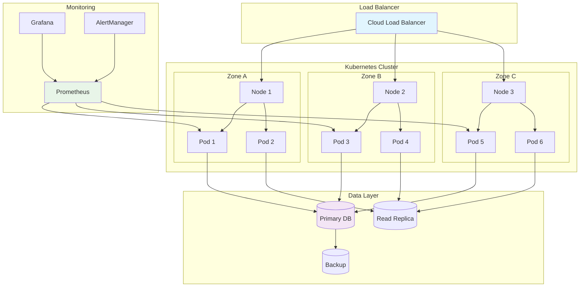

# Session 14: Production Deployment & Best Practices

## 🎯 **Session Objectives**
By the end of this session, you will be able to:
- Design production-ready Kubernetes architectures
- Implement high availability and disaster recovery strategies
- Configure cluster autoscaling and resource optimization
- Apply enterprise security and compliance frameworks
- Establish operational procedures and runbooks

## 📖 **Theoretical Foundation**

### **Production Readiness Checklist**
1. **High Availability**: Multi-zone deployments, redundancy
2. **Scalability**: Horizontal and vertical scaling strategies
3. **Security**: RBAC, network policies, image scanning
4. **Monitoring**: Comprehensive observability stack
5. **Backup & Recovery**: Data protection and disaster recovery
6. **Performance**: Resource optimization and tuning

### **Enterprise Architecture Patterns**
- **Multi-Cluster**: Separate clusters for different environments
- **Multi-Region**: Geographic distribution for disaster recovery
- **Multi-Tenant**: Shared infrastructure with isolation
- **Hybrid Cloud**: On-premises and cloud integration

## 🔧 **Hands-on Labs**

### **Lab 1: High Availability Setup**
```bash
# Create production namespace with resource quotas
kubectl create namespace production

cat > production-quota.yaml << 'YAML'
apiVersion: v1
kind: ResourceQuota
metadata:
  name: production-quota
  namespace: production
spec:
  hard:
    requests.cpu: "20"
    requests.memory: 40Gi
    limits.cpu: "40"
    limits.memory: 80Gi
    pods: "100"
    services: "50"
    persistentvolumeclaims: "20"
YAML

kubectl apply -f production-quota.yaml
```

### **Lab 2: Production Deployment Pattern**
```yaml
# Production-grade deployment
apiVersion: apps/v1
kind: Deployment
metadata:
  name: banking-api-prod
  namespace: production
  labels:
    app: banking-api
    version: v2.1.0
    environment: production
spec:
  replicas: 5
  strategy:
    type: RollingUpdate
    rollingUpdate:
      maxUnavailable: 1
      maxSurge: 2
  selector:
    matchLabels:
      app: banking-api
  template:
    metadata:
      labels:
        app: banking-api
        version: v2.1.0
    spec:
      affinity:
        podAntiAffinity:
          requiredDuringSchedulingIgnoredDuringExecution:
          - labelSelector:
              matchExpressions:
              - key: app
                operator: In
                values:
                - banking-api
            topologyKey: kubernetes.io/hostname
      securityContext:
        runAsNonRoot: true
        runAsUser: 1000
        fsGroup: 2000
      containers:
      - name: banking-api
        image: banking/api:v2.1.0-prod
        ports:
        - containerPort: 8080
        env:
        - name: ENVIRONMENT
          value: "production"
        - name: LOG_LEVEL
          value: "INFO"
        resources:
          requests:
            memory: "512Mi"
            cpu: "250m"
          limits:
            memory: "1Gi"
            cpu: "500m"
        livenessProbe:
          httpGet:
            path: /health
            port: 8080
          initialDelaySeconds: 30
          periodSeconds: 10
        readinessProbe:
          httpGet:
            path: /ready
            port: 8080
          initialDelaySeconds: 5
          periodSeconds: 5
        securityContext:
          allowPrivilegeEscalation: false
          readOnlyRootFilesystem: true
          capabilities:
            drop:
            - ALL
```

### **Lab 3: Disaster Recovery Setup**
```bash
# Velero backup configuration
helm repo add vmware-tanzu https://vmware-tanzu.github.io/helm-charts/
helm install velero vmware-tanzu/velero \
  --namespace velero \
  --create-namespace \
  --set configuration.provider=aws \
  --set configuration.backupStorageLocation.bucket=k8s-backup-bucket \
  --set configuration.backupStorageLocation.config.region=us-west-2

# Create backup schedule
cat > backup-schedule.yaml << 'YAML'
apiVersion: velero.io/v1
kind: Schedule
metadata:
  name: production-backup
  namespace: velero
spec:
  schedule: "0 2 * * *"  # Daily at 2 AM
  template:
    includedNamespaces:
    - production
    - banking-prod
    storageLocation: default
    ttl: 720h0m0s  # 30 days retention
YAML

kubectl apply -f backup-schedule.yaml
```

## 📊 **Production Architecture Diagram**



## 🏢 **Real-World Use Case: Enterprise Banking Production**

### **Scenario: Multi-Region Banking Platform**
A global bank deploys their core banking system across multiple regions:

**Architecture Components:**
- **Primary Region**: US-East (Production traffic)
- **Secondary Region**: US-West (Disaster recovery)
- **Edge Locations**: Regional API gateways
- **Data Replication**: Cross-region database replication

```yaml
# Multi-region deployment configuration
apiVersion: apps/v1
kind: Deployment
metadata:
  name: core-banking-system
  namespace: banking-global
  annotations:
    deployment.kubernetes.io/revision: "1"
    compliance.bank.com/sox-compliant: "true"
    security.bank.com/pci-dss-level: "1"
spec:
  replicas: 10
  strategy:
    type: RollingUpdate
    rollingUpdate:
      maxUnavailable: 2
      maxSurge: 3
  template:
    spec:
      topologySpreadConstraints:
      - maxSkew: 1
        topologyKey: topology.kubernetes.io/zone
        whenUnsatisfiable: DoNotSchedule
        labelSelector:
          matchLabels:
            app: core-banking-system
      affinity:
        podAntiAffinity:
          preferredDuringSchedulingIgnoredDuringExecution:
          - weight: 100
            podAffinityTerm:
              labelSelector:
                matchExpressions:
                - key: app
                  operator: In
                  values:
                  - core-banking-system
              topologyKey: kubernetes.io/hostname
      containers:
      - name: banking-core
        image: banking/core-system:v3.2.1-prod
        resources:
          requests:
            memory: "2Gi"
            cpu: "1000m"
          limits:
            memory: "4Gi"
            cpu: "2000m"
        env:
        - name: REGION
          value: "us-east-1"
        - name: ENVIRONMENT
          value: "production"
        - name: COMPLIANCE_MODE
          value: "strict"
```

**Production Metrics:**
- **Availability**: 99.99% uptime (4.32 minutes downtime/month)
- **Performance**: <100ms API response time
- **Scalability**: Auto-scales from 10 to 100 pods based on load
- **Recovery**: <15 minutes RTO, <1 hour RPO

## 🛠 **Production Operational Procedures**

### **Deployment Runbook**
```bash
# Pre-deployment checklist
1. Verify all tests pass in staging
2. Security scan completed with no critical issues
3. Database migrations tested
4. Rollback plan prepared
5. Monitoring alerts configured

# Deployment procedure
kubectl apply -f production-manifests/ --dry-run=server
kubectl apply -f production-manifests/
kubectl rollout status deployment/banking-api-prod -n production

# Post-deployment verification
kubectl get pods -n production
kubectl logs -l app=banking-api -n production --tail=100
curl -f https://api.bank.com/health
```

### **Incident Response Procedure**
```bash
# Incident detection
1. Monitor alerts in Grafana/PagerDuty
2. Check application logs in Kibana
3. Verify infrastructure metrics in Prometheus

# Immediate response
kubectl get pods -n production
kubectl describe pod <failing-pod> -n production
kubectl logs <failing-pod> -n production

# Rollback if necessary
kubectl rollout undo deployment/banking-api-prod -n production
kubectl rollout status deployment/banking-api-prod -n production
```

## ✅ **Production Readiness Checklist**

- [ ] Multi-zone deployment with pod anti-affinity
- [ ] Resource requests and limits properly configured
- [ ] Health checks (liveness and readiness probes) implemented
- [ ] Security contexts and policies applied
- [ ] Monitoring and alerting configured
- [ ] Backup and disaster recovery tested
- [ ] CI/CD pipeline with automated testing
- [ ] Documentation and runbooks created
- [ ] Incident response procedures established
- [ ] Performance testing completed
- [ ] Security scanning integrated
- [ ] Compliance requirements validated

## 👨‍💻 **About the Author**
**Varun Kumar Manik** - Kubernetes Expert & AWS Ambassador

*Next: [Session 15 - Capstone Project & Certification Prep](../session-15-capstone-project/)*
