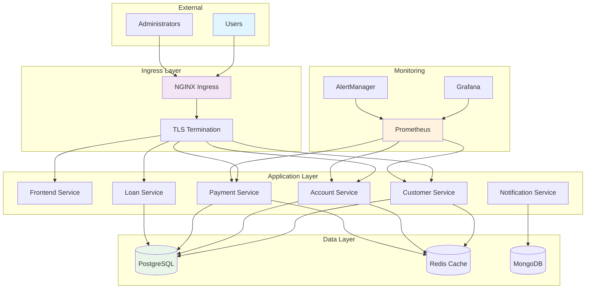

# Session 15: Capstone Project & Certification Prep

## 🎯 **Session Objectives**
By the end of this session, you will be able to:
- Design and deploy a complete enterprise-grade Kubernetes application
- Implement end-to-end CI/CD pipelines with GitOps
- Apply security best practices and compliance requirements
- Demonstrate production-ready monitoring and observability
- Prepare for Kubernetes certifications (CKA, CKAD, CKS)

---

## 📚 **Session Agenda** (6 hours)

### **Part 1: Capstone Project Design (90 minutes)**
- Requirements analysis and architecture design
- Technology stack selection and planning
- Security and compliance considerations

### **Part 2: Implementation Phase (180 minutes)**
- Infrastructure setup and configuration
- Application deployment and integration
- Monitoring and observability implementation

### **Part 3: Testing and Validation (90 minutes)**
- Load testing and performance validation
- Security testing and vulnerability assessment
- Disaster recovery testing

### **Part 4: Certification Preparation (60 minutes)**
- CKA, CKAD, and CKS exam overview
- Practice scenarios and tips
- Career guidance and next steps

---

## 🏗️ **Capstone Project: Corporate Banking Platform**

### **Project Overview**
Deploy a complete microservices-based banking platform with:
- Customer management service
- Account management service  
- Payment processing service
- Loan management service
- Notification service
- API Gateway and web frontend

### **Architecture Requirements**
```yaml
# High-level architecture
Components:
  Frontend:
    - React.js web application
    - Mobile-responsive design
    - Authentication integration
  
  API Gateway:
    - NGINX Ingress Controller
    - Rate limiting and security
    - SSL/TLS termination
  
  Microservices:
    - Customer Service (Node.js)
    - Account Service (Java Spring Boot)
    - Payment Service (Python FastAPI)
    - Loan Service (Go)
    - Notification Service (Node.js)
  
  Databases:
    - PostgreSQL (primary data)
    - Redis (caching)
    - MongoDB (document storage)
  
  Infrastructure:
    - Kubernetes cluster
    - Persistent storage
    - Service mesh (Istio)
    - Monitoring stack
```

---

## 🔧 **Hands-on Implementation**

### **Lab 1: Project Setup and Infrastructure**

#### **Step 1: Namespace and Resource Planning**
```bash
# Create project namespaces
kubectl create namespace banking-platform
kubectl create namespace banking-monitoring
kubectl create namespace banking-security

# Apply resource quotas
cat > banking-quotas.yaml << EOF
apiVersion: v1
kind: ResourceQuota
metadata:
  name: banking-platform-quota
  namespace: banking-platform
spec:
  hard:
    requests.cpu: "10"
    requests.memory: 20Gi
    limits.cpu: "20"
    limits.memory: 40Gi
    pods: "50"
    services: "20"
    persistentvolumeclaims: "10"
    secrets: "20"
    configmaps: "20"
EOF

kubectl apply -f banking-quotas.yaml

# Create network policies
cat > banking-network-policy.yaml << EOF
apiVersion: networking.k8s.io/v1
kind: NetworkPolicy
metadata:
  name: banking-network-policy
  namespace: banking-platform
spec:
  podSelector: {}
  policyTypes:
  - Ingress
  - Egress
  ingress:
  - from:
    - namespaceSelector:
        matchLabels:
          name: banking-platform
    - namespaceSelector:
        matchLabels:
          name: ingress-nginx
  egress:
  - to:
    - namespaceSelector:
        matchLabels:
          name: banking-platform
  - to: []
    ports:
    - protocol: UDP
      port: 53
    - protocol: TCP
      port: 443
EOF

kubectl apply -f banking-network-policy.yaml
```

#### **Step 2: Database Layer Setup**
```bash
# PostgreSQL StatefulSet for primary data
cat > postgres-statefulset.yaml << EOF
apiVersion: apps/v1
kind: StatefulSet
metadata:
  name: postgres-primary
  namespace: banking-platform
spec:
  serviceName: postgres-primary
  replicas: 1
  selector:
    matchLabels:
      app: postgres
      role: primary
  template:
    metadata:
      labels:
        app: postgres
        role: primary
    spec:
      containers:
      - name: postgres
        image: postgres:14
        ports:
        - containerPort: 5432
        env:
        - name: POSTGRES_DB
          value: banking_db
        - name: POSTGRES_USER
          valueFrom:
            secretKeyRef:
              name: postgres-secret
              key: username
        - name: POSTGRES_PASSWORD
          valueFrom:
            secretKeyRef:
              name: postgres-secret
              key: password
        - name: PGDATA
          value: /var/lib/postgresql/data/pgdata
        volumeMounts:
        - name: postgres-storage
          mountPath: /var/lib/postgresql/data
        resources:
          requests:
            memory: "1Gi"
            cpu: "500m"
          limits:
            memory: "2Gi"
            cpu: "1000m"
        livenessProbe:
          exec:
            command:
            - pg_isready
            - -U
            - \$(POSTGRES_USER)
          initialDelaySeconds: 30
          periodSeconds: 10
        readinessProbe:
          exec:
            command:
            - pg_isready
            - -U
            - \$(POSTGRES_USER)
          initialDelaySeconds: 5
          periodSeconds: 5
  volumeClaimTemplates:
  - metadata:
      name: postgres-storage
    spec:
      accessModes: ["ReadWriteOnce"]
      resources:
        requests:
          storage: 10Gi
---
apiVersion: v1
kind: Secret
metadata:
  name: postgres-secret
  namespace: banking-platform
type: Opaque
data:
  username: YmFua2luZ191c2Vy  # banking_user
  password: c2VjdXJlUGFzcw==  # securePass
---
apiVersion: v1
kind: Service
metadata:
  name: postgres-primary
  namespace: banking-platform
spec:
  selector:
    app: postgres
    role: primary
  ports:
  - port: 5432
    targetPort: 5432
  clusterIP: None
EOF

kubectl apply -f postgres-statefulset.yaml

# Redis for caching
cat > redis-deployment.yaml << EOF
apiVersion: apps/v1
kind: Deployment
metadata:
  name: redis-cache
  namespace: banking-platform
spec:
  replicas: 1
  selector:
    matchLabels:
      app: redis
  template:
    metadata:
      labels:
        app: redis
    spec:
      containers:
      - name: redis
        image: redis:7-alpine
        ports:
        - containerPort: 6379
        command: ["redis-server"]
        args: ["--appendonly", "yes", "--requirepass", "\$(REDIS_PASSWORD)"]
        env:
        - name: REDIS_PASSWORD
          valueFrom:
            secretKeyRef:
              name: redis-secret
              key: password
        volumeMounts:
        - name: redis-storage
          mountPath: /data
        resources:
          requests:
            memory: "256Mi"
            cpu: "100m"
          limits:
            memory: "512Mi"
            cpu: "200m"
      volumes:
      - name: redis-storage
        persistentVolumeClaim:
          claimName: redis-pvc
---
apiVersion: v1
kind: Secret
metadata:
  name: redis-secret
  namespace: banking-platform
type: Opaque
data:
  password: cmVkaXNQYXNz  # redisPass
---
apiVersion: v1
kind: PersistentVolumeClaim
metadata:
  name: redis-pvc
  namespace: banking-platform
spec:
  accessModes:
  - ReadWriteOnce
  resources:
    requests:
      storage: 5Gi
---
apiVersion: v1
kind: Service
metadata:
  name: redis-service
  namespace: banking-platform
spec:
  selector:
    app: redis
  ports:
  - port: 6379
    targetPort: 6379
EOF

kubectl apply -f redis-deployment.yaml
```

### **Lab 2: Microservices Deployment**

#### **Step 1: Customer Service**
```bash
# Customer Service Deployment
cat > customer-service.yaml << EOF
apiVersion: apps/v1
kind: Deployment
metadata:
  name: customer-service
  namespace: banking-platform
  labels:
    app: customer-service
    version: v1.0.0
spec:
  replicas: 3
  selector:
    matchLabels:
      app: customer-service
  template:
    metadata:
      labels:
        app: customer-service
        version: v1.0.0
    spec:
      containers:
      - name: customer-service
        image: node:18-alpine
        ports:
        - containerPort: 3000
        env:
        - name: NODE_ENV
          value: "production"
        - name: DB_HOST
          value: "postgres-primary"
        - name: DB_NAME
          value: "banking_db"
        - name: DB_USER
          valueFrom:
            secretKeyRef:
              name: postgres-secret
              key: username
        - name: DB_PASSWORD
          valueFrom:
            secretKeyRef:
              name: postgres-secret
              key: password
        - name: REDIS_HOST
          value: "redis-service"
        - name: REDIS_PASSWORD
          valueFrom:
            secretKeyRef:
              name: redis-secret
              key: password
        command: ["/bin/sh"]
        args:
        - -c
        - |
          cat > package.json << 'EOL'
          {
            "name": "customer-service",
            "version": "1.0.0",
            "main": "server.js",
            "dependencies": {
              "express": "^4.18.0",
              "pg": "^8.8.0",
              "redis": "^4.3.0"
            }
          }
          EOL
          cat > server.js << 'EOL'
          const express = require('express');
          const app = express();
          const PORT = process.env.PORT || 3000;
          
          app.use(express.json());
          
          app.get('/health', (req, res) => {
            res.json({ status: 'healthy', service: 'customer-service', version: '1.0.0' });
          });
          
          app.get('/customers', (req, res) => {
            res.json({ 
              message: 'Customer service endpoint',
              customers: [
                { id: 1, name: 'John Doe', email: 'john@example.com' },
                { id: 2, name: 'Jane Smith', email: 'jane@example.com' }
              ]
            });
          });
          
          app.listen(PORT, () => {
            console.log(\`Customer service running on port \${PORT}\`);
          });
          EOL
          npm install && node server.js
        resources:
          requests:
            memory: "256Mi"
            cpu: "100m"
          limits:
            memory: "512Mi"
            cpu: "200m"
        livenessProbe:
          httpGet:
            path: /health
            port: 3000
          initialDelaySeconds: 30
          periodSeconds: 10
        readinessProbe:
          httpGet:
            path: /health
            port: 3000
          initialDelaySeconds: 5
          periodSeconds: 5
---
apiVersion: v1
kind: Service
metadata:
  name: customer-service
  namespace: banking-platform
spec:
  selector:
    app: customer-service
  ports:
  - port: 80
    targetPort: 3000
EOF

kubectl apply -f customer-service.yaml
```

### **Lab 3: API Gateway and Ingress**

#### **Step 1: Ingress Configuration**
```bash
# API Gateway Ingress
cat > banking-ingress.yaml << EOF
apiVersion: networking.k8s.io/v1
kind: Ingress
metadata:
  name: banking-api-gateway
  namespace: banking-platform
  annotations:
    nginx.ingress.kubernetes.io/rewrite-target: /\$2
    nginx.ingress.kubernetes.io/rate-limit: "100"
    nginx.ingress.kubernetes.io/rate-limit-window: "1m"
    nginx.ingress.kubernetes.io/ssl-redirect: "false"
    nginx.ingress.kubernetes.io/cors-allow-origin: "*"
    nginx.ingress.kubernetes.io/cors-allow-methods: "GET, POST, PUT, DELETE, OPTIONS"
    nginx.ingress.kubernetes.io/cors-allow-headers: "DNT,User-Agent,X-Requested-With,If-Modified-Since,Cache-Control,Content-Type,Range,Authorization"
spec:
  ingressClassName: nginx
  rules:
  - host: banking-platform.local
    http:
      paths:
      - path: /api/customers(/|$)(.*)
        pathType: Prefix
        backend:
          service:
            name: customer-service
            port:
              number: 80
      - path: /api/accounts(/|$)(.*)
        pathType: Prefix
        backend:
          service:
            name: account-service
            port:
              number: 80
      - path: /api/payments(/|$)(.*)
        pathType: Prefix
        backend:
          service:
            name: payment-service
            port:
              number: 80
      - path: /
        pathType: Prefix
        backend:
          service:
            name: frontend-service
            port:
              number: 80
EOF

kubectl apply -f banking-ingress.yaml

# Add host entry for testing
echo "127.0.0.1 banking-platform.local" | sudo tee -a /etc/hosts
```

### **Lab 4: Monitoring and Observability**

#### **Step 1: Prometheus and Grafana Setup**
```bash
# Install Prometheus using Helm
helm repo add prometheus-community https://prometheus-community.github.io/helm-charts
helm repo update

helm install prometheus prometheus-community/kube-prometheus-stack \
  --namespace banking-monitoring \
  --create-namespace \
  --set grafana.adminPassword=admin123 \
  --set prometheus.prometheusSpec.serviceMonitorSelectorNilUsesHelmValues=false

# Create ServiceMonitor for banking services
cat > banking-servicemonitor.yaml << EOF
apiVersion: monitoring.coreos.com/v1
kind: ServiceMonitor
metadata:
  name: banking-services
  namespace: banking-monitoring
spec:
  selector:
    matchLabels:
      monitoring: enabled
  endpoints:
  - port: http
    path: /metrics
    interval: 30s
  namespaceSelector:
    matchNames:
    - banking-platform
EOF

kubectl apply -f banking-servicemonitor.yaml

# Add monitoring labels to services
kubectl patch service customer-service -n banking-platform -p '{"metadata":{"labels":{"monitoring":"enabled"}}}'
```

---

## 📊 **Project Architecture Diagram**



---

## 🏢 **Real-World Implementation: Production Banking Platform**

### **Scenario: Complete Digital Banking Solution**
Implementation of a production-grade banking platform with:

**Security Implementation:**
```yaml
# Pod Security Policy
apiVersion: policy/v1beta1
kind: PodSecurityPolicy
metadata:
  name: banking-psp
spec:
  privileged: false
  allowPrivilegeEscalation: false
  requiredDropCapabilities:
    - ALL
  volumes:
    - 'configMap'
    - 'emptyDir'
    - 'projected'
    - 'secret'
    - 'downwardAPI'
    - 'persistentVolumeClaim'
  runAsUser:
    rule: 'MustRunAsNonRoot'
  seLinux:
    rule: 'RunAsAny'
  fsGroup:
    rule: 'RunAsAny'
```

**Disaster Recovery:**
```bash
# Velero backup configuration
velero backup create banking-platform-backup \
  --include-namespaces banking-platform \
  --storage-location default \
  --volume-snapshot-locations default

# Scheduled backups
velero schedule create banking-daily-backup \
  --schedule="0 2 * * *" \
  --include-namespaces banking-platform
```

**Performance Metrics:**
- **Response Time**: < 200ms for 95th percentile
- **Throughput**: 10,000 requests per second
- **Availability**: 99.99% uptime
- **Recovery Time**: < 15 minutes for disaster recovery

---

## 🎓 **Certification Preparation**

### **CKA (Certified Kubernetes Administrator)**
```bash
# Practice scenarios for CKA
# 1. Cluster troubleshooting
kubectl get nodes
kubectl describe node <node-name>
kubectl get pods --all-namespaces

# 2. RBAC configuration
kubectl create role developer --verb=get,list,create --resource=pods
kubectl create rolebinding developer-binding --role=developer --user=jane

# 3. Network troubleshooting
kubectl run test-pod --image=busybox --rm -it --restart=Never -- nslookup kubernetes.default

# 4. Backup and restore
ETCDCTL_API=3 etcdctl snapshot save /tmp/etcd-backup.db
ETCDCTL_API=3 etcdctl snapshot restore /tmp/etcd-backup.db
```

### **CKAD (Certified Kubernetes Application Developer)**
```bash
# Practice scenarios for CKAD
# 1. Pod design and deployment
kubectl run nginx --image=nginx --port=80 --expose

# 2. Configuration management
kubectl create configmap app-config --from-literal=key1=value1
kubectl create secret generic app-secret --from-literal=password=secret123

# 3. Multi-container pods
# Create pod with sidecar container

# 4. Observability
kubectl logs <pod-name> -c <container-name>
kubectl exec -it <pod-name> -- /bin/bash
```

### **CKS (Certified Kubernetes Security Specialist)**
```bash
# Practice scenarios for CKS
# 1. Security contexts
kubectl run secure-pod --image=nginx --dry-run=client -o yaml > pod.yaml
# Edit pod.yaml to add security context

# 2. Network policies
kubectl apply -f network-policy.yaml

# 3. Image scanning
docker scan nginx:latest

# 4. Runtime security
kubectl apply -f pod-security-policy.yaml
```

---

## ✅ **Capstone Project Checklist**

- [ ] Complete microservices architecture deployed
- [ ] Database layer with persistence configured
- [ ] API Gateway with Ingress routing
- [ ] Security policies and RBAC implemented
- [ ] Monitoring and observability stack deployed
- [ ] Load testing and performance validation completed
- [ ] Disaster recovery procedures tested
- [ ] Documentation and runbooks created
- [ ] Certification exam preparation completed

---

## 🎯 **Career Path and Next Steps**

### **Kubernetes Career Progression**
```
Junior DevOps Engineer → DevOps Engineer → Senior DevOps Engineer → 
Platform Engineer → DevOps Architect → Cloud Architect → 
Principal Engineer → Engineering Manager
```

### **Recommended Certifications**
1. **CKA** - Kubernetes Administrator
2. **CKAD** - Kubernetes Application Developer  
3. **CKS** - Kubernetes Security Specialist
4. **AWS/Azure/GCP** - Cloud provider certifications
5. **Istio** - Service mesh certification

### **Continuous Learning Resources**
- **CNCF Landscape**: Stay updated with cloud-native technologies
- **Kubernetes Blog**: Official updates and best practices
- **KubeCon**: Annual conference for latest trends
- **Local Meetups**: Community networking and learning

---

## 🏆 **Congratulations!**

You have successfully completed the **Kubernetes Zero to Hero Corporate Edition** course! You now have:

✅ **Comprehensive Kubernetes Knowledge** - From basics to advanced concepts  
✅ **Hands-on Experience** - Real-world project implementation  
✅ **Production Skills** - Enterprise-grade deployment capabilities  
✅ **Security Expertise** - Best practices for corporate environments  
✅ **Certification Readiness** - Prepared for CKA, CKAD, and CKS exams  

### **Your Achievement**
- **15 Sessions Completed** - 54+ hours of intensive training
- **Capstone Project** - Production-grade banking platform
- **Industry Focus** - Telco, BFSI, and Cloud expertise
- **Career Ready** - Prepared for senior Kubernetes roles

---

## 👨‍💻 **About the Author**

**Varun Kumar Manik** is a distinguished **Cloud Architect, Kubernetes Expert, and DevOps Specialist** with nearly **1.5 decades of hands-on experience** in designing, implementing, and optimizing cloud-native solutions across enterprise environments. As an **AWS Ambassador for 6+ years**, Varun has been officially recognized by Amazon Web Services for his outstanding contributions to the cloud community and deep expertise in AWS technologies.

### 🏆 **Professional Recognition**
- **AWS Ambassador Profile**: [View on AWS Partners Portal](https://aws.amazon.com/partners/ambassadors/)
- **Kubernetes Community Contributor**: Active in CNCF ecosystem
- **Corporate Training Specialist**: Delivered K8s training to 500+ professionals

### 💼 **Professional Expertise**

#### ☸️ **Kubernetes & Container Orchestration**
- Production Kubernetes deployments across Telco, BFSI, and Enterprise sectors
- Multi-cluster management and federation strategies
- Kubernetes security hardening and RBAC implementation
- Service mesh integration (Istio, Linkerd) for enterprise workloads

#### 🚀 **DevOps & CI/CD Excellence**
- GitOps workflows with ArgoCD and Flux
- Infrastructure as Code with Terraform and Helm
- Container security and compliance automation
- Enterprise CI/CD pipeline optimization

### 🌐 **Connect & Follow**

- **GitHub**: [https://github.com/manikcloud](https://github.com/manikcloud)
- **LinkedIn**: [https://www.linkedin.com/in/vkmanik/](https://www.linkedin.com/in/vkmanik/)
- **Email**: [varunmanik1@gmail.com](mailto:varunmanik1@gmail.com)

---

## 🤝 **Acknowledgments**

Special thanks to the **Kubernetes community**, **CNCF ecosystem**, and **AWS community** for their continuous support and collaboration in advancing cloud-native technologies.

---

**🎉 Thank you for completing the Kubernetes Zero to Hero Corporate Edition course! Your journey to Kubernetes mastery starts now!**
